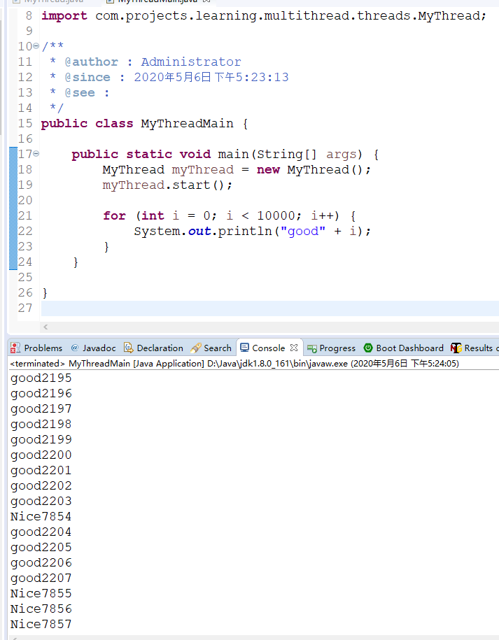

# 多线程概述

## 一、Thread的run和start

### 1.1 概述

新建线程类,继承Thread类并重写run方法
```java
public class MyThread extends Thread {
	public void run() {
		for (int i = 0; i < 10000; i++) {
			System.out.println("Nice" + i);
		}
	}
}
```

启动Main方法，新建线程并启动,启动要调用start方法
```java
public static void main(String[] args) {
		MyThread myThread = new MyThread();
		myThread.start();

		for (int i = 0; i < 10000; i++) {
			System.out.println("good" + i);
		}
	}

```

start是Thread类的方法，用于启动新的线程。

执行结果如下,可看出是多线程运行，每次运行结果都可能有差异。

```txt
...
good2198
good2199
good2200
good2201
good2202
good2203
Nice7854
good2204
good2205
good2206
good2207
Nice7855
Nice7856
Nice7857
Nice7858
Nice7859
Nice7860
...
```



***需要注意的是：启动多线程调用的是start方法，不是run方法，当然run方法不是不能调用，只是调用它不会启动新的线程，会当成一个同步方法***

start方法的主要作用:
- 启动新线程
- 调用run方法

因此对于上述的demo，主要表达的就是main线程会输出good，MyThread线程会输出Nice，由于是并行运行的，因此结果会交替打印。

### 1.2 顺序、并行、并发

- 顺序(sequential): 表示多个操作“依次处理”。
- 并行(parallel)：表示逗哥操作"同时处理"。
- 并发(concurrent): 相对于顺序和并行来说比较抽象，表示“把一个操作分割成多个部分并且允许无序处理”。
  
如果CPU只有一个那么并发处理就会降级成顺序处理，如果有多个cpu，那么并发处理就“可能”会变成并行运行。

线程类的实例和线程本身并不是同一个东西，即使创建了线程类的实例，也没有启动线程，直到你调用了start方法。而且就算线程终止了，线程类的实例还有可能在。

**程序的终止**:

Java程序的终止，是指的除守护线程之外的线程全部终止。守护线程是执行后台作业的线程，可以通过setDaemon把线程设置为守护线程。

可以在主线程中启动其他线程，当其他线程start之后，主线程就结束了，但整个程序并不会随着主线程的终止而终止，其他线程当然也不一定会终止，直到所有的线程都终止以后，程序才会终止。

## 二、 Java多线程的启动

线程的启动有如下两种方式:
- Thread类的子类实例启动
- Runnable接口的实现类启动

### 2.1 Thread类的子类实例启动

同上，不再赘述

### 2.2 实现Runnable

实现Runnable接口，必须实现run方法

示例：

```java

public class Printer implements Runnable {
	private String message;

	public Printer(String message) {
		this.message = message;
	}

	/**
	 * @see :
	 */
	public Printer() {
		this("defaultMessage");
	}

	@Override
	public void run() {
		for (int i = 0; i < 10000; i++) {
			System.out.println(message);
		}
	}

}
```

Main方法
```java
public static void main(String[] args) {
		new Thread(new Printer("GOOD!")).start();
		new Thread(new Printer("Nice!")).start();
	}

```
运行结果则会交替,如下所示：

```txt
GOOD!
GOOD!
GOOD!
GOOD!
GOOD!
GOOD!
GOOD!
GOOD!
GOOD!
GOOD!
GOOD!
GOOD!
GOOD!
Nice!
GOOD!
Nice!
GOOD!
GOOD!
GOOD!
GOOD!
GOOD!
GOOD!
GOOD!
GOOD!
GOOD!
GOOD!

```

当然，上述代码也可以写成如下,效果跟一行代码是相同的:
```java

Runnable runnable1 = new Printer("BEST");
Thread thread = new Thread(runnable1);

thread.start();

```

总结：
这种方式，就是创建Runnable接口的实现类，然后把这个实现类的实例传给Thread的构造函数，其他就跟Thread类同。

所以不管是哪种方式，启动新线程都是要Thread的start方法。

**实际上，Thread本身也实现了Runnable，且持有run方法，不过内部run方法是空的，交给子类去实现**

### 2.3 ThreadFactory

java内置的并发包中包含一个将线程创建抽象化的ThreadFactory接口。利用这个接口可以将Runnable作为参数传入并通过new创建Thread实例的处理隐藏在ThreadFactory的内部。默认的ThreadFactory对象是通过Executors.defaultThreadFactory方法获取。

示例:

```java
public static void main(String[] args) {
    ThreadFactory threadFactory = Executors.defaultThreadFactory();

    threadFactory.newThread(new Printer("BEST!")).start();

    for (int i = 0; i < 10000; i++) {
        System.out.println("GOOD!");
    }
}
```

## 三、线程的其他动作

### 3.1 暂停

Thread类中有sleep方法，可以让线程暂停一段时间，是一个静态方法。
sleep本身有可能会抛出InterruptedException异常.这个异常可以取消线程的处理。

它通常被用来模拟线程的耗时，用于假设在执行一个耗时很久的方法。但在实际的使用中，没有那么高的出场率。

有一个重载的方法，可以让这个暂停精确到纳秒级别，第一个参数是毫秒，第二个参数是纳秒
sleep(long millseconds , int nanos)

不过通常，java的平台运行环境没有这么精确，具体精确程度依赖于java的平台运行环境。

### 3.2 线程的互斥


