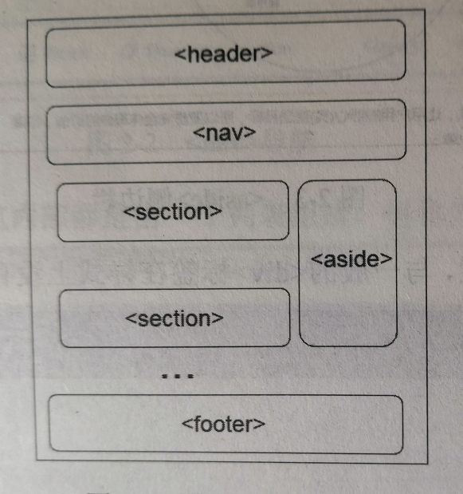
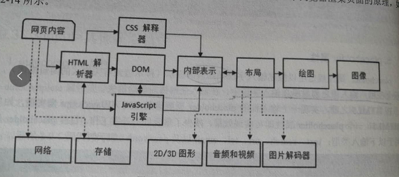

# <center>移动Web开发</center>

## 一、移动Web

### 1.1 移动Web和H5

H5和之前点相比。

- 语义。恰当描述内容。
- 离线和存储。让网页在客户端本地存储数据和更高效的离线运行。
- 多媒体。Video和Audio称为Web中更常见的元素。
- Canvas和2D/3D。多范围呈现元素。
- 设备访问(Device Access)。提供能够操作原生硬件设备的接口。
- 样式动画效果。CSS3可以创建更复杂的前端。

与此同时，JS也更新了版本，有一些新的数据结构和API，被称为ES6。

### 1.2 环境要求

#### 1.2.1 Chrome

#### 1.2.2 Node和http-server

## 二、H5

标签语义化，意思是让标签有含义。标题用\<hx>来表示，列表地用\<ul>表示。

h5之前，多数是用div和span来表示很多的网页元素，过于单一。h5引入了一些新的标签，如header、footer等。

语义化新标签的优点：

- html结构清晰
- 代码可读性好
- 无障碍阅读
- 搜索引擎可以根据标签的语义确定上下文和权重
- 移动设备可以完美展现网页
- 便于团队维护和开发

### 2.1 标签

#### 2.1.1 DOCTYPE

\<!DOCTYPE>它本身不是HTML的标签，它的作用是告知浏览器该使用哪个HTML的版本。H5之前有三种设置方式：

- 严格标准模式。(HTML4 Strict)

```html
<!DOCTYPE HTML PUBLIC "-//W3C//DTD HTML 4.01//EN" "http://www.w3.org/TR/html4/strict.dtd">
```

- 近似标准模式。(HTML4 Transitional)

```html
<!DOCTYPE HTML PUBLIC "-//W3C//DTD HTML 4.01 Transitional//EN" 
"http://www.w3.org/TR/html4/loose.dtd">
```

- 近似标准框架模式。(HTML4 Frameset)

```html
<!DOCTYPE HTML PUBLIC "-//W3C//DTD HTML 4.01 Frameset//EN" 
"http://www.w3.org/TR/html4/frameset.dtd">
```

H5就很简单了,只有一种版本。

```html
<!DOCTYPE html>
```

**关于编码方式**
在设置完DOCTYPE之后，多数情况下要对网页的语言和编码进行设置，如果网页文件没有正确声明编码方式，浏览器会根据网络浏览器或者计算机上的设置来编码。

HTML4中，采用Meta标签设置语言和编码方式：

```html
<meta http-equiv="Content-Type" content="text/html;charset=UTF-8">
```

在H5中，可以使用Meta直接追加charset属性指定编码方式。

```html
<meta charset="UTF-8">
```

同时可以使用html标签中的lang属性来设置语言。

```html
<html lang="zh-CN">...</html>
```

在DOCTYPE和meta标签中设置的属性都是不区分大小写的。

#### 2.1.2 header

可以理解成头或者页眉。header在默认样式上是等同于div，属于块级元素，只是在语义上有区别。

header应该作为一个容器，负责html页面的顶部内容的显示，可以有很多子元素。
在一个html中，某些业务逻辑情况下，可以定义多个header元素，数量不受限制。
尽量不要把header放在footer标签或者另一个header标签内部。

#### 2.1.3 footer

可以把页面最下面的内容放到footer标签里。在样式上本质和div没有区别，在使用的时候注意语义和规范。

footer一般会包含多个子元素，有网站的坐着信息、备案信息、姓名、文件的创建日期以及联系信息等。
在一个HTML页面中，某些业务逻辑情况下，可以包含多个footer元素，并且在每个section标签中都可以有一个footer元素，不受限制。

尽量不要把footer标签放在header标签中，或者另一个footer元素内部。

通常footer标签常驻在底部，因此可以搭配CSS。

```html
footer{
    position:absolute;
    bottom:0;
    width: 100%;
    height:100px;
    background-color:#ffc0cb;
}
```

这通常是标配。

#### 2.1.4 section

主要用于分块，用于按功能划分。每个部分都有自己的标题和内容，并且相对独立。
使用场景：

- 里面一般要搭配标题和正文，如H1和H6等等。
- 每个section都是一个独立的模块，这些模块内部不应该再嵌套section标签，但是多个section可以并列使用。
- 不应当作为一个容器使用，它的语义化更强一些，无法找到使用section的充分理由时，尽量不要用。

#### 2.1.5 nav

用于导航，可以是页面和页面之间的导航，也可以是页面段和段之间的导航。nav代表的导航一般是位于页面顶部的横向导航，或者面包屑导航。

大部分导航内部都是一个列表组成，称为导航列表。nav内部可以用ul或者ol来实现导航元素的布局。
使用场景:

- nav标签中一般会放一些a标签来链接元素，实现单击导航效果。但是并不是所有链接都必须用nav元素，只用来将一些功能性强的链接加入导航。
- 一个网页也可能包含多个nav，例如一个是网站内页面之间的导航列表，另一个是本页面内段与段的导航列表。
- 移动web的页面，nav标签也可以防止在页面底部代表页面内的导航。例如微信底部的微信、发现、通讯录等等。

#### 2.1.6 aside

用来表示与当前页面内容相关的部分内容，通常用来显示侧边栏或者补充内容，如目录、索引等。在一些场景下，可以理解成一个侧边的导航栏。

```html
<aside>
    <h2>标题1</h2>
    <ul>
        <li>目录1-1</li>
        <li>目录1-2</li>
    </ul>

    <h2>标题2</h2>
    <ul>
        <li>目录2-1</li>
        <li>目录2-2</li>
    </ul>
</aside>
```

它也可由作为section标签中独立模块的一部分，用来表示主要内容的附属信息部分，其中的内容可以是当前文章有关的相关资料、名词解释等。

```html
<section>
    <h1>文章标题Section</h1>
    <p>文章的正文</p>
    <aside>
        文章相关的资料、名词解释等。
    </aside>
</section>

```

使用场景:

- 在页面的一侧，其中的内容可以是友情链接，博客中的其他文章列表，广告等。
- 可以和section搭配使用，作为单个独立模块的附加信息来源。

#### 2.1.7 总结



### 2.2 新增标签

#### 2.2.1 progress

进度条。需要显示进度的程序中，比如需要加载或者等待的场景使用。

有两个属性可以设置：

- max。progress完成需要的总工作。
- value。已经完成的工作。如果没有value属性，则进度为不确定，进度条不会显示进度，无法估计当前工作会在何时完成。progress会显示动态效果。

```html
设置进度:
<progress value="45" max="100"></progress>

不设置进度:
<progress></progress>
```

也可以修改进度条的样式。

```css
progress::-webkit-progress-bar{
    height: 10px;
    background-color:#d7d7d7;
}

progress::-webkit-progress-value{
    height: 10px;
    background-color: orange;
}
```

#### 2.2.2 picture

picture标签。用法主要是在其内部创建若干个可以设置特性的source元素，每个source可以设置不同的srcset属性，代表不同的图片地址，同时可以设置不同的media属性，代表符合特定条件。

```html
<picture>
    <source srcset="" media="(min-width: 800px)">
    <source srcset="" media="(min-width: 600px)">
    
</picture>
```

- srcset。类似于img标签的src属性，设置图片地址。
- media。媒体查询，结果是一个布尔类型，用来判断是不是满足查询条件，成立的时候便会使用srcset设置的图片显示。
- type。该属性为source元素的srcset属性设置的图片资源指定一个MIME类型，如果答案设备不支持指定的类型，那么就不会使用srcset设置的图片。

该标签中需要有一个img标签表示默认图片。当其他的source条件都不满足的时候，就会用默认图片。
针对不同的移动设备加载不同的图片可以节省带宽，显示效果也好，即便图片差别不大，细节上可以提升用户体验。

#### 2.2.3 dialog

提供一个对话框，该元素位置上默认是在屏幕上左右居中，同时有一个黑色的边框，具有open束胸，用来表示显示弹出框，但是在大多数时需要Js来控制。

```html
<dialog id="dialog" open>
    这是一个弹出框
</dialog>
```

open意味着这个弹出框可见，如果没有这个属性，则对话框会隐藏起来，直到我们用js修改它。

dialog对应的元素有两个方法可以调用：

- show、showModal，区别是show方法会按照在DOM中的位置显示对话框，没有遮罩，showModal是会出现遮罩，并监听按键，如果按了esc等，则会关闭。大多情况下，会使用更智能的showModal。
- close。关闭对话框，删除open属性，可以携带一个参数作为额外数据，传入的值可以通过DOM对象dialog.returnValue获取。

同时也提供了两个事件。

- close事件。弹出对话框关闭时触发。
- cancel事件。按下esc关闭模态框时触发。

可以使用js来控制。

```html
<button onclick="openDialog()">打开</button>
<button onclick="closeDialog()">关闭</button>
<dialog id="dialog" >这是一个弹出框对话元素</dialog>
```

### 2.3 新增标签属性

#### 2.3.1 input的type属性

增加了一些type属性，丰富文本框的类型。

- email
- tel
- url
- number
- search
- range
- time
- date
- month
- week
- color

```html
<legend>H5新增的input type类型</legend>
邮箱:<input type="email" /><br />
手机:<input type="tel" /><br />
网址:<input type="url" /><br />
数字:<input type="number" /><br />
搜索框:<input type="search" /><br />
滑块:<input type="range" /><br />
时间:<input type="time" /><br />
日期:<input type="date" /><br />
几年几月:<input type="month" /><br />
几年几周:<input type="week" /><br />
颜色:<input type="color" /><br />
```

#### 2.3.2 input文件上传

h5之前，可以使用input  type="file"来设置文件或者图片的上传，H5中使用input标签，在移动web端会变成调用相册面板，在PC端会打开文件选择窗口，同时H5针对上传功能在input中扩展了属性。

- accept。限制上传的类型，
- multiple。是否支持同时选择多个，选择支持后，files将会得到一个数组。
- capture。可以调用默认相机、摄像、和录音功能。同时有其他取值：
  - camera。相机
  - camcorder 摄像机
  - microphone。录音

在移动端，如果给input设置了capture属性，当input被鼠标点击之后，会直接调用对应的模块，不会让用户选择。设置了capture属性之后，multiple也会被忽略。

可以给input绑定一个onchange事件，获取对应的文件数据。

```html
<p>选取图片：</p>
<input type="file" accept="image/*" multiple="multiple" id="uploadFile" />

<script type="text/javascript">
    var recorder = document.getElementById("uploadFile");

    recorder.addEventListener("change", function (e) {
        var files = e.target.files;
        console.log(files);
    });
</script>
```

#### 2.3.3 input其他的新增属性

##### 2.3.3.1 autocomplete
 
规定表单或者输入字段是否应该自动完成，自动完成启用之后，浏览器会基于用户之前的输入自动填写，在默认时，大多数浏览器都启用这个。

autocomplete适用于这些类型，text、search、URL、tel、email、password、datepickers、range、color。

##### 2.3.3.2 autofocus

布尔属性。则表示加载时，自动获取焦点。

关于布尔值: 如果元素的布尔属性有值，就是true，如果没有就是false，因此在声明的时候不用赋值。autofocus等同于autofocus="true"。

##### 2.3.3.3 min和max

代表最大值和最小值。适用类型是: number、range、date、month、time、week。

##### 2.3.3.4 pattern

检查是否符合正则表达式。适用于:text、search、URL、tel、email、password。

##### 2.3.3.5 placeholder

##### 2.3.3.6 required

布尔属性。如果设置，则必填，适用于:text、search、URL、tel、email、password、number、checkbox、radio、file。

对于这些限制类属性，如果值不符合规则，则会有提示。

当鼠标移动上去到非法元素的时候，也有错误提示信息。

#### 2.3.4 script的async和defer



步骤解释一下：

- 浏览器获得服务端返回的html页面时，总是从上往下解析并渲染
- 一般的html页面，一些样式文件css和脚本文件放在头部head标签中被导入
- 当浏览器解析到头部的css和js标签时，如果遇到的是外部链接，就会下载这些资源
- 暂不提外部css资源，只说外部脚本资源，当浏览器遇到外部的script src="xx.js"时，就会暂停解析后面的html，先发起请求获取当前的这个页面内容，而后解析获取的页面内容并执行。
- script标签会阻塞html解析和渲染，尤其当script标签导入的外部内容很大时，这种阻塞就很明显，导致html加载变慢，白屏时间变长。

为了解决这些问题，h5引入了script标签的async和defer属性。

##### 2.3.4.1 defer

当浏览器遇到了设置引入外部资源的时候script src="xx.js" defer的时候，不会再阻止解析，会另外并行去下载对应的文件，下载完成之后也不会立即执行，而是等到整个html页面解析完之后执行。如果页面多个这种标签，则会按照定义的顺序执行，这一点很重要。

##### 2.3.4.2 async

同defer。都用来改变脚本的执行行为。也是适用外部资源，告诉浏览器立即下载文件，但不同的是，标记为async的脚本并不保证按照定义的顺序执行。

指定这个属性的目的是不让页面等待两个脚本文件下载和执行，从而异步加载页面的其他内容。因此建议在指定async的脚本内容中，不应该有修改dom的逻辑。

同时，如果感觉不需要这两个属性，或者并不需要延迟加载，最优的方法是老老实实将外部资源的script放在页面底部，就不会影响html的解析和渲染。

### 2.4 音频和视频

#### 2.4.1 audio

常用的音乐格式有wav、mp3、ogg等，最多的是mp3格式的音频。可以使用audio标签导入文件。

- src。音频文件的路径和文件名。
- autoplay。是否自动播放。是否生效取决于浏览器的设置。
- controls。是否显示播放控件和面板，设置了则表示显示出播放控件和面板
- loop。是否循环播放，设置loop则表示循环播放。
- preload。是否预加载，减少用户缓冲时间，属性值有auto、metadata、none等三个。
  - auto。一旦页面加载，就开始加载音频。
  - metadata。加载后仅加载音频的元数据，指视频的作者、时长等。
  - none。页面加载的时候不预先加载音频。

可以用source标签来指定多个文件，为不同浏览器提供可支持的编码格式。

```html
<audio src="../audiosAndVideos/北京第三区交通委.mp3" controls autoplay="true">浏览器不支持audio</audio>
<audio controls autoplay="true">
    <source src="../audiosAndVideos/北京第三区交通委.mp3" type="audio/mp3"></source>
    <source src="../audiosAndVideos/test.ogg" type="audio/ogg"></source>
    您的浏览器不支持H5的audio标签。
</audio>
```

上面的代码，表示如果浏览器不支持第一个source指定的音频或者找不到对应的资源文件的时候，就会使用第二个。

#### 2.4.2 js操作audio

h5中，audio不止是个标签，还是windows下的一个对象。
可通过document.getElementById来获取这个对象，是一个HTMLAudioElement实例。

```html
<audio id="audio" src="../audiosAndVideos/北京第三区交通委.mp3" controls autoplay="true">
			浏览器不支持audio
</audio>

<script>
    var audio  = document.getElementById("audio");

    console.log(audio);

    // audio.muted =  true;
    audio.volume = 0.2;

    audio.canPlayType("audio/ogg");
    audio.pause();
    audio.load();
    audio.play();
    audio.pause();
</script>

```

不过新版本的audio有要求，在用户没有操作的时候，不能自动点击，所以这里的play会报错。

#### 2.4.3 audio的事件

在音频播放的整个流程中或者状态改变的时候，都有对应的api可以供使用。

```html
<script>
    var audio  = document.getElementById("audio");
    audio.addEventListener("canplay", function () {
        console.log(audio.duration);
    });
    audio.addEventListener("loadstart", function () {
        console.log("loadstart" + new Date().getTime());
    });
    audio.addEventListener("durationchange", function () {
        console.log("durationchange:" + new Date().getTime());
    });
    audio.addEventListener("loadedmetadata", function () {
        console.log("loadedmetadata:" + new Date().getTime());
    });
    audio.addEventListener("progress", function () {
        console.log("progress:" + new Date().getTime());
    });
    audio.addEventListener("suspend", function () {
        console.log("suspend:" + new Date().getTime());
    });
    audio.addEventListener("loadeddata", function () {
        console.log("loadeddata:" + new Date().getTime());
    });
    audio.addEventListener("canplaythrough", function () {
        console.log("canplaythrough:" + new Date().getTime());
    });
    audio.addEventListener("play", function () {
        console.log("play:" + new Date().getTime());
    });
    audio.addEventListener("timeupdate", function () {
        console.log("timeupdate:" + new Date().getTime());
    });
    audio.addEventListener("pause", function () {
        console.log("pause:" + new Date().getTime());
    });
    audio.addEventListener("ended", function () {
        console.log("ended:" + new Date().getTime());
    });
    audio.addEventListener("volumechange", function () {
        console.log("volumechange:" + new Date().getTime());
    });
</script>
```

各个事件的含义如下：

- canplay。浏览器可以开始播放指定的音频时。
- loadstart。浏览器开始寻找指定的音频，也即加载过程开始。
- durationchange。指定音频的时长数据发生变化。
- loadedmetadata。指定音频元数据已经加载时。
- progress。浏览器正在下载指定的音频。
- suspend。媒体数据被阻止加载的时候。可以在完成加载后触发，或者在暂停时触发。
- loadeddata。当前帧的数据已经加载，但没有足够的数据来播放指定音频的下一帧时。
- canplaythrough。浏览器预计能在不停下来进行缓冲的情况下，持续播放完指定音频时。
- play。播放时触发。
- timeupdate。播放时间改变时触发。会在播放中一直触发，触发频率取决于系统。
- pause。暂停时触发。
- ended。播放完一个音频时触发。
- volumechange。改变音量时触发。

有些事件或者行为的操作需要有先后依赖，比如一些依赖元数据的属性，例如获取音频播放时长的 duration属性或者当前播放时间的currentTime属性，必须等到音频的加载完成事件触发之后才可以获取。例如可以在loadedmetadata、或者canplay这些事件触发回调函数中来获取这些属性的值。

一些使用较多的事件时timeupdate，它会一直触发，但是触发的频率并不确定，取决于当前的浏览器或者系统。所以当我们想以一个固定频率来获得这个事件的触发时机，可以调用setInterval方法来轮询currentTime属性。

```javascript
setInterval(function(){
    console.log(audio.currentTime);//1s触发一次，获取音频的播放速度
},1000);
```

在一些浏览器里，尤其是移动端的浏览器，系统不允许代码直接调用audio.play()来播放，原因是避免一些网站在未经允许的情况下自动播放声音，有时设置autoplay属性不会生效。解决这个问题的方法是通过一个按钮来绑定click事件，在事件的回调函数中调用play方法，这样就说明是用户主动播放的。

```javascript
button.addEventListener("click",function(){
    audio.play();
});
```

#### 2.4.4 video

在移动端使用video的时候一定要注意不同机型的验证工作。

```html
<video controls src="" width="" id="">您的浏览器不支持video</video>
```

用法类似于audio，通过src设置资源地址。主流浏览器一般支持3种视频格式，Ogg、MPEG4、WebM。

- ogg。带有Theora视频编码和Vorbis音频编码的Ogg文件。
- MPEG4。带有H.264视频编码和AAC音频编码的MP4文件。
- WebM。带有VP8视频编码和Vorbis音频编码的WebM文件。

无论是PC还是移动端，MP4格式的视频文件都是支持度最好的。所以大多数的应用产品或者服务网站来说，都会支持MP4格式。

Video的支持属性：

- autoplay。视频准备完毕后是否自动播放。
- controls。是否包含播放和进度条、全屏等操作控件。
- loop。是否循环播放。
- muted。是否静音播放。
- poster。设置图像，即视频播放前或者下载时显示的预览图像。在移动端支持不好。如果没有设置，则是黑色区域。
- preload。视频在页面加载时进行加载（缓冲），并预备播放。如果使用autoplay，则忽略该属性。
  - auto。页面加载完成就开始加载视频。
  - metadata。页面加载后仅加载视频的元数据。
  - none。当页面加载完成，但不预先加载视频。

也可以使用source，设置多个不同的文件，来支持不同浏览器。

#### 2.4.5 js操作video和video的事件

```html
<script>
    var video = document.getElementById("video");
    video.muted = true;
    video.volume = 1;
    video.poster = "../images/语义化标签总结.png";
    // video.width = 200;
    // video.height = 200;

    video.load();
    video.play();
    video.pause();

    video.addEventListener("loadstart", function () {
        console.log("loadstart" + new Date().getTime());
    });
    video.addEventListener("durationchange", function () {
        console.log("durationchange:" + new Date().getTime());
    });
    video.addEventListener("loadedmetadata", function () {
        console.log("loadedmetadata:" + new Date().getTime());
    });
    video.addEventListener("progress", function () {
        console.log("progress:" + new Date().getTime());
    });
    video.addEventListener("suspend", function () {
        console.log("suspend:" + new Date().getTime());
    });
    video.addEventListener("loadeddata", function () {
        console.log("loadeddata:" + new Date().getTime());
    });

    video.addEventListener("canplay", function () {
        console.log(video.duration);
    });

    video.addEventListener("canplaythrough", function () {
        console.log("canplaythrough:" + new Date().getTime());
    });
    video.addEventListener("play", function () {
        console.log("play:" + new Date().getTime());
    });
    video.addEventListener("timeupdate", function () {
        console.log("timeupdate:" + new Date().getTime());
    });
    video.addEventListener("pause", function () {
        console.log("pause:" + new Date().getTime());
    });
    video.addEventListener("ended", function () {
        console.log("ended:" + new Date().getTime());
    });
    video.addEventListener("volumechange", function () {
        console.log("volumechange:" + new Date().getTime());
    });
</script>
```

各个事件的含义如下：

- canplay。浏览器可以开始播放指定的视频时。
- loadstart。浏览器开始寻找指定的视频，也即加载过程开始。
- durationchange。指定视频的时长数据发生变化。
- loadedmetadata。指定视频元数据已经加载时。
- progress。浏览器正在下载指定的视频。
- suspend。媒体数据被阻止加载的时候。可以在完成加载后触发，或者在暂停时触发。
- loadeddata。当前帧的数据已经加载，但没有足够的数据来播放指定视频的下一帧时。
- canplaythrough。浏览器预计能在不停下来进行缓冲的情况下，持续播放完指定视频时。
- play。播放时触发。
- timeupdate。播放时间改变时触发。会在播放中一直触发，触发频率取决于系统。
- pause。暂停时触发。
- ended。播放完一个视频时触发。
- volumechange。改变音量时触发。

从上可以看出，video事件含义和audio对象的含义是一致的。

包括使用时的一些注意事项，也和audio基本雷同。

#### 2.4.6 videojs视频播放器的使用

videojs是一款开源的免费web视频播放器。在移动端有着很好的兼容性和适配性。可以解决以下问题：

- web端。在web端的视频不仅仅是一个静态的资源，例如一个MP4文件，对于实时视频，例如m3u8格式的视频，类似这种实时直播的视频，也是一种视频，videojs内置了h5和flash两种模式，可以兼容。
- 移动端Web。各式各样的操作系统自带的浏览器定制的video标签渲染出来的界面风格不统一，直接原生的js控制视频兼容性差，video.js内置的视频播放器解决了这些不统一的问题，统一封装成相同的接口供使用。

```html
<!DOCTYPE html>
<html lang="zh-CN">
	<head>
		<meta charset="UTF-8" />
		<title>HTML5</title>
		<link href="../video-js-7.8.3/video-js.css" rel="stylesheet" />
		<script src="../video-js-7.8.3/video.js"></script>
	</head>
	<body>
		<video
			controls
			src="../audiosAndVideos/01_开发背景.mp4"
			class="video-js"
			width="300"
			id="video"
			type="video/mp4"
		>
			您的浏览器不支持video
		</video>
		<script type="text/javascript">
			var options = {
				width: 300, //设置宽度
				height: 400, //页面高度
				controls: true, //设置显示控件
				preload: "auto", //是否缓冲
			};
			//初始化videojs，第一个参数是video的标签id，第二个参数是videojs接收的参数，第三个是videojs初始化成功后执行的方法

			var video = videojs("video", options, function () {
				console.log("初始化成功！");
			});
		</script>
	</body>
</html>
```

同时，videojs也支持直接在video标签的属性上设置初始化参数。

关于options的选项。

```yaml
Player:
    Poster: 设置默认封面
    TextTrackDisplay: 字幕显示
    LoadingSpinner: 设置加载中loadding样式
    BigPlayButton: 大播放按钮。
    ControlBar: 控制条。
        PlayToggle: 播放暂停
        FullScreenToggle: 全屏
        CurrentTimeDisplay: 当前播放时间
        TimeDivider: 时间分隔器
        DurationDisplay: 总时长
        RemainingTimeDisplay: 剩余播放时间
        ProgressControl: 进度条时间轴
            SeekBar: 拖动按钮
            LoadProgressBar: 加载进度条
            PlayProgressBar: 播放进度条
            SeekHandle: 拖动回调函数。
        VolumeControl: 设置音量
            VolumeBar: 音量按钮
            VolumeLevel: 音量等级
            VolumeHandle: 音量处理回调函数
        PlaybackRateMenuButton: 播放速率按钮
```

设置项的命名方式采用驼峰命名方式。