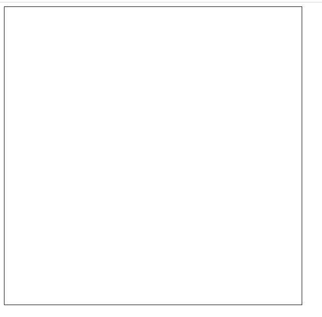
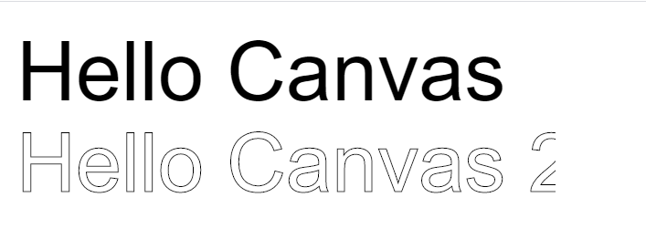

# <center>H5的Canvas</center>

画布。使用HTML和CSS实现一些非标准的页面元素。

## 一、Canvas的使用场景

- 数据可视化。
- 游戏。
- WebGL。
- 图像处理。

## 二、简单示例

```html
<!DOCTYPE html>
<html lang="zh-CN">
<head>
    <meta charset="UTF-8" />
    <title>HTML5</title>
    <meta name="viewport" content="width=device-width,initial-scale=1.0,maximum-scale=1.0,user-scalable=no" />
</head>
<style type="text/css">
    #canvas {
        border: 1px solid black;
    }
</style>
<body>
    <canvas id="canvas" width="600" height="600">你的浏览器不支持</canvas>
</body>
</html>
```



使用方法:

需要先获取Canvas的上下文对象，可以理解为画布的画笔。

```html
<script type="text/javascript">
    var canvas = document.getElementById("canvas");

    var context = canvas.getContext("2d");
    var context3D = canvas.getContext("webgl");
</script>
```

先试一下画一个矩形：

```html
context.fillRect(10,10,55,50);
context.fillStyle="rgb(200,0,0)"
```

可以看到，在调用API的时候，会传递一些坐标值。在Canvas的元素中，默认被网格所覆盖。通常来说，网格中的一个单元，相当于Canvas元素中的一些像素，网格的原点在左上角（坐标（0，0））。
所有元素的位置都相对于原点。

## 三、Canvas绘制路径

在Canvas中，绘制起点到终点所经过的点成为路径。Canvas的所有基本图形，包括线段、矩形、圆弧、贝塞尔曲线等，都可以基于路径来绘制。

### 3.1 绘制直线

Canvas提供了一下方法来绘制直线。

- beginPath。
  新建一条路径，路径一旦创建成功，图形绘制命令就被指向到路径上来生成路径。
- moveTo(x,y)。
  把画笔移动到指定的坐标，相当于设置路径的起始点坐标，此方法不会划线，只是移动画笔。
- lineTo(x,y)。
  从当前位置到xy画出一条直线路径，如果不存在当前位置，相当于执行moveTo(x,y)，在崭新的路径中没有执行过任何操作的情况下，默认是不存在当前位置的，所以一般在执行lineTo之前，先moveTo
- closePath
  创建从当前点到开始点的路径。当路径中的起始点和终止点不在同一个点上，执行closePath会用一条直线将起点和终点相连，形成一个闭合的图形。
- stroke()
  对当前路径中的线段或者曲线进行描边。颜色由strokeStyle决定，粗细由lineWidth决定。另外，与stroke相关的属性还有lineCap、lineJoin和miterLimit。

  lineWidth。决定了Canvas绘制线段的屏幕像素宽度，必须是非负数的double，默认是1.0。
  strokeStyle。对路径进行描边的时候所用的风格，可设置为颜色、渐变、或者图案，目前畅用来设置路径颜色。
  lineCap。设置如何绘制端点。有三个值可选，butt(向线条的每个末端添加平直的边缘)、round（向线条的每个末端添加圆形线冒）、square（向线条的每个末端添加正方形线帽）。
  lineJoin。指定同一个路径中相连线段的交汇处如何绘。有三个值可选：bevel(斜角)、rount(圆角)、miter(尖角)。默认是miter
  miterLimit。当lineJoin设置为miter时有效，该属性设置两条线段交汇处最大的渲染长度。如果长度超过miterLimit的值，边角会以lineJoin的bevel来显示。

  浙些属性都可以通过Canvas的上下文对象context来设置。butt没有伸出去的一截，square伸出去的一截的长度是宽度的一半。

  示例：绘制一个线段和一个闭合的三角形。

```html
<canvas id="canvasDraw" width="600" height="600">你的浏览器不支持</canvas>
<script type="text/javascript">
    var canvasDraw = document.getElementById("canvasDraw");
    var contextDraw = canvasDraw.getContext("2d");
    //绘制线段
    contextDraw.beginPath();
    contextDraw.moveTo(50, 50);
    contextDraw.lineTo(200, 50);
    contextDraw.closePath();
    contextDraw.lineWidth = "4";
    contextDraw.stroke();

    //绘制三角形
    contextDraw.beginPath();
    contextDraw.moveTo(50, 70);
    contextDraw.lineTo(200, 70);
    contextDraw.lineTo(200, 200);
    contextDraw.closePath();

    contextDraw.lineWidth = "7";
    contextDraw.strokeStyle = "blue";
    contextDraw.lineJoin = "round";
    contextDraw.stroke();
</script>
```

Canvas绘制的步骤：

- 创建路径的起点。对应beginPath和moveTo
- 调用绘制的方法去绘制路径，对应方法lineTo
- 路径闭合，对closePath
- 一旦路径生成，通过描边或者填充路径来渲染图形。对应stroke和fill

Canvas只能有一条路径，就是当前路径。对一条路径描边的时候，这条路径的所有线段，曲线都会被描边成指定颜色。意味着，如果一条路上画了条线，描边成红色，再画一条线，描边成黑色，那么整条都会被变成黑色，包括之前已经成红色的那条线。

所以，在你需要独立的时候，需要画完之后closePath，再进行下一条线的绘制，重新beginPath。

### 3.2 路径填充

fill方法根据当前的填充样式填充当前或者已经存在的路径。与stroke类似，可以使用filleStyle属性来设置图形填充操作中使用的颜色、渐变色或图案。

如果绘制的路径没有闭合，或者是一个非闭合的区域，那么fill方法会从路径的开始点和结束点之间来一条直线，闭合这个路径，相当于自动调用closePath，然后再填充。

比如：下面可以画一个五角星。

```html
<canvas id="canvasDraw" width="600" height="600">你的浏览器不支持</canvas>
<canvas id="canvasFive" width="600" height="600">你的浏览器不支持</canvas>

<script type="text/javascript">
    var canvasDraw = document.getElementById("canvasDraw");
    var canvasFive = document.getElementById("canvasFive");
    var contextDraw = canvasDraw.getContext("2d");
    var contextFive = canvasFive.getContext("2d");
    //绘制线段
    contextDraw.beginPath();
    contextDraw.moveTo(50, 50);
    contextDraw.lineTo(200, 50);
    contextDraw.closePath();
    contextDraw.lineWidth = "4";
    contextDraw.stroke();

    //绘制三角形
    contextDraw.beginPath();
    contextDraw.moveTo(50, 70);
    contextDraw.lineTo(200, 70);
    contextDraw.lineTo(200, 200);
    contextDraw.closePath();

    contextDraw.lineWidth = "7";
    contextDraw.strokeStyle = "blue";
    contextDraw.lineJoin = "round";
    contextDraw.stroke();

    //绘制五角星
    var R = 100;
    var r = 50;
    var x = 200;
    var y = 200;

    contextFive.beginPath();
    //在五角星的内外画两个圆，五角星有五个角，360/5 = 72度
    for (var i = 0; i < 5; i++) {
        contextFive.lineTo(
            Math.cos(((18 + 72 * i) / 180) * Math.PI) * R + x,
            -Math.sin(((18 + 72 * i) / 180) * Math.PI) * R + y
        );

        contextFive.lineTo(
            Math.cos(((54 + 72 * i) / 180) * Math.PI) * r + x,
            -Math.sin(((54 + 72 * i) / 180) * Math.PI) * r + y
        );
    }

    contextFive.closePath();
    contextFive.fill();
    contextFive.stroke();
</script>
```

## 四、Canvas绘制图形

### 4.1 绘制矩形

有三个绘制矩形的相关方法。包含2个绘制方法和一个清除方法。

- strokeRect(x,y,width , height)。绘制矩形边框
- fillRect(x,y,width,height)。绘制填充的矩形
- clearRect(x,y,width,height)。清除指定的矩形区域，然后会变得透明。

x,y指的是矩形左上角的坐标。width和height分别指的是宽和高。

```html
<canvas id="canvasRect" width="600" height="600">你的浏览器不支持</canvas>
var canvasRect = document.getElementById("canvasRect");
var contextRect = canvasRect.getContext("2d");
contextRect.fillRect(10, 10, 100, 50); //绘制矩形，默认是填充黑色
contextRect.strokeRect(10, 70, 100, 50); //绘制矩形边框
```

### 4.2 绘制圆

#### 4.2.1 arc

arc方法。arc(x,y,r,startAngle,endAngle,anticlockwise)
以x,y为圆心，r为半径，从startAngle弧度开始到endAngle弧度结束。anticlockwise是布尔值，true代表逆时针，fasle代表顺时针，默认是顺时针。startAngle和endAngle都是弧度。

一个整圆的弧度可以用2*Math.PI表示。

```html
<canvas id="canvasCircle" width="600" height="600">你的浏览器不支持</canvas>

//绘制圆
var canvasCircle = document.getElementById("canvasCircle");
var contextCircle = canvasCircle.getContext("2d");
contextCircle.arc(100, 75, 50, 0, 2 * Math.PI); //绘制，默认是填充黑色
contextCircle.stroke();
```

#### 4.2.2 artTo

arcTo(x1,y1,x2,y2,radius)。

首先从起点位置到坐标(x1,y1)画条辅助线，再从坐标(x1,y1)到坐标(x2,y2)画条辅助线，然后以radius为半径，画一条与两条辅助线相切的曲线，形成圆弧。

上面的方法只会画一段弧，多次调用可以画出多段弧，从而组成一个圆。

```html
<canvas id="canvasCircleArcTo" width="600" height="600">你的浏览器不支持</canvas>
<script>
//绘制圆
    var canvasCircleArcTo = document.getElementById("canvasCircleArcTo");
    var contextCircleArcTo = canvasCircleArcTo.getContext("2d");
    contextCircleArcTo.beginPath();

    //标出辅助点的位置
    contextCircleArcTo.fillText("A", 100, 100);
    contextCircleArcTo.fillText("B", 150, 100);
    contextCircleArcTo.fillText("C", 150, 150);
    contextCircleArcTo.fillText("D", 150, 200);
    contextCircleArcTo.fillText("E", 100, 200);
    contextCircleArcTo.fillText("F", 50, 200);
    contextCircleArcTo.fillText("G", 50, 150);
    contextCircleArcTo.fillText("H", 50, 100);

    contextCircleArcTo.moveTo(100, 100);
    //第一段弧
    contextCircleArcTo.arcTo(150, 100, 150, 150, 50);

    //第二段
    contextCircleArcTo.arcTo(150, 200, 100, 200, 50);

    //第三段
    contextCircleArcTo.arcTo(50, 200, 50, 150, 50);
    contextCircleArcTo.arcTo(50, 100, 100, 100, 50);
    contextCircleArcTo.stroke();
</script>
```

上面的代码，artTo画了四段弧，A~H分别是辅助点的位置，这四段组成了一个圆。

在大多数绘制圆的场景中，使用最多的还是arc，符合真实绘制的思路，artTo可以调整两个辅助点的位置，绘制不同的弧。

### 4.3 绘制图形的锯齿问题

绘制图形的时候会有一些模糊，有锯齿问题。

解决办法就是利用缩放的方式，先放大再缩小，具体就是给Canvas本身设置宽和高的同时(w1和h1)，使用CSS样式也给canvas标签设置宽和高（w2和h2），使得w1和h1分别是w2和h2的两倍。

### 4.4 Canvas绘制文本

- fillText(text , x ,y,[,maxWidth]) 指定坐标，填充实心文字指定的文本，内容参数是text，绘制的最大宽度是可选的。
- strokeText(text,x,y,[,maxWidth]) 指定坐标，填充空心文字指定的文本，内容参数是text，绘制的最大宽度是可选的，

```html
<canvas id="canvasDraw" width="600" height="600">你的浏览器不支持</canvas>
<script type="text/javascript">
    var canvasDraw = document.getElementById("canvasDraw");
    var canvasContext = canvasDraw.getContext("2d");

    canvasContext.font = "90px Arial";
    canvasContext.fillText("Hello Canvas", 10, 100);
    canvasContext.strokeText("Hello Canvas 2", 10, 200);
</script>

```

结果如下:



当fontSize设置的比较大的时候，绘制文本的区别就比较明显。

- font。绘制文本的样式，可以设置一个字符串，使用与CSS的font属性相同的语法，默认的字符串是10px sans-serif。
- textAlign。设置文本的对齐选项。
  - start.指定位置开始
  - end.指定位置结束。
  - left.左边在指定位置开始。
  - right。文本的右边在指定位置开始。
  - center。中心在指定位置开始。
- direction。文本的方向。
  - ltr.从左到右
  - rtl。从右到左。
  - inherit.根据情况继承canvas元素或者body，默认是inherit。
- textBaseLine。文本基线，设置蚊子垂直方式的对齐方式。
  - top.文本基线在文本块的顶部。
  - hanging.文本基线是悬挂基线。
  - middle.文本基线在文本块的中间。
  - alphabetic.文本基线是标准的字母基线。
  - ideographic.文本的基线是表意字基线，如果字符本身超出了alphabetic基线，那么ideographic基线位置在字符本身的底部。
  - bottom。文本基线在文本块的底部。与ideographic不同的地方在于ideographic基线不需要考虑下行字母。

### 4.5 Canvas绘制图片

与img标签一样，canvas标签在html页面中也可以作为一张图片的容器。canvas在底层绘制图片，也叫渲染图片，可以自由控制图片的位置和大小，并且可以对图片进行复杂的像素级的修改。通过调用drawImage()方法传递不同的参数，可以绘制不同的图片。

#### 4.5.1 drawImage(img,x,y)

在canvas调用drawImage的时候，在image加载成功之后才可以绘制。所以一般都需要先加载image，再通过onload事件在回调函数中调用drawImage，否则无法正常绘制。

在绘制图片的时候，图片必须是同一个域名的，canvas不允许导入第三方域名的图片。

为了避免多次调用onload，需要判断图片是不是已经成功加载过，可以使用Image.complete属性来判断，由于浏览器本身的缓存机制，对于同一张图片，加载成功一般会缓存起来，避免每次请求时都重新下载。

```html
if(image.complete){
    context.drawImage(image,x,y);
}else{
    image.onload = function(){
        context.drawImage(image,x,y);
    }
}
```

#### 4.5.2 drawImage(img,x,y,width , height)

这个可以在绘制的时候，改变宽度和高度来修改原始大小。

当指定图片的宽度和高度的时候，如果没有按照原始图片的比例来设置，就会压缩或者拉伸图片。借助这个方法，可以对一张图片的大小进行压缩。

#### 4.5.3 drawImage(img , sx , sy , swidth , sheight , x , y , width , height)

这种方式同样是在画布上绘制图片，添加了如图片剪裁的功能。除了已经有的参数和第二种反中的参数一致之外，新增了SX参数表示开始剪切的x坐标位置，sy参数表示开始剪切的y坐标位置，swidth参数表示剪切图片的宽度，sheight参数表示剪切的图片的高度。

### 4.6 Canvas压缩图片

#### 4.6.1 toDataURL(type ,encoderOptions)

toDataURL方法可以将绘制的图片导出成base64字符串。type参数可选，控制导出图片的格式，默认是image/png。
encoderOptions参数可选，在指定图片格式image/jpeg或者image/webp的时候，可以从0-1的区间内选择图片的质量，数值越大质量越高。如果取值超出范围，将会使用默认值0.92，其他参数都会被忽略。

### 4.7 Canvas转换

Canvas的转换主要是指对canvas内部画布的平移、旋转、缩放，主要是指对canvas自身内部画布坐标系统的转换。

#### 4.7.1 平移translate( x,y)

坐标的原点（0,0）位于canvas的左上角，canvas的平移translate的作用就是改变坐标的原点，而不是改变canvas这个dom节点在html页面中的位置。

#### 4.7.2 旋转rotate(angel)

angel是角度,表示从坐标原点为中心进行旋转。以Math.PI为基准，一个Math.PI为180度，正值表示顺时针，负值表示逆时针。比如一个图片旋转30度。就是(1/6 * Math.PI)。

旋转是基于坐标原点的旋转。如果坐标点不是原点，例如经过平移之后的原点，那么旋转的时候坐标原点也是相应的变化。

#### 4.7.3  缩放scale

scale(x,y)

x,y分别表示横轴和纵轴的缩放系数，都是正值。值比1.0小，则表示缩小；值比1.0大表示放大；等于1的时候，表示不进行缩放。

默认情况下，Canvas中的1单位就是1个px，如果缩放系数是0.5，那么原来1个单位的就变成0.5px，绘制出来的图形就是原来的一半。

### 4.8 Canvas状态的保存和恢复

Canvas的上下文对象是调用API的主要对象，好像是一支画笔，需要画什么路径和图形直接调用对应的api即可，如果我们在某个节点调整了粗细和样式，后续的绘制都会受影响。

如果我们保存了最初的状态，后面的每次绘制都会以初始状态为基准，无论中间怎么改变，因为有了开始的基准，他们之间不会互相影响。

Canvas用于保存状态的save和恢复状态的restore的方法。
可以这么理解，每次调用save都会往状态列表中保存一个状态，如果调用了restore，则会从状态列表中，取出上一个状态，拿来使用。

```html
canvas.save();//a,保存默认状态
canvas.save();//b保存当前状态
canvas.save();//c保存当前状态


canvas.restore();//恢复到上一个状态b
canvas.restore();//恢复到上上一个a
```


