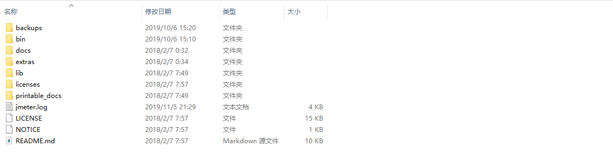
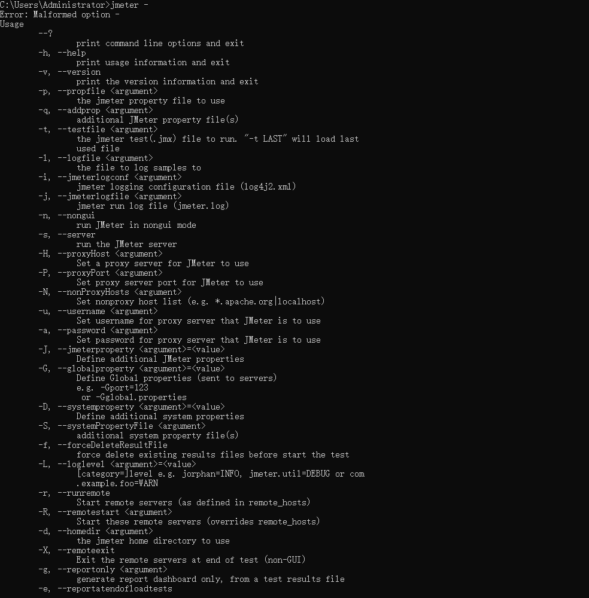

# <center>jmeter概述</center>

## 一、jmeter目录介绍

如下所示:



- bin.启动和执行其他操作的可执行文件
- docs.用户指导
- extras.使用样例，jmeter和bean shell调用其它工具。
- lib. jmeter所需要的jar包，也可以添加其他的jar包
- printable_docs 可打印的文件

### 1.1 bin

bin下是核心的启动脚本或者其它功能的脚本。

- jmeter.sh 启动jmeter gUI
- jmeter-n.sh 非gui启动jmeter，以jmx文件作为输入
- jmeter-n-r.sh 远程非gui启动
- jmeter-t.sh gui中打开一个jmx文件
- jmeter-server.sh 服务器模式下启动，在以远程方式测试多台服务器时开启主节点
- mirror-server.sh 启动jmeter镜像
- shutdown.sh  正常关闭一个正在运行的非gui实例
- stoptest.sh 立即关闭一个正在运行的非gui实例

## 二、启动

> ./jmeter.sh 或者 jmeter.bat

启动参数。
JVM_ARGS幻境变量可用于覆盖jmeter.bat或者jmeter.sh里设置的jvm参数。

export JVM_ARGS="-Xms1024m -Xmx1024m -Dpropname=propvalue"

### 2.1 命令行选项

输入错误的jmeter参数，会提示参数的使用帮助。如下所示：



### 2.2 环境变量

jmeter提供了两个路径放置三方库，使用环境变量可自动引入。

- JMETER_HOME/lib 实用的jar文件
- JMETER_HOME/lib/ext jmeter的一些元件和插件。所有定制开发的Jmeter元件都应该放在lib/ext目录中,同时三方库应该放在lib目录中。

### 2.3 代理服务器

jmeter提供附加命令行参数达到这个目的。

- -H。指定代理服务器主机或者ip地址
- -P 代理服务器端口
- -u 安全模式下的用户名
- -a 安全模式下的密码

如下所示:

```shell
./jmeter.sh -H proxy.server -P 7567 -u username -a password

```

**这里的代理服务器和jmeter内置的http代码服务器不一样**

### 2.4 非gui运行

- -n 非gui模式运行
- -t 指定测试文件
- -l 指定jtl文件的名称
- -j 指定日志文件名
- -r 运行由jmeter属性remote_hosts指定的测试服务器
- -R yunxing 运行指定远程服务器中的测试。

### 2.5 以服务器模式运行

分布式测试时会使用服务器模式，需使用更多的服务器以在系统上产生更大的负载。在服务器模式下，每个远程服务器上都会启动jmeter，在主服务器上也会启动一个gui，控制所有节点。

> ./jmeter-server.sh
> jmeter-server.bat

### 2.6 重写属性

大多数情况下，不需要重写默认属性，因为通常默认值都是合理的。
两种方式修改java、jmeter和日志属性。

- 直接编辑bin目录下的jmeter.properties
- 启动jmeter的时候，在命令行指定

- -Da=bjava系统属性
- -Ja=b 指定本地jmeter属性
- -Ga=b 指定发给所有远程服务器的jmeter属性
- -Gproperty file
- -Lcategory=priority 重写日志设置，在指定优先级监控里分类

例：
> ./jmeter.sh -Duser.dir= -Jremote_hosts= -Ljmeter.engine=DEBUG

一旦通过命令行选项对日志系统设置，就无法通过-J标记更新log_level和log_file的属性。

## 三、追踪错误

测试过程中默认日志记录在jmeter.log里，这个文件位于启动jmeter的文件夹下，这个日志文件的名字也可以通过jmeter.properties或者通过命令行参数-j配置。

## 四、配置jmeter

如果定制jmeter的默认值，可以编辑bin目录下的jmeter.properties文件，或者复制一份重命名，启动的时候做为命令行选项指定它。

可配置的部分：

- xml.parser。
  xml的解析方式。默认是org.apache.xerces.parsers.SAXParser。例如可以使用javax.xml.parser.SAXParser,将正确的jar包添加到环境变量里。
- remote_hosts。
  非必填。
  指定逗号分隔的远程JMETER主机列表，当在分布式环境中运行时候，将jmeter远程服务器运行的机器列出来，然后就可以通过gui控制这些服务器。只用于分布式测试且非必填。
- not_in_menu。
  非必填。
  指定你不想在jmeter菜单中看到的元件列表，默认值就挺好。
- user.properties
  指定包含额外jmeter属性的文件的名称。可以在初始属性文件之后但是在使用-q、-J之前添加。
  非必填。
  用户属性可以用于提供额外的类路径设置。如search_path指定插件路径、user_classpath指定jar文件路径。此外，这些属性文件可以用于对jmeter元件的日志级别进行精细调整。
  - search_paths:
    指定jmeter搜索插件类的路径列表，分号隔离。对lib.ext目录下的jar文件补充。
    非必填。
  - user.classpath:
    非必填。
    除了lib下的jar文件之外，这个选项指定其他路径。Jmeter从这个路径下寻找工具类。
- system.properties
  指定包含jmeter使用的其他系统属性的文件名。可以在使用-S -D之前添加这些系统属性。
  非必填。
  通常用于精细调整各种SSL设置、密钥存储和认证。
  - ssl.provider:
    如果想使用内置的java实现ssl，通过这个可以指定实现方式。
    非必填。
    如果内置的不能满足测试场景，这个选项可以指定另外的实现。根据经验，默认的已经足够满足要求。

命令行选项顺序:

- -p profile。
  可选。 
  指定jmeter使用的自定义属性文件。如果属性文件存在，会加载并运行这些属性文件。
- jmeter.properties。
  jmeter默认的配置文件，文件内包含了各种合理的默认值。在用户指定的自定义属性文件之后加载并运行。
- -j logfile。
  可选。
  指定jmeter的日志文件，在之前的jmeter.properties文件后加载并运行。

初始化日志。
加载user.properties，如果有
加载system.properties，如果有

最后，处理其他命令行选项。
