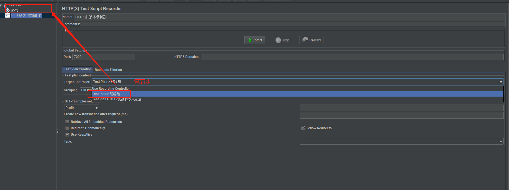
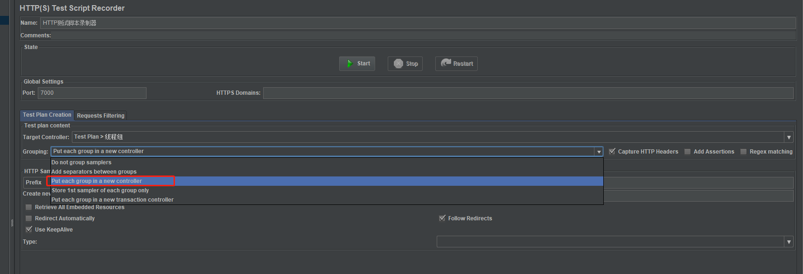
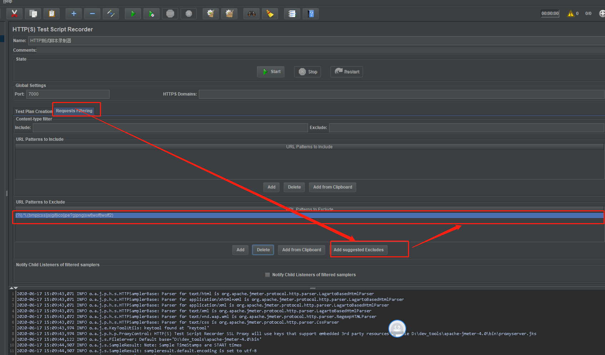
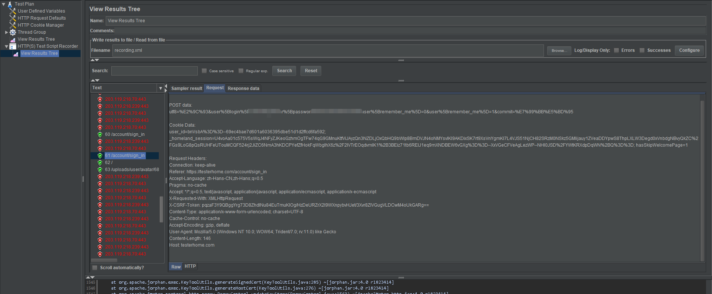

# 
录制测试

Jmeter内置脚本录制器，录制测试计划。也叫代理服务器。一旦设置成功，测试脚本录制器将会观察你在网站上的操作，创建请求样本、最终存储在测试计划里。

两个步骤

1. 配置jmeter的脚本录制器
2. 配置浏览器代理

## 一、配置脚本录制器

配置代理服务器。

1. 启动jmeter。
2. TestPlan -> Add -> Thread(User) -> Thread Group。 添加
3. WorkBench。Add -> Non-Test Elements -> Http(s) Test Script Recorder. 添加脚本录器
4. 修改端口号。7000，需要选择一个没有被占用的端口。默认是8080。
5. 选择指向的线程组。
   
6. 选择Grouping。
   
7. 将一组请求组成一次页面加载。
8. 单击Add Suggested Excludes。
   
9. start.
10. OK。接受CA证书。
11. 启动浏览器代理。
12. 访问被测服务器。
结果如下所示:

## 二、其它操作

stop 停止录制

