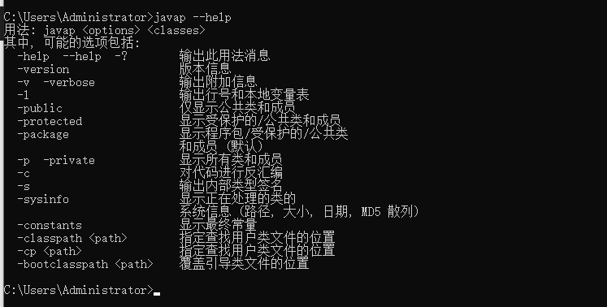
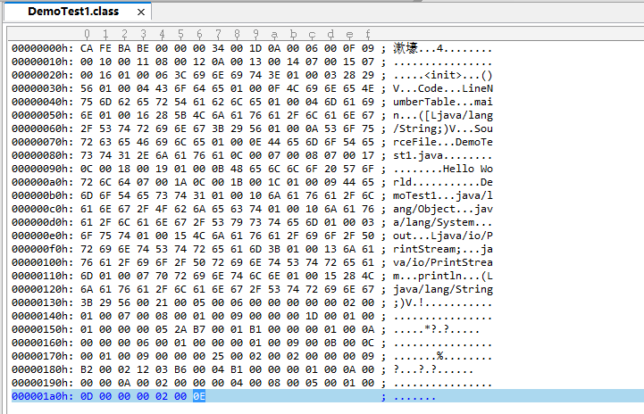
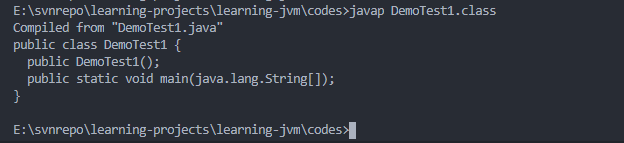
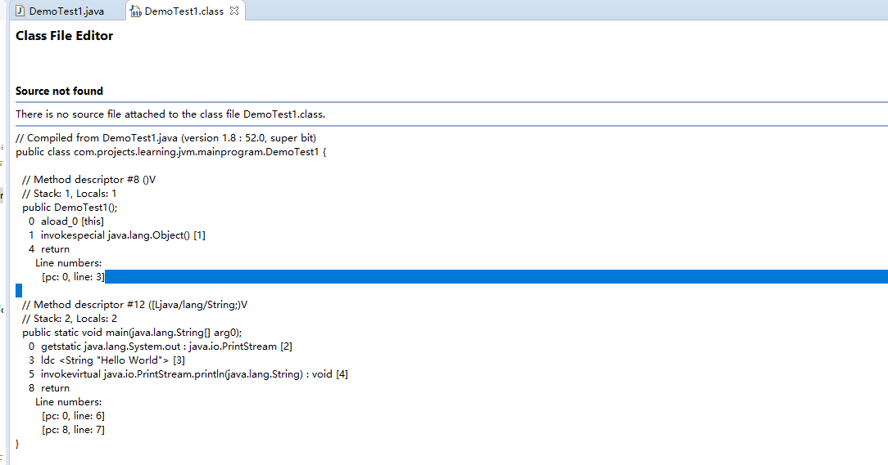

# <center>字节码的编译原理</center>

## 一、javac

字节码的编译过程，需要经过下面的步骤：

- 词法解析。 
- 语法解析。
- 语义解析。
- 字节码生成。

### 1.1 语义解析

在语义解析时，会经历一些步骤，如：

- 为没有构造方法的类型，添加缺省的无参构造方法；
- 检查任何类型的变量在使用前是否已经初始化；
- 检查变量类型是否与值匹配；
- 将string类型的常量进行合并处理；
- 检查代码中的所有偶操作语句是否可达；
- 异常检查；
- 解除java语法糖

### 1.2 生成字节码

在经过词法分析、语法分析和语义分析步骤之后，解析出来的语法树已经非常完善了，javac编译的最后任务就是调用com.sun.tools.javac.jvm.Gen类将这个语法树编译为java字节码文件。JVM的架构模式，是基于栈的，在jvm中的所有操作都要经过入栈和出栈来完成。

## 二、javap工具分析字节码

如下是javap的帮助文档：



为了验证语义分析步骤中的语义解析器是否会为没有显示指定构造方法的类型动态添加一个无参缺省构造方法，先使用示例代码DemoTest1.java来验证。

源代码:

```java
public class DemoTest1 {
    public static void main(String[] args) {
        final String STR = "Hello " + "World";
        System.out.println(STR);    
    }
}
```

编译后的class文本内容：


我们在用javap反编译一下，看得到什么:



可以看到多了一个无参构造方法出现，因此语义分析的步骤中，验证成功。

如果用Eclipse或者其他UI形式的反编译工具打开这个class文件，则大概看到如下内容：

```txt
// Compiled from DemoTest1.java (version 1.8 : 52.0, super bit)
public class com.projects.learning.jvm.mainprogram.DemoTest1 {
  
  // Method descriptor #8 ()V
  // Stack: 1, Locals: 1
  public DemoTest1();
    0  aload_0 [this]
    1  invokespecial java.lang.Object() [1]
    4  return
      Line numbers:
        [pc: 0, line: 3]
  
  // Method descriptor #12 ([Ljava/lang/String;)V
  // Stack: 2, Locals: 2
  public static void main(java.lang.String[] arg0);
    0  getstatic java.lang.System.out : java.io.PrintStream [2]
    3  ldc <String "Hello World"> [3]
    5  invokevirtual java.io.PrintStream.println(java.lang.String) : void [4]
    8  return
      Line numbers:
        [pc: 0, line: 6]
        [pc: 8, line: 7]
}
```

也同样可以看到新增了一个构造方法。



## 三、GCJ

GCJ（GNU Compiler for the Java Programming Language）编译器可以将java源码直接编译为机器码，一旦GCJ编译器编译出机器码指令之后，java程序就可以脱离jvm环境独立运行。

两款著名的"元循环"虚拟机(Mete-Circular JVM),分别是JavaInJava和Maxine VM。所谓"元循环"指的是使用java语言自身编写的虚拟机去运行java程序。

尽管可以这么做，但是还是会有缺陷。

- 一旦java被编译成机器码，那么就失去了"write once , run anywhere"的实现
- 编译为可执行程序之后的java程序体积高达几十兆
- gcj只会针对java的基础类库提供支持，其他的三方库,GCJ无能为力

所以最好还是由HotSpot中的jit编译器去负责本地机器指令的动态编译工作。

