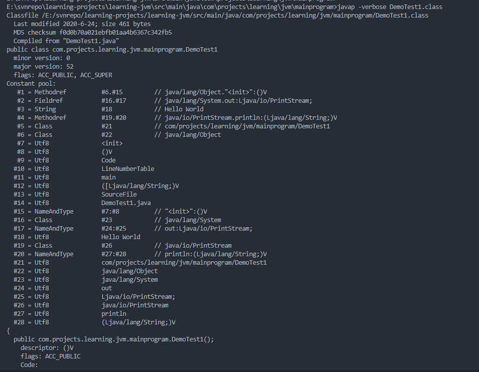
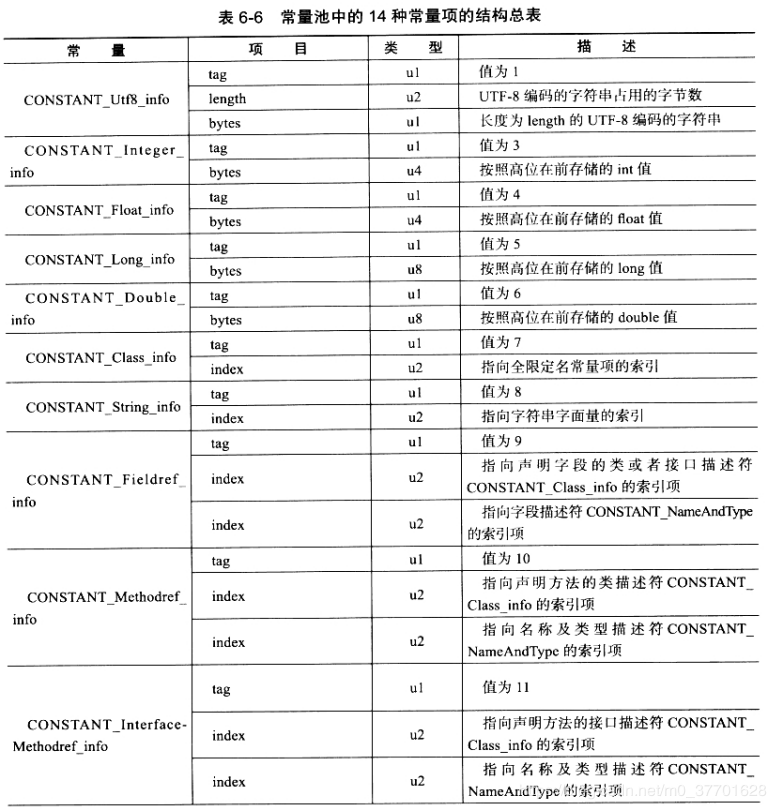
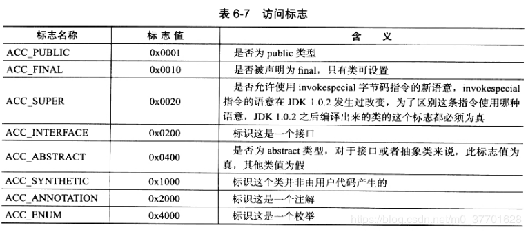

# <center>字节码文件</center>

字节码文件结构比较特殊，内部不包含分隔符区分段落，因此字节顺序、数量都是严格规定的，所有16位、32位、64位长度的数据都将构成2个、4个、8个字节单位来表示，多字节数据总是按照big-endian顺序(高位字节在地址最低位、低位字节在地址最高位)来存储，也就是说一组8位字节单位的字节流组成了一个完整的字节码文件。

## 一、字节码文件的内部组成结构

每一个字节码文件其实都是对应着全局唯一的一个类或者接口的定义。字节码文件采用的是类似于C语言结构体的伪结构来描述字节码文件格式。为了避免与类的字段、实例等概念产生混淆，我们称这个描述类结构格式的内容定义为项(Item)。

每一项都包括类型、名称、以及数量。类型可以是表名，同时也是“基本类型”。包含在字节码文件中，各项按照严格的顺序进行连续存放，内部并不包含任何的分隔符区分段落。
这个结构体中只有两种数据结构，分别是无符号数和表，无符号数属于字节码文件中的"基本类型"。

表，由多个无符号数或者其他表作为数据项构成的复合数据类型，所有表的后缀都是使用"_info"进行结尾，并且字节码文件实质上也是一张表。

每一个字节码文件对应着一个ClassFile的解构。

下面是classfile的描述信息。

```java
ClassFile {
    u4 magic; // 魔法数字，表明当前文件是.class文件，固定0xCAFEBABE
    u2 minor_version; // 分别为Class文件的副版本和主版本,最小版本
    u2 major_version; //最大版本
    u2 constant_pool_count; // 常量池计数
    cp_info constant_pool[constant_pool_count-1]; //
    u2 access_flags; // 类访问标识
    u2 this_class; // 当前类
    u2 super_class; // 父类
    u2 interfaces_count; // 实现的接口数
    u2 interfaces[interfaces_count]; // 实现接口信息
    u2 fields_count; // 字段数量
    field_info fields[fields_count]; // 包含的字段信息
    u2 methods_count; // 方法数量
    method_info methods[methods_count]; // 包含的方法信息
    u2 attributes_count; // 属性数量
    attribute_info attributes[attributes_count]; // 各种属性
}
```

### 1.1 magic(魔术)

一个有效的字节码文件的前4个字节为OxCAFEBABE，也称为魔数。就是JVM用来校验所读取的文件是不是一个有效且合法的字节码文件。

### 1.2 minor_version major_version 次版本号、主版本号

紧跟在magic之后的4个字节是编译的次版本号和主版本号。它们共同构成了字节码文件的版本号。

如果字节码文件的版本号超过了JVM所能处理的有效范围，那么jvm将不会处理这个字节码文件。低版本的jvm自然不能解析高版本的jdk编译的字节码文件，会提示java.lang.UnsupportedClassVersionError异常。高版本的jvm却能向下兼容运行低版本的jdk编译的字节码文件。

### 1.3 constant_pool_count  constant_poll 常量池计数器和常量池

紧跟在版本号之后的就是常量池计数器和常量池，这是个很重要的项，同时也是字节码文件中与其他项关联最多和占用字节码空间最大的数据项。

常量池主要用于存放字面量和符号引用，访问方式是通过索引访问。但由于常量池列表中的常量数并不固定，因此在常量池之前，需要用一个2字节的常量池计数器来统计常量池列表中到底有多少个常量项。

常量池计数器中的计数值并非是从0开始，而是从1开始，如果常量池中有2个常量时，技术值则是2，以此类推。尽管常量池计数器中并没有从0开始作为计数，但是0依然存在。目的是为了满足后续其他项在不引用常量池中的任何常量时，默认可以把常量池中的访问索引设置为0来表示。

常量池中存放的字面量由文字字符串、final常量值等构成，符号引用则包括了类和接口的全限定名、字段的名称和描述符，以及方法的名称和描述符。

可以使用命令"javap -verbose"来查看字节码文件中的常量池信息。



C语言中如果一个程序要调用其他的库的函数，那么在链接时，该函数在库中的位置，也就是相对于库文件开头的偏移量，会被写在程序中，运行时直接去这个地址调用函数即可。

但java中不是这样，字节码文件中没有包含各个方法和字段的最终内存布局信息，也就是说只有当java虚拟机在运行时从常量池中获取对应的符号引用，并经过解析阶段将这些符号引用全部转换为直接引用之后，jvm才能正常使用。

在常量池列表中的每一个常量项其实都是一个表，java7一共包含14种不尽相同的常量项。



### 1.4 access_flag 访问标志

紧跟常量池之后的2个字节是访问标志，访问标志主要用于表示某个类或者接口的访问权限。



访问标志总共有16个位置可用，但是目前只定义了8个，对于那些没有用到的标志，编译器一律要求设置为0，java虚拟机还必须忽略它。

### 1.5 this_class（类索引） super_class 超类索引

紧跟在访问标志后面的4个字节就是类索引和超类索引，类索引和超类索引各自会通过索引指向常量池列表中的一个类型为CONSTANT_CLASS_INFO的常量项。constant_Class_info由tag和name_index两部分构成，tag是一个具有CONSTANT_Class_Info值的常量，而name_index则是一个指向常量池列表中类型为CONSTANT_utf8_info常量项的索引，通过这个索引可以获取到CONSTANT_UTF8_INFO的全限定名字符串。简单来说，类索引用于确定当前类的全限定名，而超类索引则用于确定当前类的超类全限定名。

**Java规范规定一个类不允许同时继承多个类，因此超类索引时唯一的，如果没有明确继承类，那么它会指向object，父类索引的值就是0**

### 1.6 interfaces_count interfaces 接口计数器  接口表

紧跟在类索引和超类索引之后的4个字节就是接口计数器和接口表，接口计数器表示当前类或者接口的直接超类接口数量，在字节码文件中除了常量池计数器中的计数值从1开始，其余的数组集合类型都是从0开始计数。接口表实际上是一个数组集合，包含了当前类或者接口在常量池列表中直接超类接口的索引集合
