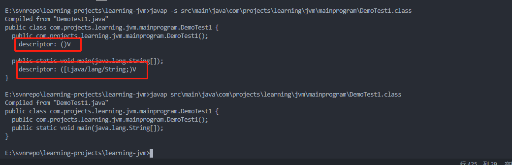

# <center>字节码文件结构</center>

Java是跨平台的，但是Jvm不是跨平台的，但是JVM是Java跨平台的关键技术。
可以让不同平台的jvm加载同一种与平台无关的字节码，源代码就可以不用根据不同平台编译成不同的二进制可执行文件。

一个真实的简单的class文件内容如下:


## 一、文件结构

JVM规定用u1、u2、u4三种数据结构来表示1、2、4字节的无符号整数，相同类型的若干条数据集合用表(table)的形式来存储。表示一种变长结构，由代表长度的表头n和紧随着的n个数据项来组成。class文件时采用类C语言的结构体来存储数据。

```c
ClassFile {
    u4 magic;
    u2 minor_version;
    u2 major_version;
    u2 constant_pool_count;
    cp_info constant_pool[constant_pool_count-1];
    u2 access_flags;
    u2 this_class;
    u2 super_class;
    u2 interfaces_count;
    u2 interfaces[interfaces_count];
    u2 fields_count;
    field_info fields[fields_count];
    u2 methods_count;
    method_info methods[methods_count];
    u2 attributes_count;
    attribute_info attributes[attributes_count];
}
```

类似以上的格式。

class文件由以上十个部分组成。

- 魔数。 Magic Number
- 版本号。Minor  Major Version
- 常量池。 Constant Pool
- 类访问标记。Access Flag
- 类索引。This Class
- 超类索引。Super Class
- 接口表索引。Interface
- 字段表。Field
- 方法表。Method
- 属性表。Attribute

一句顺口溜，记住10部分。

My Very Cute Animal Turns Savage In Full Moon Areas.

## 二、文件结构细解

### 2.1 Magic Number

魔数。使用文件名后缀来区分文件类型，有时可能会因为文件后缀可以修改，造成不是非常准确和靠谱。用魔数实现，是一些文件来确保文件类型正确的方式。

- PDF.%PDF-(十六进制:0X255044462D).
- PNG.\x89PNG.(十六进制:Ox89504E47).
  
文件格式的制定者可以自定义选择魔数值，只要魔数值没有被广泛采用且不会混淆即可。
因此按照上图来说，OxCAFEBABE是JVM识别.class文件的标志。虚拟器在加载类文件之前，会检查这四个字节，如果不是0xCAFEBABE则会抛出java.lang.ClassFormatError异常。

### 2.2 版本号

每次Java发布大版本，都会让主版本+1目前常用的java的版本号对应关系是:

|Java版本|Major Version|
|---|---|
|1.4|48|
|1.5|49|
|1.6|50|
|1.7|51|
|1.8|52|
|1.9|53|

### 2.3 常量池


这是类文件中最复杂的数据结构。
常量池是类文件中出现的第一个变长结构。常量池分两部分。

- 常量池大小。
  既然是池，就有大小，常量池大小由两个字节表示。假设常量池大小是n,那么常量池的真正有效索引就是
  1-n-1。也就是说，如果constant_pool_count等于10，那么索引就是1~9。0属于保留索引，在特殊时使用。
- 常量池项。
  最多包含n-1个元素。long和double类型的常量会占用两个索引位置，如果常量池包含了这两种类型的元素，
  实际的常量池的元素个数会少于n-1个。

常量池的项，通常由如下的数据结构来表示.

```c
cp_info{
    u1 tag;
    u1 info[];
}
```

每个数据项的数据结构，第一个字节表示常量项的tag（类型），接下来几个字节表示常量项的具体内容。
JAVA虚拟机目前一共定义14个常量项的tag类型，都以CONSTANT_开头，以info结尾。

如果想查看类文件的常量池，可以在javap的时候加上-v或者--verbose参数。

#### 2.3.1 CONSTANT_Integer_info和CONSTANT_Float_info

分别表示int和float类型的常量，都用4个字节来表数值常量。

java固定了boolean、byte、short、char类型的变量，在常量池中当做int处理。

#### 2.3.2 CONSTANT_Long_info和CONSTANT_Double_info

都用8字节表示具体的常量数值。
请记得Long和Double的常量池中会占用两个常量池的位置。

#### 2.3.3 CONSTANT_Utf8_info

存储字符串。

```c
CONSTANT_Utf8_info{
    u1 tag;
    u2 length;
    u1 bytes[length];
}
```

第一部分是tag，值为1；
第二部分是length，不代表字符串长度，而是表示第三部分字节数组的长度；
第三部分采用MUTF-8编码长度的length长度的字节数组。

**UTF8和MUTF8**:

- UTF8是一种变长的编码方式。1~4个字节表示一个字符。
  - 传统的ASCII编码字符（0x0001~Ox007E），UTF8用一个字节表示。英文字母的ASCII和UTF-8结果一样。
  - 0080~07FF。2个字节表示。
  - 0000 0800 ~ 0000 FFFF。3个字节表示。
  - 0001 0000 ~ 0010 FFFF。4个字节表示。
- MUTF8.
  - 2个字节表示空字符"\0",把前面介绍的双字节表示格式中的x全部填0。这样做的原因是在其他语言中会把空字符当做字符串的结束，而MUTF8这种处理
的方式会保证字符串不会出现空字符，C语言处理的时候不会意外截断。
  - MUTF8只用到了标准UTF8的编码中的单字节、双字节、三字节表示方法，没有用到4字节的表示方式。
编码在U+FFFF之上的字符，Java采用“代理对”通过2个字符表示。

#### 2.3.4 CONSTANT_String_info

用来表示String类型的常量对象。它和UTF8_Info的区别是后者存储了字符串真正的内容，而CONSTANT_String_info并不包含
真正的字符串的内容，仅仅包含一个指向常量池中CONSTANT_Utf8_info常量类型的索引string_index，它里面才是真正存储了字符串常量内容。

#### 2.3.5 CONSTANT_Class_info

这个结构表示类或接口，结构和String_info相同，不同的是tag的值，固定为7。name_index中存放的是一个CONSTANT_Utf8_info的值，它真正存的是类或接口的全限定名。

#### 2.3.6 CONSTANT_NameAndType_info

表示字段或者方法。

```c
CONSTANT_NameAndType_info{
    u1 tag;
    u2 name_index;
    u2 descriptor_index;
}

```

tag固定为12，
name_index和descriptro_index都指向一个utf8_info的索引，
name_index表示字段或方法的名字
descriptor_index表示字段或者方法的描述符，用来表示一个字段或者方法的类型。

#### 2.3.7 CONSTANT_Fieldref_info、CONSTANT_Methodref_info和Constant_interfaceMethodref_info

这三种比较类似，结构大致如下：

```c
CONSTANT_Fieldref_info{
    u1 tag;
    u2 class_index;
    u2 name_and_type_index;
}
CONSTANT_Methodref_info{
    u1 tag;
    u2 class_index;
    u2 name_and_type_index;
}
CONSTANT_InterfaceMethodref_info{
    u1 tag;
    u2 class_index;
    u2 name_and_type_index;
}

```

#### 2.3.8 CONSTANT_MethodType_info、 CONSTANT_MethodHandle_info 、CONSTANT_InvokeDynamic_info

这是Java7之后新增的，为了支持动态语言结构。
CONSTANT_InvokeDynamic_info: 主要作用是为invokedynamic指令提供启动引导方法。

```c
CONSTANT_InvokeDynamic_info{
    u1 tag;
    u2 bootstrap_method_attr_index;
    u2 name_and_type_index;
}

```

tag:固定为18；
bootstrap_method_attr_index:指向引导方法表数组的索引
name_and_type_index：指向一个索引，表示方法描述符。

### 2.4 Access Flag

紧随常量池之后。用来表示一个类是final、abstract等，两个字节表示，总共有16个标记位可供使用，目前只用了8个。


### 2.5 this_class、super_name、interfaces

用来确定类的继承关系。this_class表示类索引、super_name表示直接父类的索引、interfaces表示类或者接口的直接父接口。

### 2.6 字段表

紧随接口索引表之后的字段表。类中的字段被存储到这个集合，包括静态和非静态。

```c
{
    u2 fields_count;
    field_info fields[fields_count];
}

```

字段表也是变长结构，fields_count表示field的数量，接下来的fields表示字段集合，共有fields_count个，每一个字段用field_info表示。

#### 2.6.1 field_info

```c
field_info{
    u2 access_flags;
    u2 name_index;
    u2 descriptor_index;
    u2 attributes_count;
    acttribute_info attributes[attributes_count];
}

```

access_flags:字段的访问标记，标识public、static、final等；
name_index表示字段名，指向常量池的字符串常量；
descriptor_index表示描述符的索引，指向常量池的字符串常量；
acttribute_info表示属性个数和属性集合；

#### 2.6.2 字段访问标记

和类一样，字段也有自己的字段访问标记，但是比类更丰富。


他们之间也不是随意组合的，是需要符合语义。

#### 2.6.3 字段描述符

用来表示某个field的类型，比如在jvm中定义一个int类型的字段时，类文件存储的类型并不一定是字符串int，而是更简单的I.
可以分为三大类:

- 原始类型。用一个字符表示，比如J对应long，B对应byte。
- 引用类型。L表示。为了防止多个连续的引用类型描述符出现混乱，引用类型描述符最后都加一个分号";"作为结束。
  比如String的描述符为"Ljava/lang/String;"
- 数组类型。JVM使用一个前置的\[来表示数组类型，比如int[]的描述符为[I。多维数组知识增加了几个\[而已。比如Object[][][]的描述符
  为[[[Ljava/lang/Object;


#### 2.6.4 字段属性

与字段的属性相关的，包括ConstantValue、Synthetic、Signature、Deprecated、RuntimeVisibleAnnotations和RuntimeInvisibleAnnotations。

### 2.7 方法表

和前面属性类似类中定义的方法会存储在这里。

```c
{
    u2 methods_count;
    method_info methods[methods_count];
}
```

methods_count表示方法的数量，接下来的methods代表方法的集合，共有methods_count个，每一个方法用method_info表示。

#### 2.7.1 method_info结构

```c
method_info{
    u2 access_flags;
    u2 name_index;
    u2 descriptor_index;
    u2 attributes_count;
    attribute_info attributes[attributes_count];
}

```

name_index
descriptor_index 分别表示方法名和方法描述符的索引值，指向常量池的字符串常量。

attributes_count、attribute_info表示方法相关属性的个数和属性集合，包含很多信息，比如方法内部的字节码就放在code属性。

#### 2.7.2 方法访问标记

方法的访问标记比类和字段更丰富，12个。


#### 2.7.3 方法名和描述符

方法描述符表示一个方法所需要的参数和返回值。

#### 2.7.4 方法属性表

声明的异常、方法的字节码、是否过期标记等，可以在属性中存储。比较重要的属性有Code和Exceptions等。

### 2.8 属性表

方法表之后的解构时class文件的最后一部分，属性表。属性出现的地方很广泛，不只出现在字段和方法，顶层的class文件也会出现。

属性表：

```c
{
    u2 attributes_count;
    attribute_info attributes[attributes_count];
}

attribute_info{
    u2 attribute_name_index;
    u4 attribute_length;
    u1 info[attribute_length];

}
```

attribute_name_index指向常量池索引，根据这个索引得到attribute的名字，接下来的两部分表示info
数组的长度和具体byte数组的内容。

#### 2.8.1 ConstantValue属性

出现在field_info中，表示静态变量的初始值。

```c
ConstantValue_attribute{
    u2 attribute_name_index;
    //固定为2，因为接下来的内容只会有两个字节大小。
    u4 attribute_length;
    u2 constantvalue_index;
}
```

constantvalue_index指向常量池中具体的常量值索引，根据变量类型不容，指向的常量值也不同。如果变量是long类型，则指向CONSTANT_Long_info类型的常量。

#### 2.8.2 Code

类文件中最重要的组成部分，包含方法的字节码，除了native和abstract方法以外，每个method都有且仅有一个Code属性。

```c
Code_attribute{
    u2 attribute_name_index;
    u4 attribute_length;
    u2 max_stack;
    u2 max_locals;
    u4 code_length;
    u1 code[code_length];
    u2 exception_table_length;
    {
        u2 start_pc;
        u2 end_pc;
        u2 handler_pc;
        u2 catch_type;
    } exception_table[exception_table_length];
    u2 attributes_count;
    attribute_info attributes[attributes_count];
}
```

- 属性名索引。attribute_name_index，两个字节。指向常量池CONSTANT_Utf8_info常量，表示属性的名字。
- 属性长度。attribute_length。2个字节，属性值长度的大小。
- max_stack。操作数栈的最大深度，方法执行的任意期间操作数栈的深度都不会超过这个值。它的计算规则：有入栈的指令stack增加，有
  出栈的指令stack减少，在整个过程stack的最大值就是max_stack的值，增加和减少的值都是1，但也有例外。
  Long和Double相关的指令入栈会加2，void相关的指令则为0；
- max_locals。局部变量表的大小，它的值不等于方法中所有局部变量的数量之和，当一个局部作用域结束，它内部的局部变量占用的位置就可以被接下来的局部变量重复用了。
- code_length和code表示字节码相关的信息。code_length表示字节码指令的长度，占用4个字节，code是一个长度为code_length的字节数组，存储真正的字节码指令。
- exception_table_length和exception_table代表内部的异常表信息。try-catch就会生成异常表，exception_table_length表示接下来exception_table的数组长度，
  每个异常包含4个部分。
  
  ```c
    {
        u2 start_pc;
        u2 end_pc;
        u2 handler_pc;
        u2 catch_type;
    }
  ```
  这四个值，中前三个都是指向code字节数组的索引值，start_pc和end_pc表示异常处理器覆盖的字节码开始和结束的位置。
  是左闭右开区间[start_pc,end_pc)。handler_pc表示异常处理handler在code字节数组中的起始位置，异常被捕获后该跳转到何处继续执行。
  catch_type 表示要处理的异常类型是什么，两个字节表示，指向常量池中为CONSTANT_Class_info的常量项，如果catch_type为0，则表示可以处理任何异常，可用来实现finally的语义。
  当jvm执行到这个方法的时候，一旦发生了异常，如果发生的异常是这个catch_type对应的或者是子类，则跳转到code字节数组handler_pc出继续处理。
- attributes_count attributes[]表示Code属性的附属属性，JVM规定Code属性只能包含四种可选属性：
  - LineNumberTable
  - LocalVariableTable
  - LocalVariableTypeTable
  - StackMapTable
  LineNumberTable用来存源码行号和字节码偏移量之间的对应关系，属于调试信息，不是类文件运行必须的，默认都会生成。
  如果没有这个属性调试的时候就不能在源码中设置断点，也没有办法在代码抛出异常的时候在堆栈中显示出错的行号。

## 三、Javap

javap就是为了窥探class文件的内部细节。

> javap options *.classes

默认情况下javap会显示访问权限为public、protected和默认级别的方法，如果想要显示私有属性和方法，则要加上-p选项。

javap还有一个选项-s，可以输出类型描述符签名信息。


-c。可以对类文件进行反编译，可以显示出方法内的字节码。


-v.可以显示更详细的内容，如版本号、类访问权限、常量池相关的信息。如下:

```txt

Classfile /E:/svnrepo/learning-projects/learning-jvm/src/main/java/com/projects/learning/jvm/mainprogram/DemoTest1.class
  Last modified 2020-6-24; size 461 bytes
  MD5 checksum f0d0b70a021ebfb01aa4b6367c342fb5
  Compiled from "DemoTest1.java"
public class com.projects.learning.jvm.mainprogram.DemoTest1
  minor version: 0
  major version: 52
  flags: ACC_PUBLIC, ACC_SUPER
Constant pool:
   #1 = Methodref          #6.#15         // java/lang/Object."<init>":()V
   #2 = Fieldref           #16.#17        // java/lang/System.out:Ljava/io/PrintStream;
   #3 = String             #18            // Hello World
   #4 = Methodref          #19.#20        // java/io/PrintStream.println:(Ljava/lang/String;)V
   #5 = Class              #21            // com/projects/learning/jvm/mainprogram/DemoTest1
   #6 = Class              #22            // java/lang/Object
   #7 = Utf8               <init>
   #8 = Utf8               ()V
   #9 = Utf8               Code
  #10 = Utf8               LineNumberTable
  #11 = Utf8               main
  #12 = Utf8               ([Ljava/lang/String;)V
  #13 = Utf8               SourceFile
  #14 = Utf8               DemoTest1.java
  #15 = NameAndType        #7:#8          // "<init>":()V
  #16 = Class              #23            // java/lang/System
  #17 = NameAndType        #24:#25        // out:Ljava/io/PrintStream;
  #18 = Utf8               Hello World
  #19 = Class              #26            // java/io/PrintStream
  #20 = NameAndType        #27:#28        // println:(Ljava/lang/String;)V
  #21 = Utf8               com/projects/learning/jvm/mainprogram/DemoTest1
  #22 = Utf8               java/lang/Object
  #23 = Utf8               java/lang/System
  #24 = Utf8               out
  #25 = Utf8               Ljava/io/PrintStream;
  #26 = Utf8               java/io/PrintStream
  #27 = Utf8               println
  #28 = Utf8               (Ljava/lang/String;)V
{
  public com.projects.learning.jvm.mainprogram.DemoTest1();
    descriptor: ()V
    flags: ACC_PUBLIC
    Code:
      stack=1, locals=1, args_size=1
         0: aload_0
         1: invokespecial #1                  // Method java/lang/Object."<init>":()V
         4: return
      LineNumberTable:
        line 3: 0

  public static void main(java.lang.String[]);
    descriptor: ([Ljava/lang/String;)V
    flags: ACC_PUBLIC, ACC_STATIC
    Code:
      stack=2, locals=2, args_size=1
         0: getstatic     #2                  // Field java/lang/System.out:Ljava/io/PrintStream;
         3: ldc           #3                  // String Hello World
         5: invokevirtual #4                  // Method java/io/PrintStream.println:(Ljava/lang/String;)V
         8: return
      LineNumberTable:
        line 6: 0
        line 7: 8
}
SourceFile: "DemoTest1.java"

```

-l。显示行号表和局部变量表。如下所示:

```txt
Compiled from "DemoTest1.java"
public class com.projects.learning.jvm.mainprogram.DemoTest1 {
  public com.projects.learning.jvm.mainprogram.DemoTest1();
    LineNumberTable:
      line 3: 0

  public static void main(java.lang.String[]);
    LineNumberTable:
      line 6: 0
      line 7: 8
}
```
实际上没有输出局部变量表，只输出了行号表，原因是想要显示局部变量表，需要在javac的时候加上-g选项，
生成所有的调试信息选项，加上-g选项编译之后，再加上-l命令，则可以显示局部变量表。


