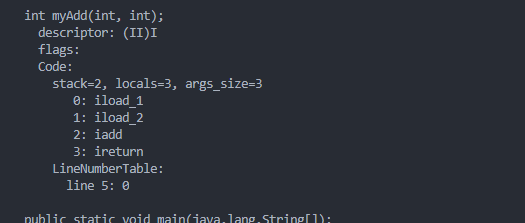
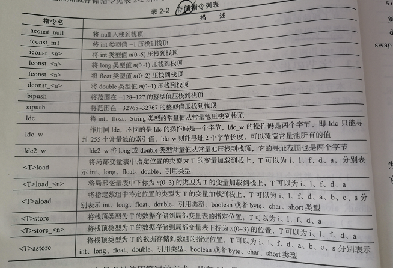
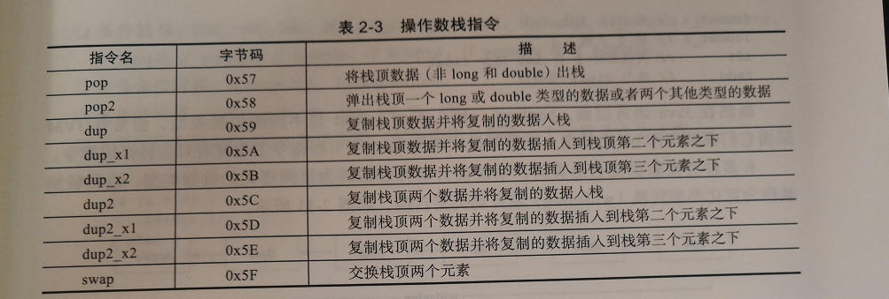
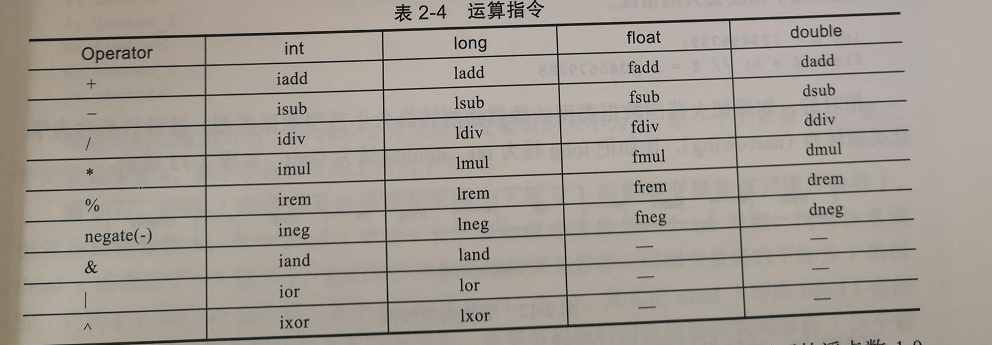
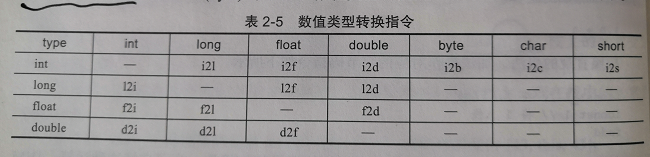
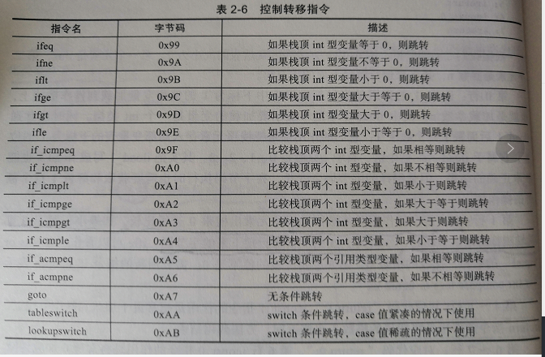
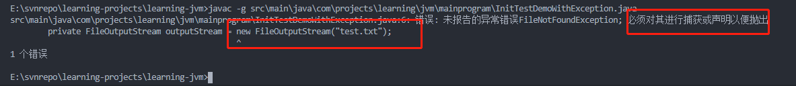
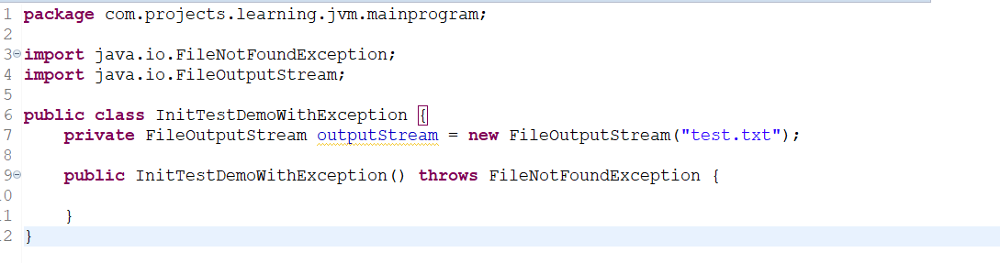

# <center>字节码基础</center>

## 一、字节码概述

jvm虚拟机的指令由一个字节长度的操作码和紧随其后的可选操作数构成。

> \<opcode> \[\<operand1>,\<operand2>]

示例:把整型常量100压栈到栈顶的指令是bipush 100，bipush是操作码，100是操作数。
字节码的由来，是操作码的长度由一个字节表示，这使得编译后的字节码文件非常小巧紧凑，但也直接限制整个jvm的操作码指令集最多只能有256个，目前已经超过了200个。

大部分字节码指令是与类型有关的，如ireturn、dreturn之类的，代表返回int或者double的值。这也让字节码的实际指令类型远少于200个。

字节码使用大端序(Big-Endian)表示，高位在前，低位在后。比如字节码指令：getfield 00 02，表示的是getfield 0x00 << 8 | 0x02 （getfield #2）。

字节码并不是某种虚拟CPU的机器码，而是介于源码和机器码之间的一种抽象，不过字节码通过jit技术可以进一步编译成机器码。

## 二、字节码分类

根据字节码的不同用途，可以大概分为以下几类:

- 加载和存储。iload将整型从局部变量表加载到操作数栈；
- 控制转移指令。条件分支：ifeq
- 对象操作。创建实例:new
- 方法调用。比如invokevirtual用于调用对象实例方法
- 运算指令和类型转换。iadd加法
- 线程同步。monitorenter和monitorexit支持synchronized关键字的语义；
- 异常处理。athrow显式抛出异常。

字节码运行在jvm上。

## 三、java虚拟机栈和栈帧

虚拟机的实现大概有两种方式：基于栈(Stack Based)和基于寄存器(Register based)。
典型的基于栈的虚拟机：HotSpot JVM、.net Clr。
典型的基于寄存器的虚拟机：Lua语言的LuaVM、Google的DalvikVM。

有什么不同呢？举个例子：

```java

int myAdd(int a , int b){
    return a + b;
}
```



```jvm
0: iload_1 //将a压入操作数栈
1: iload_2 //将b压入操作数栈
2: iadd //将栈顶的两个值相加，然后结果放回栈顶
3: ireturn //栈顶值返回
```

实现相同的lua代码：

```lua
local function myAdd(a , b )
    return a + b;
end
```

> luac -l -l -v -s test.lua查看lua的字节码

```lua
[1] ADD R2 R0 R1 ;R2 := R0 + R1
[2] RETURN R2 2 ; return R2
[3] RETURN R0 1 ; return
```

第一行调用ADD指令将R0寄存器和R1寄存器中的值相加，存储到R2中。
第二行返回R2寄存器的值。
第三行是lua的一个特殊处理，为了防止有分支漏掉了return语句，lua始终在最后插入一行return语句。

基于栈和基于寄存器的指令集架构各有优缺点：

- 基于栈。移植性好、指令短、实现简单，但是不能随机访问堆栈中的元素，完成相同功能所需的指令数一般比寄存器多，需要频繁入栈出战，不利于代码优化。
- 基于寄存器。速度快，充分利用寄存器，有利于程序优化，但是操作数需要显式指定，指令比较长。

### 3.1 栈帧

递归的时候，如果忘记递归退出条件，则会抛出Stack OverflowError异常。

HotSpotVM是基于栈的虚拟机，每个线程都有一个虚拟机栈，来存储栈帧，每次方法调用都伴随着栈帧的创建、销毁。

当线程请求分配的栈容量超过jvm允许的最大容量时，jvm将抛出StackOverFlowError异常。可以用JVM的参数，-Xss来指定线程栈大小，比如:-Xss:256k用于将栈的大小设置为256KB。

每个线程都有自己的java虚拟机栈，一个多线程的应用汇拥有多个java虚拟机栈，每个栈拥有自己的栈帧。

栈帧：用于支持虚拟机进行方法调用和方法执行的数据结构，随着方法调用而创建，方法结束而销毁。栈帧的存储空间分配在java虚拟机栈中，每个栈帧拥有自己的局部变量表、操作数栈、和指向常量池的引用。

#### 3.1.1 局部变量表

每个栈帧内部包含一组局部变量表的变量列表，大小在编译器已经确定。对应class文件中方法Code属性的max_locals字段，java虚拟机会根据这个字段来分配方法执行过程中需要分配的最大局部变量表容量。

以如下代码为例:

```java
public class MyJVMTest{
    public void foo(int id , String name){
        String tmp = "A";
    }
}
```

使用如下命令編譯和查看class信息:

> javac -g MyJVMTest.java
> javap -c -v -l MyJVMTest

java文件和class文件的具體位置需要跟你的路徑保持一致。

```txt

Classfile /E:/svnrepo/learning-projects/learning-jvm/src/main/java/com/projects/learning/jvm/mainprogram/MyJVMTest.class
  Last modified 2020-6-28; size 427 bytes
  MD5 checksum 7fd04aedba1acfaaa916f81587cdf447
  Compiled from "MyJVMTest.java"
public class MyJVMTest
  minor version: 0
  major version: 52
  flags: ACC_PUBLIC, ACC_SUPER
Constant pool:
   #1 = Methodref          #4.#21         // java/lang/Object."<init>":()V
   #2 = String             #22            // A
   #3 = Class              #23            // MyJVMTest
   #4 = Class              #24            // java/lang/Object
   #5 = Utf8               <init>
   #6 = Utf8               ()V
   #7 = Utf8               Code
   #8 = Utf8               LineNumberTable
   #9 = Utf8               LocalVariableTable
  #10 = Utf8               this
  #11 = Utf8               LMyJVMTest;
  #12 = Utf8               foo
  #13 = Utf8               (ILjava/lang/String;)V
  #14 = Utf8               id
  #15 = Utf8               I
  #16 = Utf8               name
  #17 = Utf8               Ljava/lang/String;
  #18 = Utf8               tmp
  #19 = Utf8               SourceFile
  #20 = Utf8               MyJVMTest.java
  #21 = NameAndType        #5:#6          // "<init>":()V
  #22 = Utf8               A
  #23 = Utf8               MyJVMTest
  #24 = Utf8               java/lang/Object
{
  public MyJVMTest();
    descriptor: ()V
    flags: ACC_PUBLIC
    Code:
      stack=1, locals=1, args_size=1
         0: aload_0
         1: invokespecial #1                  // Method java/lang/Object."<init>":()V
         4: return
      LineNumberTable:
        line 1: 0
      LocalVariableTable:
        Start  Length  Slot  Name   Signature
            0       5     0  this   LMyJVMTest;

  public void foo(int, java.lang.String);
    descriptor: (ILjava/lang/String;)V
    flags: ACC_PUBLIC
    Code:
      stack=1, locals=4, args_size=3
         0: ldc           #2                  // String A
         2: astore_3
         3: return
      LineNumberTable:
        line 3: 0
        line 4: 3
      LocalVariableTable:
        Start  Length  Slot  Name   Signature
            0       4     0  this   LMyJVMTest;
            0       4     1    id   I
            0       4     2  name   Ljava/lang/String;
            3       1     3   tmp   Ljava/lang/String;
}
SourceFile: "MyJVMTest.java"

```

可以看到foo方法只有两个参数，但是arg-size等于3.当一个实例方法（非静态方法）调用的时候，第0个局部变量是调用这个方法的实例本身的引用，也就是我们常用的this。因此我们调用foo(123,"hello")的时候，实际上底层的调用是foo(this,123,"hello"),这一点在Python中体现的更为明显，有兴趣的可以去参考或者尝试一下。

再看LocalVariableTable输出，显示了局部变量表的四个槽。且能看到locals=4，局部变量表的大小不是方法中所有局部变量的数量之和，它与变量的类型和作用域有关，当一个局部作用于结束，它内部的局部变量占用的位置就可以被接下来的局部变量复用了。

比如下面的示例:

```java
public static void foo2(){
    //locals=0 max_locals=0
    if(true){
        //locals=1,max_locals=1
        String a = "a";
    }

    //locals=0 max_locals=1
    if(true){
        //locals=1 ,max_locals=1
        String b = "b";
    }

    //locals=0 max_locals=1
}
```

foo2对应的方法局部变量表大小等于1，因为是静态方法，局部变量表不用自动添加this为第一个元素，a和b公用一个槽的位置。

当包含long或者double类型的变量时，这些变量会占用两个局部变量表的slot。以下为例：

```java
public void foo3(){
    double a = 1L;
    int b = 10;
}
```

同样的方法编译并用javap，得到的关于foo3的class内容如下:

```txt
public void foo3();
    descriptor: ()V
    flags: ACC_PUBLIC
    Code:
      stack=2, locals=4, args_size=1
         0: dconst_1
         1: dstore_1
         2: bipush        10
         4: istore_3
         5: return
      LineNumberTable:
        line 22: 0
        line 23: 2
        line 24: 5
      LocalVariableTable:
        Start  Length  Slot  Name   Signature
            0       6     0  this   LMyJVMTest;
            2       4     1     a   D
            5       1     3     b   I

```

可以看到D占用slot1和2的位置，I占用slot3的位置。

我们再加一个long型的，效果会更明显。

```java
public void foo3(){
    double a = 1L;
    int b = 10;
    long c = 100;
    int d = 10;
}
```

看到如下信息:

```txt
public void foo3();
    descriptor: ()V
    flags: ACC_PUBLIC
    Code:
      stack=2, locals=7, args_size=1
         0: dconst_1
         1: dstore_1
         2: bipush        10
         4: istore_3
         5: ldc2_w        #5                  // long 100l
         8: lstore        4
        10: bipush        10
        12: istore        6
        14: return
      LineNumberTable:
        line 22: 0
        line 23: 2
        line 24: 5
        line 25: 10
        line 26: 14
      LocalVariableTable:
        Start  Length  Slot  Name   Signature
            0      15     0  this   LMyJVMTest;
            2      13     1     a   D
            5      10     3     b   I
           10       5     4     c   J
           14       1     6     d   I
```

可以看到this占用slot0，a占用2个slot，从1-2；b占用1个slot，从3-3；c占用2个slot，从4-5，d占用1个slot6。

#### 3.1.2 操作数栈

每个栈帧内部包含一个操作数栈的后进先出栈，大小同样是编译期确定。jvm提供的很多字节码指令用于从局部变量表或者对象实例的字段中复制常量或者变量到操作数栈，也有一些指令用于从操作数栈取出数据、操作数据、和把结果重新入栈。在方法调用的时候，操作数栈也用于准备调用方法的参数和接收方法的返回结果。

比如:
iadd指令用于将两个int的数值相加，要求之前操作数栈已经存在两个int数值，在iadd 执行指令的时候，两个int数值从操作数栈中出栈，相加求和之后把结果重新入栈。

整个jvm执行的过程，就是局部变量表和操作数栈之间不断加载、存储的过程。

如何计算操作数栈的最大值？它对应方法Code属性里面的max_stack，表示当前方法的操作数栈在执行过程中任何时间点的最大深度。调用一个成员方法会把this和所有参数入栈，调用完毕this和所有参数都会出栈，如果方法有返回值，则会返回值入栈。

计算stack的方法如下：

遇到入栈的字节码指令，stack+=1或者stack+=2(根据不同的指令类型)，遇到出栈的字节码指令，则stack相应减少，这个过程stack最大值就是max_stack，也就是javap输出的stack的值。

## 四、 字节码指令

### 4.1 加载和存储

这两种指令使用很频繁，分为load和store、常量加载这三种。

#### 4.1.1 load

将局部变量表中的变量加载到操作数栈，比如iload_0讲局部变量表中下标为0的int类型变量加载到操作数栈上，根据不同的数据类型还有lload、fload、dload、aload，分别表示加载long、float、double和引用类型。

#### 4.1.2 store

把栈顶的数据存储到局部变量表，比如istore_0把操作数栈顶的元素存储到局部变量表下标为0的位置，这个位置存储int类型；相应的还有fstore、dstore、lstore、astore等。

#### 4.1.3 常量加载

常见的有const、push、ldc。const、push将常量值直接加载到操作数栈的栈顶，比如iconst_0表示把整数0加载到操作数栈上，bipush 100是把int常量100加载到操作数栈上。ldc指令是从常量池中加载对应的常量到操作数栈顶，比如ldc#10把常量池中下表为10的常量数据加载到操作数栈上。

同样是int类型，为什么有这么多种类？为了使字节码紧凑，int常量值根据n的范围，使用的指令有如下规则：

- [-1,5]之间。iconst_n，操作数和操作码加一起只占用一个字节。iconst_2对应十六进制为0x05,-1特殊，对应的指令是iconst_m1(0x02)。
- [-128,127]。bipush n方式，操作数和操作码一起占用2个字节，比如100(0x64)时，bipush 100对应十六进制0x1064。
- [-23768,32767]。sipush n。操作数和操作码一起占三个字节，如n为1024(0x0400)，对应的字节码为sipush 1024(0x110400).
- 其他范围。ldc这个范围的整数值被放在常量池里。比如n为40000，被存储到常量池里，加载指令为ldc#i，i为常量池的索引值。

下面是完整的加载指令：



### 4.2 操作数栈指令

常见的操作数栈指令，pop、dup、swap。
pop出栈栈顶元素。常见的场景是调用了有返回值的方法，但是没有使用这个返回值。
示例:

```java
public String foo(){
    return "";
}

public void bar(){
    foo();
}

```

编译之后，可以看到如下的内容:

```txt
public java.lang.String foo();
    descriptor: ()Ljava/lang/String;
    flags: ACC_PUBLIC
    Code:
      stack=1, locals=1, args_size=1
         0: ldc           #2                  // String
         2: areturn
      LineNumberTable:
        line 3: 0
      LocalVariableTable:
        Start  Length  Slot  Name   Signature
            0       3     0  this   LMyJVMTest2;

  public void bar();
    descriptor: ()V
    flags: ACC_PUBLIC
    Code:
      stack=1, locals=1, args_size=1
         0: aload_0
         1: invokevirtual #3                  // Method foo:()Ljava/lang/String;
         4: pop
         5: return
      LineNumberTable:
        line 7: 0
        line 8: 5
      LocalVariableTable:
        Start  Length  Slot  Name   Signature
            0       6     0  this   LMyJVMTest2;
```

可以看到bar方法中，第四个指令pop，用于弹出栈顶元素并返回。

dup指令用复制栈顶元素并压入栈顶，比如创建对象的时候会用到dup。
swap用于交换栈顶的两个元素。

还有稍复杂一点的：
dup_x1
dup2_x1
dup2_x2。

dup_x1为例。指复制操作数栈顶的值，并插入到栈顶以下2个值，可以拆开实现:

- v1 = stack.pop()//弹出栈顶元素记为v1
- v2 = stack.pop()//弹出次栈顶元素记为v2(此时已经是栈顶元素，相对于v1第一步叫次栈顶元素)
- state.push(v1);//v1入栈
- state.push(v2);//v2入栈
- state.push(v1);//v1再次入栈

看个示例代码:

```java
public class Hello{
    private int id;

    public int incAndGetId(){
        return ++id;
    }
}
```

详见(MyJVMTestWithDupCommand.txt)这个文件。
可看到关键内容:

```txt
public int incAndGetId();
    descriptor: ()I
    flags: ACC_PUBLIC
    Code:
      stack=3, locals=1, args_size=1
         0: aload_0
         1: dup
         2: getfield      #2                  // Field id:I
         5: iconst_1
         6: iadd
         7: dup_x1
         8: putfield      #2                  // Field id:I
        11: ireturn
      LineNumberTable:
        line 4: 0
      LocalVariableTable:
        Start  Length  Slot  Name   Signature
            0      12     0  this   LMyJVMTestWithDupCommand;
```

完整的操作数栈指令如下:



### 4.3 运算和类型转换



如果参与运算的数据类型不同，则会出现类型转换指令。JVM会先把两个数据类型转换为一样，再进行运算，但是可能会有精度问题。

在JAVA语言层面，boolean、char、byte、short是不同的类型，但是在jvm中都会当做int处理。不需要显式转换，直接骂中也没有对应的转换指令。

当有多种类型参与运算的时候，系统自动把数据类型转为范围更大的数据类型，这叫宽化类型转换，或者叫自动转换。

> byte > short > int > long > float > double

自动类型转换不意味着不丢失精度。
比如下面的代码:

```java
int n = 123456789;
float f = n;//f=1.13456792E8
```

相应的，大范围数据转化为小范围的数据类型，称为窄化类型转换，通常会有精度丢失,甚至有可能在目标类型范围过窄时发生截断，变成完全不一样的值。

> byte < short < int < long < float < double

以下是数据转换类型的指令:



### 4.4 控制转移指令

控制转移指令用于有条件或者无条件的跳转，常见的if-then-else、三目表达式、for循环、异常处理等都属于这个范畴。

- 条件转移。ifeq、iflt、ifle、ifne、ifgt、ifge、ifnull、ifnonnull、if_icmpeq、if_icmpne、if_icmplt、if_icmpgt、if_icmple、if_icmpge、if_acmpeq、if_acmpne。
- 复合条件转移。tableswitch、lookupswitch。
- 无条件转移。goto、goto_w、jsr、jsr_w、ret.



### 4.5 for语句的原理

for(item: array)就是语法糖，字节码会让它现出原形，回归本质，本质就是数组的循环遍历。

### 4.6 switch-case的实现原理

tableswitch和lookupswitch两条指令生成switch语句的编译代码。
为什么会有两条语句？基于效率的考量。

示例代码:

```java
int chooseNear(int i){
    switch(i){
        case 100: return 0;
        case 101: return 1;
        case 104: return 4;
        default: return -1;
    }
}
```

对应的字节码如下所示:

```txt
int chooseNear(int);
    descriptor: (I)I
    flags:
    Code:
      stack=1, locals=2, args_size=2
         0: iload_1
         1: tableswitch   { // 100 to 104

                     100: 36

                     101: 38

                     102: 42

                     103: 42

                     104: 40
                 default: 42
            }
        36: iconst_0
        37: ireturn
        38: iconst_1
        39: ireturn
        40: iconst_4
        41: ireturn
        42: iconst_m1
        43: ireturn
      LineNumberTable:
        line 3: 0
        line 4: 36
        line 5: 38
        line 6: 40
        line 7: 42
      LocalVariableTable:
        Start  Length  Slot  Name   Signature
            0      44     0  this   LMyJVMTestWithSwitchCase;
            0      44     1     i   I
      StackMapTable: number_of_entries = 4
        frame_type = 36 /* same */
        frame_type = 1 /* same */
        frame_type = 1 /* same */
        frame_type = 1 /* same */
```

可以看出case中本来没有102、103,但是字节码中出现了，原因是编译器会对case的值作分析，如果case的值比较紧凑，中间有少量的断层或者没有断层，则会选择使用tableswitch来实现swtich-case，如果case有大量断层，会生成一些虚假的case帮忙补齐，这样可以在O(1)时间复杂度的查找。case的值已经被补齐为连续的值，通过下标可以一次找到。

再看一个断层严重的例子。

```java
int chooseFar(int i){
    switch(i){
        case 1: return 1;
        case 10: return 10;
        case 100: return 100;
        default: return -1;
    }
}
```

字节码如下：

```txt
int chooseFar(int);
    descriptor: (I)I
    flags:
    Code:
      stack=1, locals=2, args_size=2
         0: iload_1
         1: lookupswitch  { // 3

                       1: 36

                      10: 38

                     100: 41
                 default: 44
            }
        36: iconst_1
        37: ireturn
        38: bipush        10
        40: ireturn
        41: bipush        100
        43: ireturn
        44: iconst_m1
        45: ireturn
      LineNumberTable:
        line 13: 0
        line 14: 36
        line 15: 38
        line 16: 41
        line 17: 44
      LocalVariableTable:
        Start  Length  Slot  Name   Signature
            0      46     0  this   LMyJVMTestWithSwitchCase;
            0      46     1     i   I
      StackMapTable: number_of_entries = 4
        frame_type = 36 /* same */
        frame_type = 1 /* same */
        frame_type = 2 /* same */
        frame_type = 2 /* same */
```

可以看出，断层严重的时候，使用的是lookupswitch，因为如果还是采用之前的tableswitch，会生成上百个case，class文件会爆炸式增长。lookupswitch采用键值排序的方式，查找的时候可以二分查找，时间复杂度是O(logn)。

### 4.7 String的switch-case实现原理

上面看到的tableswitch和lookupswitch，只支持整型，那么string是怎么完成的呢？

看看示例代码:

```java

String chooseString(String sex ){
        switch (sex) {
            case "man":
                return "man";
            case "woman":
                return "woman";
            default:
                return "nosex";
        }
    }
```

字节码为：

```txt
java.lang.String chooseString(java.lang.String);
    descriptor: (Ljava/lang/String;)Ljava/lang/String;
    flags:
    Code:
      stack=2, locals=4, args_size=2
         0: aload_1
         1: astore_2
         2: iconst_m1
         3: istore_3
         4: aload_2
         5: invokevirtual #2                  // Method java/lang/String.hashCode:()I
         8: lookupswitch  { // 2

                  107866: 36

               113313666: 50
                 default: 61
            }
        36: aload_2
        37: ldc           #3                  // String man
        39: invokevirtual #4                  // Method java/lang/String.equals:(Ljava/lang/Object;)Z
        42: ifeq          61
        45: iconst_0
        46: istore_3
        47: goto          61
        50: aload_2
        51: ldc           #5                  // String woman
        53: invokevirtual #4                  // Method java/lang/String.equals:(Ljava/lang/Object;)Z
        56: ifeq          61
        59: iconst_1
        60: istore_3
        61: iload_3
        62: lookupswitch  { // 2

                       0: 88

                       1: 91
                 default: 94
            }
        88: ldc           #3                  // String man
        90: areturn
        91: ldc           #5                  // String woman
        93: areturn
        94: ldc           #6                  // String nosex
        96: areturn
      LineNumberTable:
        line 22: 0
        line 24: 88
        line 26: 91
        line 28: 94
      LocalVariableTable:
        Start  Length  Slot  Name   Signature
            0      97     0  this   LMyJVMTestWithSwitchCase;
            0      97     1   sex   Ljava/lang/String;
      StackMapTable: number_of_entries = 6
        frame_type = 253 /* append */
          offset_delta = 36
          locals = [ class java/lang/String, int ]
        frame_type = 13 /* same */
        frame_type = 10 /* same */
        frame_type = 26 /* same */
        frame_type = 2 /* same */
        frame_type = 2 /* same */
```

由class解析出来的内容可以看出，会先对string的各个值，做hashCode()方法调用，后面对hashCode进行switch之后，这是采用的方式一般是lookupswitch，因为hashCode一般都比较离散，所以不适合用tableswitch；
调用之后，会产生一个matchIndex的值，会再对matchIndex进行一次switch调用，此时就类似于之前的整型switch。

那么如果hashCode冲突的时候怎么办？比如Aa和BB？

可以尝试一下，会发现多了一次字符串的equals的调用。在判断时，会判断与BB不相等的时候，会继续判断是否等于Aa。

**如何构造两个hashCode相等的字符串？**：
看看hashCode的源码

```java
public int hashCode(){
    int h = hash;
    if(h == 0 && value.length > 0 ){
        char val[] = value;
        for (int i = 0 ; i < value.length ; i++ ){
            h = 31 * h + val[i];
        }

        hash = h;
    }

    return h;
}
```

假设要构造的字符串只有两个字符，“ab”和“cd”表示，如果满足hashCode相等，则满足：

> a * 31 + b = c * 31 + d; => 31 * (a - c) =  d - b ;

其中有一个特殊解，可以看出来，a - c = 1 , d - b =31;只要满足这个，则ab和cd的这两个字符串的hashCode一定相等。比如Aa和BB、Ba和CB、Ca和DB之类。

### 4.8 ++i和i++

i++在字节码层面，先把i的值加载到操作数栈上，随后才会对局部变量i执行加一操作，留在操作数栈顶的还是i的旧值。如果此时把栈顶值赋给其他值，则这个值依然是加一之前的值。

++i可以看出，它会先把局部变量表下标为X的值加一，然后把它加载到操作数栈上，随后又从操作数栈上出栈赋值给局部变量表中下标为X的变量。如果此时把栈顶值赋给其他值，则这个值则是加一之后的值。

### 4.9 try-catch-finally

#### 4.9.1 try-catch

```java
public class MyJVMTestWithTryCatch{
    public static class MyException1 extends Exception{

    }

    public void tryItOut1() throws MyException1{

    }

    public void handleException(){

    }
    
    public void foo(){
        try{
            tryItOut1();
        }catch(MyException1 e){
            handleException();
        }
    }
}
```

字节码如下：

```txt
public void foo();
    descriptor: ()V
    flags: ACC_PUBLIC
    Code:
      stack=1, locals=2, args_size=1
         0: aload_0
         1: invokevirtual #2                  // Method tryItOut1:()V
         4: goto          12
         7: astore_1
         8: aload_0
         9: invokevirtual #4                  // Method handleException:()V
        12: return
      Exception table:
         from    to  target type
             0     4     7   Class MyJVMTestWithTryCatch$MyException1
      LineNumberTable:
        line 16: 0
        line 19: 4
        line 17: 7
        line 18: 8
        line 20: 12
      LocalVariableTable:
        Start  Length  Slot  Name   Signature
            8       4     1     e   LMyJVMTestWithTryCatch$MyException1;
            0      13     0  this   LMyJVMTestWithTryCatch;
      StackMapTable: number_of_entries = 2
        frame_type = 71 /* same_locals_1_stack_item */
          stack = [ class MyJVMTestWithTryCatch$MyException1 ]
        frame_type = 4 /* same */
```

由之前的内容可以看出来， goto语句在没有产生异常的时候，会跳到return语句退出，那么如果抛出了异常该怎么处理？

之前提到过，如果方法包含try-catch，则这个方法在编译的时候，会在Code属性中有一个异常表，这个异常表中的每个异常项，都表示一个异常处理器，由from、to、target这三种指针，还有一个异常类型type一共四部分组成。这些指针的值，是字节码的索引，用于定位字节码，含义是:如果在from到to这段字节码范围内，抛出了异常类型为type的异常，会跳到target指针所在的字节码处继续执行。

如上面的字节码就表示，如果在0-4这一段字节码中如果抛出了异常类型为MyException1的异常，则调到7字节码处执行。

**值得注意的是**：如果有异常抛出了，jvm会自动将异常对象加载到操作数栈顶。

如果有多个catch怎么办呢？看代码:

```java
public void fooMultiException(){
        try{
            tryItOut1();
        }catch(MyException1 e){
            handleException();
        }catch(Exception e1){
            handleException();
        }
    }
```

字节码为：

```txt
public void fooMultiException();
    descriptor: ()V
    flags: ACC_PUBLIC
    Code:
      stack=1, locals=2, args_size=1
         0: aload_0
         1: invokevirtual #2                  // Method tryItOut1:()V
         4: goto          20
         7: astore_1
         8: aload_0
         9: invokevirtual #4                  // Method handleException:()V
        12: goto          20
        15: astore_1
        16: aload_0
        17: invokevirtual #4                  // Method handleException:()V
        20: return
      Exception table:
         from    to  target type
             0     4     7   Class MyJVMTestWithTryCatch$MyException1
             0     4    15   Class java/lang/Exception
      LineNumberTable:
        line 24: 0
        line 29: 4
        line 25: 7
        line 26: 8
        line 29: 12
        line 27: 15
        line 28: 16
        line 30: 20
      LocalVariableTable:
        Start  Length  Slot  Name   Signature
            8       4     1     e   LMyJVMTestWithTryCatch$MyException1;
           16       4     1    e1   Ljava/lang/Exception;
            0      21     0  this   LMyJVMTestWithTryCatch;
      StackMapTable: number_of_entries = 3
        frame_type = 71 /* same_locals_1_stack_item */
          stack = [ class MyJVMTestWithTryCatch$MyException1 ]
        frame_type = 71 /* same_locals_1_stack_item */
          stack = [ class java/lang/Exception ]
        frame_type = 4 /* same */
```

可以看出在9和17的位置，有两个catch的处理分支，异常表里面也多了一个记录，程序出现异常的时候。jvm会从上到下遍历异常表中的所有条目。当触发异常的字节码索引值在某个from到to的范围内，则会判断抛出的异常是不是想捕获的异常或者其子类。
如果一旦异常类型匹配，jvm会将控制跳转到target指向的异常字节码继续执行，如果没有匹配，则继续遍历。如果遍历完所有的异常表，还未找到匹配的异常处理器，那么将会把该异常继续抛到调用方，重复这个步骤。

#### 4.9.2 finally

曾经我们经常听到有一句关于finally的话：finally的语句块一定会执行。背后的原理却不简单。按照如下示例代码：

```java
public void fooWithFinally(){
        try{
            tryItOut1();
        }catch(MyException1 e){
            handleException();
        }finally{
            handleFinally();
        }
    }
```

看看字节码:

```txt
public void fooWithFinally();
    descriptor: ()V
    flags: ACC_PUBLIC
    Code:
      stack=1, locals=3, args_size=1
         0: aload_0
         1: invokevirtual #2                  // Method tryItOut1:()V
         4: aload_0
         5: invokevirtual #6                  // Method handleFinally:()V
         8: goto          30
        11: astore_1
        12: aload_0
        13: invokevirtual #4                  // Method handleException:()V
        16: aload_0
        17: invokevirtual #6                  // Method handleFinally:()V
        20: goto          30
        23: astore_2
        24: aload_0
        25: invokevirtual #6                  // Method handleFinally:()V
        28: aload_2
        29: athrow
        30: return
      Exception table:
         from    to  target type
             0     4    11   Class MyJVMTestWithTryCatch$MyException1
             0     4    23   any
            11    16    23   any
      LineNumberTable:
        line 38: 0
        line 42: 4
        line 43: 8
        line 39: 11
        line 40: 12
        line 42: 16
        line 43: 20
        line 42: 23
        line 43: 28
        line 44: 30
      LocalVariableTable:
        Start  Length  Slot  Name   Signature
           12       4     1     e   LMyJVMTestWithTryCatch$MyException1;
            0      31     0  this   LMyJVMTestWithTryCatch;
      StackMapTable: number_of_entries = 3
        frame_type = 75 /* same_locals_1_stack_item */
          stack = [ class MyJVMTestWithTryCatch$MyException1 ]
        frame_type = 75 /* same_locals_1_stack_item */
          stack = [ class java/lang/Throwable ]
        frame_type = 6 /* same */
```

可以看到有三处的位置，进行了handleFinally的调用，这说明当前的java编译器采用的是复制finally语句的方式，把其插入到try和catch代码块中所有正常退出和异常退出之前。这就是finally一定会被执行的思想来源。

借着这个基础，可以理解finally语句中如果包含return语句，会发生什么。因为finally语句块插入在try和catch返回指令之前，finally语句会“覆盖”其他的返回，包括异常。

所以还可以看出，任何的finally语句，都可以只用try-catch来代替实现。

再看看如果在finally中修改return语句的值，会发生什么？

```java
public int tryCatchWithFinalliAndModifyReturnValue(){
    int i = 100;

    try{
        return i;
    }finally{
        ++i;
    }
}
```

这里采用了++i，就是为了让i的值及时变化。看看字节码:

```txt
public int tryCatchWithFinalliAndModifyReturnValue();
    descriptor: ()I
    flags: ACC_PUBLIC
    Code:
      stack=1, locals=4, args_size=1
         0: bipush        100
         2: istore_1
         3: iload_1
         4: istore_2
         5: iinc          1, 1
         8: iload_2
         9: ireturn
        10: astore_3
        11: iinc          1, 1
        14: aload_3
        15: athrow
      Exception table:
         from    to  target type
             3     5    10   any
      LineNumberTable:
        line 47: 0
        line 50: 3
        line 52: 5
        line 50: 8
        line 52: 10
        line 53: 14
      LocalVariableTable:
        Start  Length  Slot  Name   Signature
            0      16     0  this   LMyJVMTestWithTryCatch;
            3      13     1     i   I
      StackMapTable: number_of_entries = 1
        frame_type = 255 /* full_frame */
          offset_delta = 10
          locals = [ class MyJVMTestWithTryCatch, int ]
          stack = [ class java/lang/Throwable ]
```

finally语句中包含return语句的时候，会把返回值暂存到临时变量中，这个finally语句中的++i操作只会影响i的值，不会影响已经暂存的临时变量的值。

换一个代码示例:

```java
public String tryCatchWithFinallyAndModifyReturn(){
    String s = "hello";
    try{
        return s ;
    }finally{
        s = null;
    }
}
```

看看字节码:

```txt
public java.lang.String tryCatchWithFinallyAndModifyReturn();
    descriptor: ()Ljava/lang/String;
    flags: ACC_PUBLIC
    Code:
      stack=1, locals=4, args_size=1
         0: ldc           #7                  // String hello
         2: astore_1
         3: aload_1
         4: astore_2
         5: ldc           #8                  // String xyz
         7: astore_1
         8: aload_2
         9: areturn
        10: astore_3
        11: ldc           #8                  // String xyz
        13: astore_1
        14: aload_3
        15: athrow
      Exception table:
         from    to  target type
             3     5    10   any
      LineNumberTable:
        line 57: 0
        line 59: 3
        line 61: 5
        line 59: 8
        line 61: 10
        line 62: 14
      LocalVariableTable:
        Start  Length  Slot  Name   Signature
            0      16     0  this   LMyJVMTestWithTryCatch;
            3      13     1     s   Ljava/lang/String;
      StackMapTable: number_of_entries = 1
        frame_type = 255 /* full_frame */
          offset_delta = 10
          locals = [ class MyJVMTestWithTryCatch, class java/lang/String ]
          stack = [ class java/lang/Throwable ]
```

可以看出，0-2的位置就是加载hello字符串到索引1的位置，赋值给变量s。
3-4是将局部变量s的引用加载到栈上，随后赋值给局部变量表中的2位置，这个变量在源代码中不存在，这是一个临时变量，记为tmp。5-7行就是把"xyz"载进来，加载到栈上，随后赋值给变量s.
8-9的位置：把tmp局部变量加载到栈顶，tmp指向的字符串依旧是原来的"hello",随后ireturn把栈顶元素返回。

这个过程和如下的代码类似:

```java
public String tryCatchWithFinallyAndModifyReturn(){
    String s = "hello";
    String tmp = s;
    s = "xyz";
    return tmp ;
}
```

### 4.10 try-with-resource原理

原来的try-catch-finally用法，可能会在finally中进行一些close的操作，但有时怕就怕try中抛出异常，finally中的收尾操作也抛出异常，那么可以由前面的try-catch-finally原理来推断，finally中的异常会捷足先登，覆盖掉try中的异常。

举个例子:

```java
import java.io.FileOutputStream;
import java.io.IOException;
public static void tryCatchDemoWithFinallyCommon() throws IOException{
    FileOutputStream in = null;
    try{
        in = new FileOutputStream("test.txt");
        in.write(1);
    }finally{
        if(null != in){
            in.close();
        }
    }
}

public static void tryCatchDemoWithResource() throws IOException{
    try(FileOutputStream in = new FileOutputStream("test.txt")){
        in.write(1);
    }
}
```

字节码如下:

```txt
public static void tryCatchDemoWithFinallyCommon() throws java.io.IOException;
    descriptor: ()V
    flags: ACC_PUBLIC, ACC_STATIC
    Code:
      stack=3, locals=2, args_size=0
         0: aconst_null
         1: astore_0
         2: new           #9                  // class java/io/FileOutputStream
         5: dup
         6: ldc           #10                 // String test.txt
         8: invokespecial #11                 // Method java/io/FileOutputStream."<init>":(Ljava/lang/String;)V
        11: astore_0
        12: aload_0
        13: iconst_1
        14: invokevirtual #12                 // Method java/io/FileOutputStream.write:(I)V
        17: aconst_null
        18: aload_0
        19: if_acmpeq     41
        22: aload_0
        23: invokevirtual #13                 // Method java/io/FileOutputStream.close:()V
        26: goto          41
        29: astore_1
        30: aconst_null
        31: aload_0
        32: if_acmpeq     39
        35: aload_0
        36: invokevirtual #13                 // Method java/io/FileOutputStream.close:()V
        39: aload_1
        40: athrow
        41: return
      Exception table:
         from    to  target type
             2    17    29   any
      LineNumberTable:
        line 68: 0
        line 70: 2
        line 71: 12
        line 73: 17
        line 74: 22
        line 73: 29
        line 74: 35
        line 76: 39
        line 77: 41
      LocalVariableTable:
        Start  Length  Slot  Name   Signature
            2      40     0    in   Ljava/io/FileOutputStream;
      StackMapTable: number_of_entries = 3
        frame_type = 255 /* full_frame */
          offset_delta = 29
          locals = [ class java/io/FileOutputStream ]
          stack = [ class java/lang/Throwable ]
        frame_type = 252 /* append */
          offset_delta = 9
          locals = [ class java/lang/Throwable ]
        frame_type = 250 /* chop */
          offset_delta = 1
    Exceptions:
      throws java.io.IOException
```

如果在in.write()和in.close()同时抛出异常的话，则调用方收到的是in.close()抛出的异常。in.write()抛出的异常，虽很重要，但是莫名其妙消失了。这不是我们想要的结果。那么想要一种方式，既可以抛出try中的异常，又不丢掉finally的异常。

看看try-with-resource的字节码。

```txt
public static void tryCatchDemoWithResource() throws java.io.IOException;
    descriptor: ()V
    flags: ACC_PUBLIC, ACC_STATIC
    Code:
      stack=3, locals=5, args_size=0
         0: new           #9                  // class java/io/FileOutputStream
         3: dup
         4: ldc           #10                 // String test.txt
         6: invokespecial #11                 // Method java/io/FileOutputStream."<init>":(Ljava/lang/String;)V
         9: astore_0
        10: aconst_null
        11: astore_1
        12: aload_0
        13: iconst_1
        14: invokevirtual #12                 // Method java/io/FileOutputStream.write:(I)V
        17: aload_0
        18: ifnull        86
        21: aload_1
        22: ifnull        41
        25: aload_0
        26: invokevirtual #13                 // Method java/io/FileOutputStream.close:()V
        29: goto          86
        32: astore_2
        33: aload_1
        34: aload_2
        35: invokevirtual #15                 // Method java/lang/Throwable.addSuppressed:(Ljava/lang/Throwable;)V
        38: goto          86
        41: aload_0
        42: invokevirtual #13                 // Method java/io/FileOutputStream.close:()V
        45: goto          86
        48: astore_2
        49: aload_2
        50: astore_1
        51: aload_2
        52: athrow
        53: astore_3
        54: aload_0
        55: ifnull        84
        58: aload_1
        59: ifnull        80
        62: aload_0
        63: invokevirtual #13                 // Method java/io/FileOutputStream.close:()V
        66: goto          84
        69: astore        4
        71: aload_1
        72: aload         4
        74: invokevirtual #15                 // Method java/lang/Throwable.addSuppressed:(Ljava/lang/Throwable;)V
        77: goto          84
        80: aload_0
        81: invokevirtual #13                 // Method java/io/FileOutputStream.close:()V
        84: aload_3
        85: athrow
        86: return
      Exception table:
         from    to  target type
            25    29    32   Class java/lang/Throwable
            12    17    48   Class java/lang/Throwable
            12    17    53   any
            62    66    69   Class java/lang/Throwable
            48    54    53   any
      LineNumberTable:
        line 80: 0
        line 81: 12
        line 82: 17
        line 80: 48
        line 82: 53
        line 83: 86
      LocalVariableTable:
        Start  Length  Slot  Name   Signature
           10      76     0    in   Ljava/io/FileOutputStream;
      StackMapTable: number_of_entries = 8
        frame_type = 255 /* full_frame */
          offset_delta = 32
          locals = [ class java/io/FileOutputStream, class java/lang/Throwable ]
          stack = [ class java/lang/Throwable ]
        frame_type = 8 /* same */
        frame_type = 70 /* same_locals_1_stack_item */
          stack = [ class java/lang/Throwable ]
        frame_type = 68 /* same_locals_1_stack_item */
          stack = [ class java/lang/Throwable ]
        frame_type = 255 /* full_frame */
          offset_delta = 15
          locals = [ class java/io/FileOutputStream, class java/lang/Throwable, top, class java/lang/Throwable ]
          stack = [ class java/lang/Throwable ]
        frame_type = 10 /* same */
        frame_type = 3 /* same */
        frame_type = 255 /* full_frame */
          offset_delta = 1
          locals = []
          stack = []
    Exceptions:
      throws java.io.IOException
```

发现字节码中出现了新的名词:Throwable.addSuppressed。

Java7给Throwable增加以个addSuppressed方法，当一个异常被抛出的时候可能有其他的异常因为该异常而被抑制，从而无法正常抛出，这个时候可以addSuppressed方法，把抑制的异常记录下来，这些异常会出现在抛出的异常的堆栈信息中，也可以通过getSuppressed获取。好处就是可以不丢失异常，方便调试。

由此可见可以用以下的方式改写try-with-resource。

```java
public static void tryCatchDemoSameUsageWithTryWithResource() throws IOException{
    FileOutputStream in = null;
    Exception tmpException = null;
    try{
        in = new FileOutputStream("test.txt");
        in.write(1);
    }catch(Exception e){
        tmpException = e;
        throw e;
    }finally{
        if(null != in){
            if(null != tmpException){
                try{
                    in.close();
                }catch(Exception e){
                    tmpException.addSupressed(e);
                }
            }else{
                in.close();
            }
        }
    }
}
```

上面的代码中如果in.close抛出异常，这个异常不会覆盖原来的异常，只是放到源异常的supressed异常中。

总结：try-with-resource不是简单的在finally中加入.close方法，因为finally中的close有可能会淹没真正的异常；同时引入了supressed异常，即可抛出真正的异常，又可以调用addSupressed附带上被覆盖的异常。

### 4.11 对象相关的字节码

#### 4.11.1 \<init>方法

对象初始化方法,类构造方法、非静态变量的初始化、对象初始化代码块都会被编译到这个方法。

示例代码:

```java
public class InitTestDemoCommon{
    //初始化变量
    private int a = 10;

    //构造方法
    public InitTestDemoCommon(){
        int c = 30;
    }

    //对象初始化代码块
    {
        int b = 20;
    }
}
```

字节码如下:

```txt
public InitTestDemoCommon();
    descriptor: ()V
    flags: ACC_PUBLIC
    Code:
      stack=2, locals=2, args_size=1
         0: aload_0
         1: invokespecial #1                  // Method java/lang/Object."<init>":()V
         4: aload_0
         5: bipush        10
         7: putfield      #2                  // Field a:I
        10: bipush        20
        12: istore_1
        13: bipush        30
        15: istore_1
        16: return
      LineNumberTable:
        line 3: 0
        line 2: 4
        line 7: 10
        line 4: 13
        line 5: 16
      LocalVariableTable:
        Start  Length  Slot  Name   Signature
            0      17     0  this   LInitTestDemoCommon;
           16       1     1     c   I
```

上面的可以看出5-7 10-12 13-15 分别把10 20 30的赋值过程体现出来。虽然java语法上允许我们把成员变量初始化和初始化代码块写在构造方法之外，但是在编译的时候，统一会编进init方法。

看一个比较明显的例子：

```java
public class InitTestDemoWithException {
	private FileOutputStream outputStream = new FileOutputStream("test.txt");

	public InitTestDemoWithException() {

	}
}
```

在编译的时候，会出现如下的错误:



为了使编译通过，只需要在构造方法上加上异常处理即可：



这也从侧面证明了，成员变量的初始化是在init中进行的。

#### 4.11.2 new、dup、invokespecial对象创建的三条指令

new是java的关键字，字节码指令中也存在new指令，但两者不同。
创建对象的时候发生了什么？

```java
public void testMethodWithNew(){
        InitTestDemoCommon initTestDemoCommon = new InitTestDemoCommon();
    }
```

字节码:

```txt
public void testMethodWithNew();
    descriptor: ()V
    flags: ACC_PUBLIC
    Code:
      stack=2, locals=2, args_size=1
         0: new           #3                  // class com/projects/learning/jvm/mainprogram/InitTestDemoCommon
         3: dup
         4: invokespecial #4                  // Method "<init>":()V
         7: astore_1
         8: return
      LineNumberTable:
        line 15: 0
        line 16: 8
      LocalVariableTable:
        Start  Length  Slot  Name   Signature
            0       9     0  this   Lcom/projects/learning/jvm/mainprogram/InitTestDemoCommon;
            8       1     1 initTestDemoCommon   Lcom/projects/learning/jvm/mainprogram/InitTestDemoCommon;
```

看到一个对象的创建需要三条指令，new、dup、\<init>方法的invokespecial调用，在jvm中类的实例初始化方法是init，调用new指令的时候，只是创建了一个类实例引用，将这个引用压进操作数栈顶，此时还没有调用初始化方法，使用invokespecial调用init方法后，真正调用了构造器方法。

invokespecial会消耗操作数栈顶的类实例引用，如果想要在这个方法调用完之后，栈顶还保留着指向新建类对象实例的引用，需要在调用之前复制一份类对象的实例引用，否则调用完init之后类实例引用会出栈，就再也找不到这个刚刚创建的引用了，有了这个栈顶新建对象的引用，就可以使用astore指令将对象引用存储到局部变量表。

本质上理解，导致必须有dup指令的原因是init方法没有返回值，如果它把刚才新建的引用返回出去，也不必有dup指令的存在。

#### 4.11.3 clinit方法

clinit是静态初始化方法，类静态初始化块、静态变量初始化都会被编译进方法。

示例代码:

```java
private static int aInt = 0;
static {
        int bInt = 20;
    }
```

字节码如下:

```txt
 static {};
    descriptor: ()V
    flags: ACC_STATIC
    Code:
      stack=1, locals=1, args_size=0
         0: iconst_0
         1: putstatic     #5                  // Field aInt:I
         4: bipush        20
         6: istore_0
         7: return
      LineNumberTable:
        line 4: 0
        line 17: 4
        line 18: 7
      LocalVariableTable:
        Start  Length  Slot  Name   Signature
```

javap输出的字节码信息中static{}表示clinit方法，它不会被直接调用，在四个指令触发的时候被调用(new、getstatic、putstatic、invokestatic)。比如下面的场景：

- 创建类对象的实例，比如new、反射、反序列化
- 访问类静态变量或者静态方法
- 访问类的静态字段或者对静态字段赋值（final除外）
- 初始化某个类的子类
