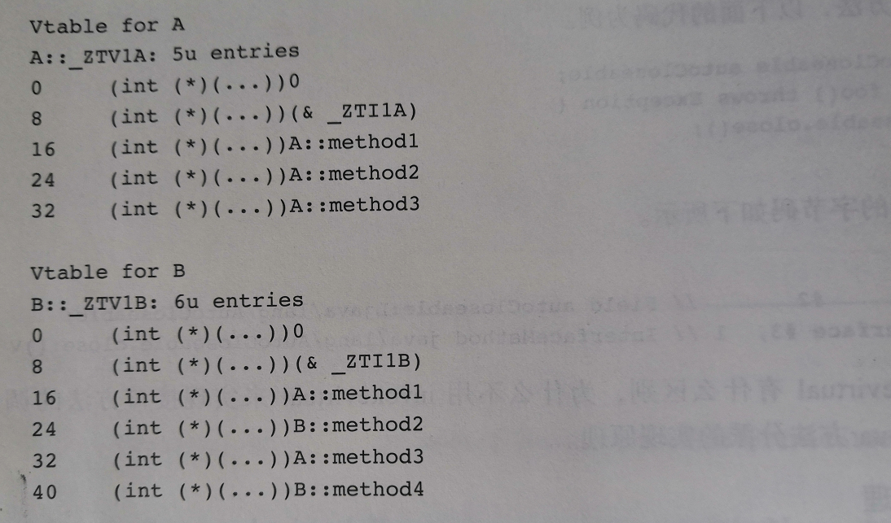
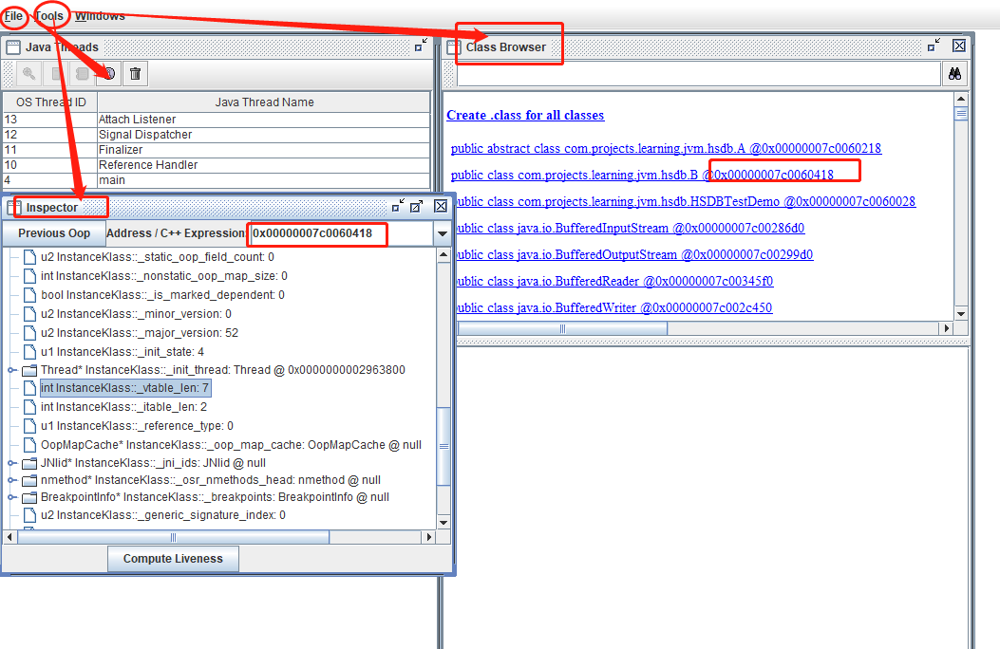
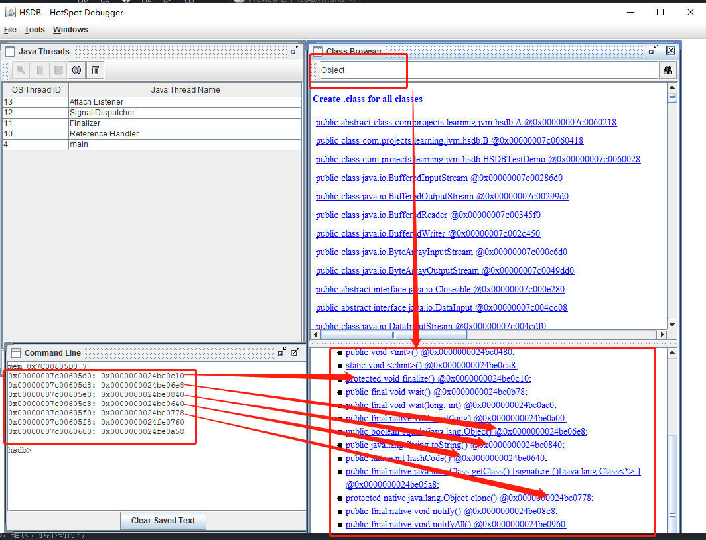
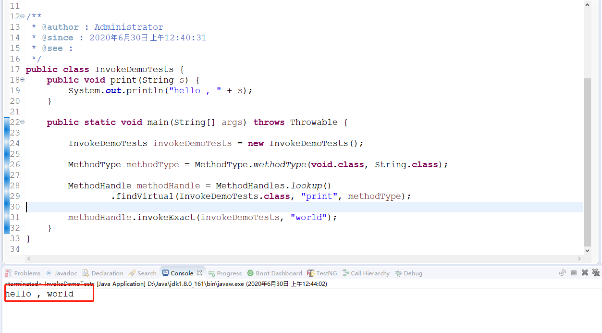
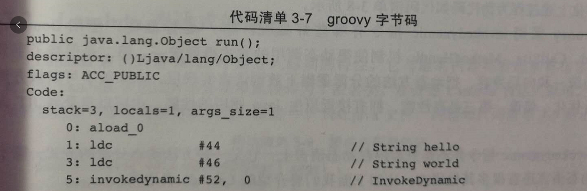
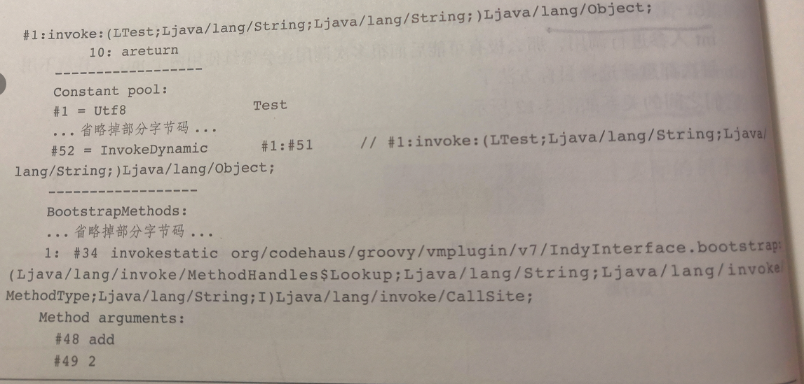

# <center>字节码进阶</center>

## 一、方法调用

jvm的方法调用都是以invoke开头。

- invokestatic。静态方法。
- invokespecial。私有实例方法、构造方法、super关键字调用父类的实例方法。
- invokevirtual。非私有实例方法。
- invokeinterface。接口方法。
- invokedynamic。动态方法。

### 1.1 invokestatic指令

静态方法调用，使用static修饰的方法。它调用的方法主要在编译期间确定，运行期不会修改，属于静态绑定。调用它不需要把对象加载到操作数栈，只需要将所需要的参数入栈就行了。
比如： Integer.valueOf("42");

### 1.2 invokevirtual

普通实例方法调用。目标方法在运行时才能根据对象的实际类型确定，编译期间无法知道。

这个指令之前，需要把对象引用和参数入栈，调用结束对象引用和方法参数都出栈，如果方法有返回值则会把它压入栈顶。

### 1.3 invokespecial

特殊的方法，包含三种：

- 实例构造方法。init
- private修饰的私有实例方法；
- super关键字调用的父类方法。

invokespecial调用的方法可以在编译期间确定。

### 1.4 invokeinterface

调用接口方法，同invokevirtual一样，需要运行时期根据具体类型确定目标方法。

为什么不用invokevirtual呢？了解一下java方法分派的原理。

#### 1.4.1(补充) 方法分派原理

JAVA的设计设计受到C++的影响，分派思路参考了C++的实现。

看看C++.
当c++类中包含虚方法的时候，编译器会为这个类生成一个虚方法表(vtable)，每个类都有一个指向虚方法表的指针vptr,虚方法表是方法指针的数组，用来实现多态。看看C++的单继承场景。

```c++
class A{
    public:
    virtual void method1();
    virtual void method2();
    virtual void method3();
};

void A::method1(){}
void A::method2(){}
void A::method3(){}

class B: public A{
    public:
    void method2() override;
    virtual void method4();
    void method5();
};

void B::method2(){};
void B::method4(){};
void B::method5(){};
```

使用: 
> g++ -std=c++11 -fdump-class-hierarchy test.cpp
会输出A和B的虚方法表。如下所示:



可以看出vtable除了包含虚方法以外，还有两个元素。看下16位置的内容，在单继承的情况下，子类B的虚方法的顺序和父类A的虚方法顺序保持一致，B类虚方法表中覆写method2指向了B的实现，B的新增方法method4跟随在虚方法表的末尾。

单继承的方法分派比较简单，比如对象A *a调用method2的时候，我们一开始不知道a指针指向的真正类型是谁，不确定他是A还是B还是其他的子类，但是可以确定每个method2的方法，都被放在虚函数表的offset为24的位置上，不会随类型的影响而受影响。

单继承中这个非常高效，但是java只支持单继承，在实现上基本和C++相似，也是使用了一个vtable的结构。
子类B包留了父类A中的虚方法表的顺序，只是覆盖了method2指向的方法链接和新增了一个方法。如果这时候要调用method2方法，则invokevirtual只需要直接去找虚方法表位置2的引用就行了。

java的单继承规避了C++的多继承带来的复杂性。支持实现多个接口，与多继承本质上没有很大区别。

除了虚方法表vtable，jvm提供了一个名为itable(interface method table)的结构来支持多接口的实现，itable由偏移量(offset table)和方法表(method table)两部分组成。

在需要调用某个接口方法的时候，虚拟机会在itable的offset table中查找对应的方法表位置和方法位置，随后在methodtable中查找具体实现。

结合itable和vtable的实现，可以看出，invokevirtual的实现依赖于java的单继承特性，子类的虚方法表保留了父类的虚方法表的顺序，但是因为java的多接口实现，这个特性就失效了。

因此如果用invokevirtual调用的话，就不能直接从固定索引的位置取得相应的方法，只能搜索整个itable来找到对应的方法，使用invokeinterface指令进行调用。

#### 1.4.2 HSDB探究多态

HSDB全称HotSpot Debugger，内置的jvm工具，可以深入分析JVM的运行时状态。
启动命令:
> java -cp sa-jdi.jar sun.jvm.hotspot.HSDB

使用hsdb包中的几个类，运行起来之后，在hsdb调试工具上分别按照如下步骤调出解析图：

- 运行HSDBTestDemo.java
- jps查找到对应的进程id
- 在HSDB调试工具上，File->Attach to Hotspot process，输入进程号
- 在Tools菜单栏上选择class browser，找到B类，看到B对象的地址0x,,,418
- 在Tools菜单上选择inspect，输入框中输入B地址，然后出现B类的vtable，往下翻，找到Thread * 。。可以看到vtable_len是7.

这个7应该是包含Object的5个方法，1个从A类继承来的printMe，1个是B覆写了A的sayHello().



vtable分配在instanceKlass对象实例的内存末尾，instanceKlass在64位系统中大小为0x1B8。所以vtable的起始地址等于instanceKlass的内存首地址，加上Ox1B8等于0X00000007C00605D0.

在HSDB的console中输入mem 0x7C00605D0 7，可以查看到vtable的内存气势地址开始的7个方法指针。



可以看出前5个方法分别是:
finalize 
equals
toString
hashCode
clone

在通过后面的地址，可以发现B类中另外两个方法分别指向A类的printMe和B重写之后的sayHello。

因此总结vtable、itable的部分如下：

- vtable、itable机制是实现java多态的基础
- 子类会继承父类的vtable。因为java类都会继承object，所以一个空的java类的vtable大小也是5
- 被final和static修饰的方法不会出现在vtable，因为没有办法被继承重写，同理private也不会出现在vtable中
- 接口方法的使用invokeinterface，java使用itable来实现多接口实现，itable由offsettable和method table两部分组成。在调用接口方法的时候，会现在offset table中查找method table的偏移量，随后在method table中查找具体的接口实现。

### 1.5 invokedynamic

java7新增，但是javac并不会生成这个指令。java8中的lambda表达式出现之后，java中才用上了这个指令。

jvm而言，不管是什么语言都是强类型语言，会在编译的时候检查传入参数的类型和返回的类型。

鸭子类型：

当看到一只鸟走起来像鸭子、游泳起来像鸭子、叫起来也像鸭子，那么这只鸟就可以被称为鸭子。

关注对象的行为，不是关注对象的所述类型，也不关心对象的继承关系。

核心概念：方法句柄。Method Handle，又称方法指针。是java.lang.invoke包中的一个类，它的出现使得java可以像其他语言一样把函数当成参数传递。Method Handle类似于反射中的Method类，但是比Method类灵活和轻量。

示例代码:

```java
import java.lang.invoke.MethodHandle;
import java.lang.invoke.MethodHandles;
import java.lang.invoke.MethodType;

/**
 * @author : Administrator
 * @since : 2020年6月30日 上午12:40:31
 * @see :
 */
public class InvokeDemoTests {
	public void print(String s) {
		System.out.println("hello , " + s);
	}

	public static void main(String[] args) throws Throwable {

		InvokeDemoTests invokeDemoTests = new InvokeDemoTests();

		MethodType methodType = MethodType.methodType(void.class, String.class);

		MethodHandle methodHandle = MethodHandles.lookup()
		        .findVirtual(InvokeDemoTests.class, "print", methodType);

		methodHandle.invokeExact(invokeDemoTests, "world");
	}
}
```



使用MethodType的步骤：

- 创建MethodType的对象，用来表示方法签名，每个MethodHandle都有一个MethodType实例，用来指定方法的返回值和参数类型
- 调用MethodHandles.lookup静态方法返回MethodHandles.Lookup对象，这个对象表示查找的上下文，根据方法的不同类型通过findStatic、findSpecial、findVirtual等方法查找签名为MethodType的方法句柄
- 方法句柄拿到以后，就可以调用具体方法，通过传入目标方法的参数，使用invoke和invokeExact来进行方法的调用。

invokedynamic的指令调用流程：

- jvm首次执行invokedynamic指令时会调用引导方法
- 引导方法返回一个CallSite对象，内部根据方法签名进行目标方法查找，它的getTarget方法返回方法句柄对象
- CallSite没有变化的情况下，MethodHandle一直可以被调用，如果有变化，则重新查找即可。

#### 1.5.1 invokedynamic在Groovy中的应用

```groovy
def add(a, b){
    new Exception().printStackTrace();
    return a + b;
}

add("hello" , "world");
```

默认invokedynamic在groovy中没有启用，需要加上--indy选项启用。比如:
> groovy --indy Test.groovy
编译代码会生成Test.class。

字节码如下:




可以看出，add("hello","world")被编译成invokedynamic指令。

groovy采用invokedynamic有什么好处呢？一个是标准化，第二是保持了字节码的层的统一和向后兼容，把动态方法的分派逻辑下放到语言层，未来版本可以方便优化、修改，第三是高性能，拥有接近原生java的调用的性能，也可以享受jit的优化。

### 1.6 lambda表达式的原理

那么先看一下匿名内部类。熟悉的话可以知道匿名内部类在编译的时候，会有多出来的class文件，匿名内部类是在编译期间生成新的class来实现。

看看lambda表达式。
字节码中会出现一个名为labmda\$main\$0的静态方法。它会默默生成新的内部类，类名的顺序为：ClassName$$Lambda\$n，n按照生成的顺序递增。


