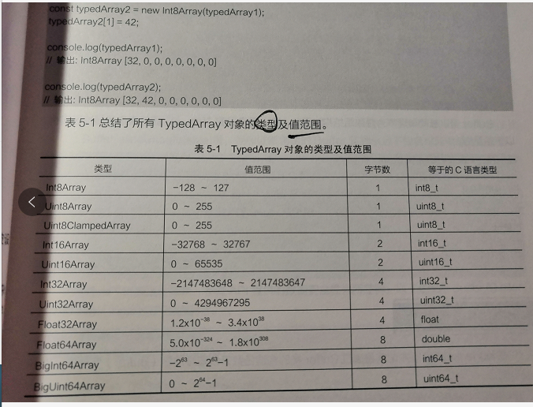

# <center>缓冲区和IO</center>

设定缓冲区可以提升IO处理性能。

## 一、Buffer

Node引入Buffer，用于在TCP流、文件系统操作和上下文中与8位字节流交互。

### 1.1 TypedArray

用来描述基础二进制数据缓冲区中的类数组视图，没有名为TypedArray的全局属性，也没有可见的构造函数，而是有很多不同的全局属性。

```javascript
const typedArray = new Int8Array(8);
typedArray[0] = 32;

const typedArray2 = new Int8Array(typedArray);
typedArray2[1] = 42;

console.log(typedArray);
console.log(typedArray2);

```



### 1.2 Buffer类

Buffer基于Unit8Array，从0~255.示例:

```javascript
//长度为10的缓冲区
const buf1 = Buffer.alloc(10);

//长度为10的填充0X1缓冲区
const buf2 = Buffer.alloc(10,1);

//长度为10的未初始化缓冲区
//比alloc快，但是返回了缓冲区实例
//有可能包含旧数据、可以fill或者write来覆盖旧数据
const buf3 = Buffer.allocUnsafe(10);

//创建包含[0X1 ,0X2,0X3]的缓冲区
const buf4 = Buffer.from([1,2,3]);

//创建包含utf-8的
const buf5 = Buffer.from("test");

//拉丁
const buf6 = Buffer.from("拉丁文" ,“Latin1”);
```

### 1.3 创建缓冲区

```javascript

const buf1 = new Buffer();
const buf2 = new Buffer(10);
```

初始化缓存区有两方式：

- 创建快速但未初始化的缓冲区
- 创建速度更慢但更安全的缓冲区

### 1.4 初始化缓冲区的API

> Buffer.from(array) 返回一个新的buffer，包含提供的8位字节的副本
> Buffer.from(arrayBuffer [,byteOffset [, length]]) 返回一个新的Buffer，与给定的ArrayBuffer共享已分配的内存
> Buffer.from(buffer) 返回一个新的Buffer，包含buffer的内容副本
> Buffer.from(string , [,encoding ]) 返回一个新的Buffer，包含指定字符串的副本
> Buffer.alloc(size ,[ , fill [, encoding]]) 返回指定初始化大小的Buffer，虽然比Buffer.allocUnSafe慢但是安全
> Buffer.allocUnsafe(size) Buffer.allocUnsafeSlow(size) 分别返回指定大小的未初始化缓冲区，由于未被初始化在分配的内存段中可能包含敏感数据

### 1.5 数据安全性

## 二、切分缓冲区

buf.slice(start[,end]) 
start: integer 新缓冲区的起始索引。默认是0
end : integer 指定缓冲区的结束索引（不包括），默认是buf.length

返回的新Buffer会引用原始内存中的数据，只是由起始索引和结束索引进行了偏移和切分。

切分出来点缓冲区，跟原来的共享数据，原来的缓冲区数据变化之后，切分出来的缓冲区内容同样变化，反之一样。

## 三、链接缓冲区

> Buffer.concat(list [,totalLength ] )

list: 待链接的Buffer或者Uint8Array实例
totalLength : 链接完成之后list里Buffer实例的长度

如果list没有项，或者totalLength为0，则新的缓冲区也是0

如果totalLength不指定，则会计算list的长度，如果指定了，则会以它为准，即使计算出来的list长度可能比totalLength大，也会以totalLength为准。

## 四、比较缓冲区

> compare(buf1, buf2)

通常是为了排序。

```javascript
const buf1=Buffer.from("1234");
const buf2 = Buffer.from("0123");

console.log(buf1.compare(buf2));

```

返回一个数字，此数字指示buf1在排序时是排在buf2之前、之后还是相同。比较是基于每个缓冲区的实际字节序列：

- 0。相同
- 1。buf2在buf1之前
- -1。 buf2在buf1之后

## 五、缓冲区编解码


