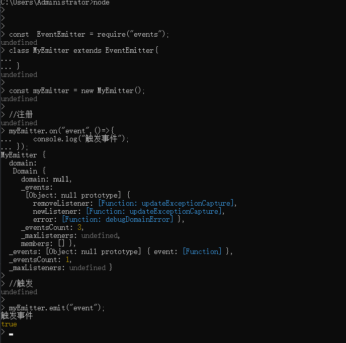
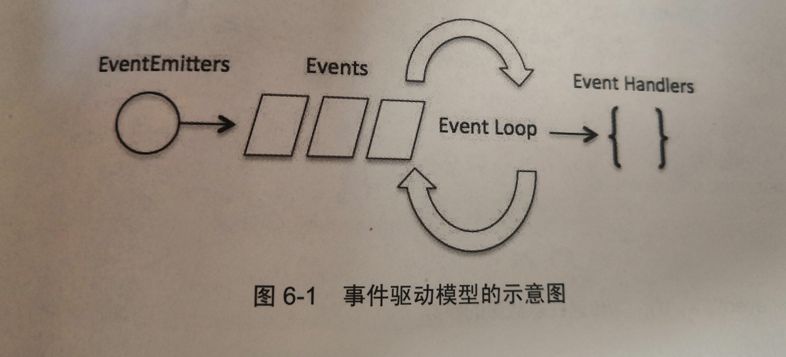
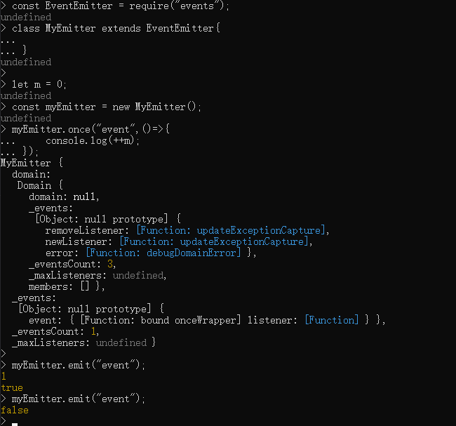

# <center>事件</center>

异步事件驱动，使nodejs拥有了处理高并发的能力。

## 一、事件、回调

- 事件
- 发射器
- 监听器

所有能触发事件的对象在Node中都是EventEmitter的实例。有一个eventEmitter.on函数，用于将一个或者多个函数绑定到命名事件上。通常是驼峰命名。

当对象触发一个事件时，所有绑定在该事件上的函数都会同步调用。

```javascript
const  EventEmitter = require("events");
class MyEmitter extends EventEmitter{

}

const myEmitter = new MyEmitter();

//注册
myEmitter.on("event",()=>{
    console.log("触发事件");
});

//触发

myEmitter.emit("event");

```

结果如下：



### 1.1 事件循环

node应用是单线程，但是v8引擎提供了异步执行回调的接口。
Node几乎所有api都支持回调。
Node几乎所有事件机制都是用设计模式中的观察者模式实现。
Node单线程类似进入一个while true循环，直到没有事件观察者时退出。每个异步事件都生成一个事件观察者，如果有事件发生，则调用回调。

### 1.2 事件驱动

示意图：



Node使用事件驱动模型。服务器接收到请求之后，把请求交给后续的事件处理器处理，然后自己去处理下一个请求，当后继的事件处理器完成之后，请求会被放回处理队列，当请求到达队列开头的时候，请求处理完的结果返回给用户。

### 1.3 事件发射器

当EventEmitter类实例新增监听器的时候，触发newListener事件，当移除已经存在的监听器时，触发removeListener事件。

#### 1.3.1 传递参数

可以传递任意数量的参数给监听器函数。当监听器函数被调用时，this会指向监听器所绑定的EventEmitter实例。

```javascript
const EventEmitter = require("events");
class MyEmitter extends EventEmitter{

}

const myEmitter = new MyEmitter();

myEmitter.on("event",function(a , b){
    console.log(a , b , this ,this === myEmitter);
});

myEmitter.emit("event","a1" , "b1");
```

如果用lambda表达式来传递给监听器，则this不再指向emitter实例。

#### 1.3.2 异步、同步

EventEmitter会按照监听器注册的顺序同步调用监听器。所以必须确保事件的排序，避免竞态条件。

也可以切换到异步模式。
> setImmediate() 
> process.nextTick()

```javascript
const EventEmitter = require("events");
class MyEmitter extends EventEmitter{

}

const myEmitter = new MyEmitter();
myEmitter.on("event",function(a , b){
    setImmediate(()=>{
        console.log("异步执行:",a , b , this ,this === myEmitter);
    });
});

myEmitter.emit("event","a1" , "b1");
```

#### 1.3.3 只处理一次

emitter.on会在触发时调用回调，emitter.once会在第一次触发时调用一次，事件触发之后注销。

```javascript
const EventEmitter = require("events");
class MyEmitter extends EventEmitter{

}

let m = 0;
const myEmitter = new MyEmitter();
myEmitter.once("event",()=>{
    console.log(++m);
});

myEmitter.emit("event");
myEmitter.emit("event");
```

结果如下:


### 1.4 事件类型

node事件是通过类型区分的。

事件类型是可以定义为任意的字符串，通常是不包含空白的小写单词组成。

#### 1.4.1 内置

- newListener
- removeListener
- error 如果没有为error注册监听器，当error被触发的时候抛出错误、打印堆栈、退出node
  
#### 1.4.2 error

为了防止node进程崩溃，可以有两种解决办法。

##### 1.4.2.1 domain

```javascript
var domain = require("domain");
var connect = require("connect");


var app = connect();

app.use(function(req,res,next){
    var d= domain.create();
    d.on("error",function(err){
        logger.error(err);
        res.statusCode = 500;
        res.json({
            success :false,
            message: "服务器异常"

        });
        d.dispose();
    });

    d.add(req);
    d.add(res);
    d.run(next);
});


app.get("/index",function(){
    console.log("访问业务");
})
```

domain会把多个不同的IO操作分为一个组，在发生一个错误事件或者抛出一个错误的时候，domain对象会被通知，不会丢失上下文，也不会导致进程突然退出。

##### 1.4.2.2 为error注册监听器

应该始终为error事件注册监听器。

### 1.5 事件的操作

#### 1.5.1 设置最大监听器

默认情况下，每个事件最多注册10个监听器。
> emitter.setMaxListeners(n)来设置最大个数

也可以使用：
> EventEmitter.defaultMaxListeners属性来改变所有的实例默认值。

#### 1.5.2 获取已注册事件的名称

> emitter.eventNames() 返回已注册的时间的名称数组。值可以是字符串或者是Symbol

#### 1.5.3 获取监听器数组的副本

> emitter.listeners(eventName) 返回名称为eventName的监听器数组的副本。

#### 1.5.4 插队：把监听器添加到数组的最前面

emitter.on("eventName",listener)，添加到数组末尾；
emitter.prependListener()添加到开头

默认情况下，会按照加入的顺序顺序依次调用事件监听器。prependListener让其加入到开头，因此会被优先执行。

#### 1.5.5 移除

> emitter.removeListener(eventName,listener)，可以从名为eventName的事件监听器数组中，移除指定的listener。

最多只能从监听器数组中移除一个监听器，如果监听器被多次调用注册到指定名称的监听器数组中，则必许多次调用removeListener

如果想要快捷删除所有的监听器，则可以使用
> emitter.removeAllListeners()