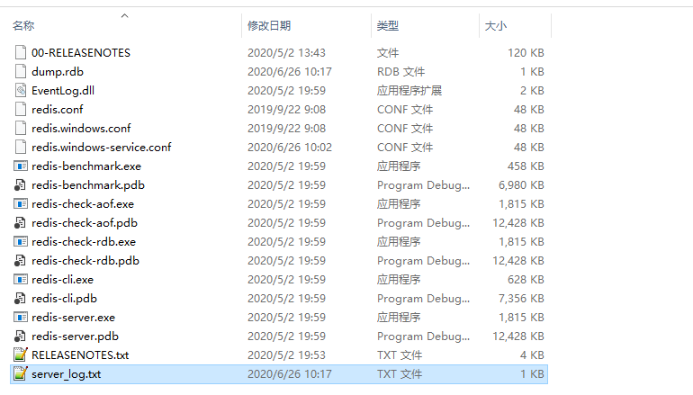
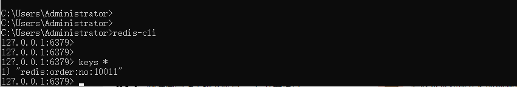
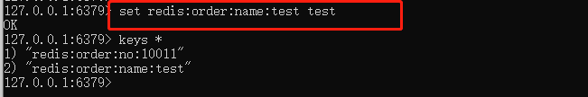
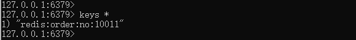
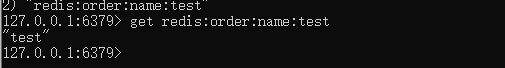
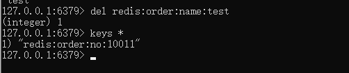
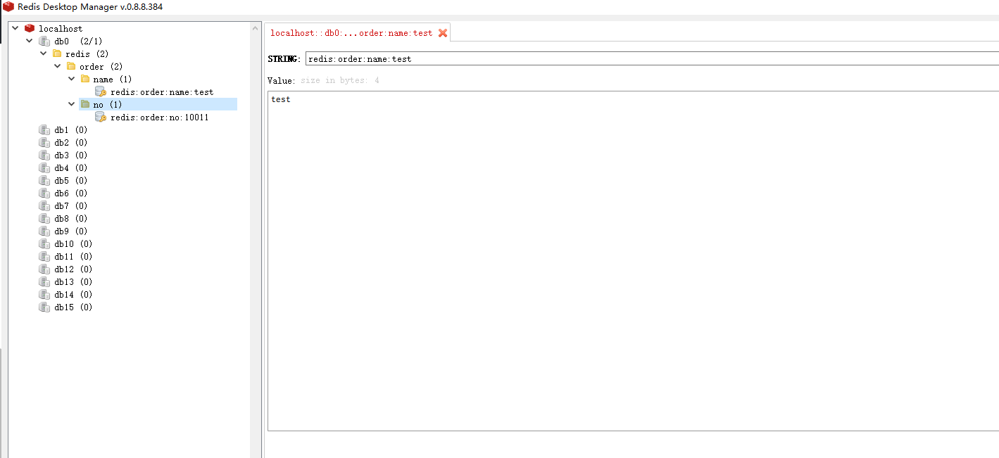

# 
Redis环境安装

## 一、Windows安装

### 1.1 redis安装目录

- redis-server 启动服务
- redis-cli Redis客户端
- redis-check-aof redis内置的数据持久化备份的工具
- redis-benchmark redis内置的测试性能的工具
- redis-windows.conf redis在windows下的配置文件，主要用于windows下的ip绑定、数据持久化备份连接数和相关操作
  
如果是msi安装的，可能会直接安装成一个windows服务,去服务列表中看服务状态或者尝试用客户端直连试试;
如果是解压安装，则直接启动redis-server启动redis.

## 二、连接redis

### 2.1 redis_cli

redis本身提供了redis-cli命令行工具来连接。

示例:

- 增。
  > set key value

  

- 查。
  - 查所有
  
    > keys *

    

  - 查指定
    > get key

    

- 改。

- 删。返回值为1代表删除成功。
  > del key
  
  
  
### 2.2 redis-desktop-manager

略。

