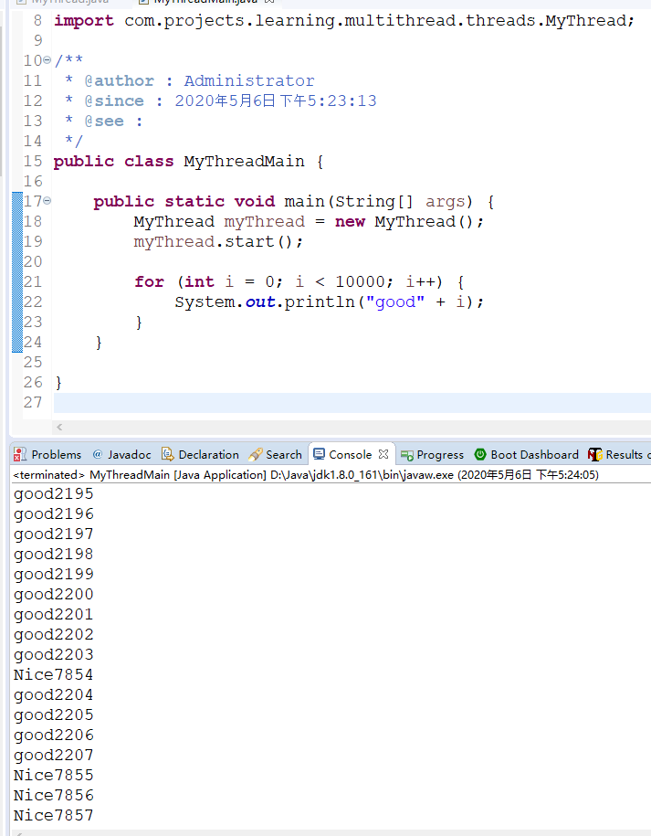

# 多线程概述

## 一、Thread的run和start

### 1.1 概述

新建线程类,继承Thread类并重写run方法
```java
public class MyThread extends Thread {
	public void run() {
		for (int i = 0; i < 10000; i++) {
			System.out.println("Nice" + i);
		}
	}
}
```

启动Main方法，新建线程并启动,启动要调用start方法
```java
public static void main(String[] args) {
		MyThread myThread = new MyThread();
		myThread.start();

		for (int i = 0; i < 10000; i++) {
			System.out.println("good" + i);
		}
	}

```

start是Thread类的方法，用于启动新的线程。

执行结果如下,可看出是多线程运行，每次运行结果都可能有差异。

```txt
...
good2198
good2199
good2200
good2201
good2202
good2203
Nice7854
good2204
good2205
good2206
good2207
Nice7855
Nice7856
Nice7857
Nice7858
Nice7859
Nice7860
...
```



***需要注意的是：启动多线程调用的是start方法，不是run方法，当然run方法不是不能调用，只是调用它不会启动新的线程，会当成一个同步方法***

start方法的主要作用:
- 启动新线程
- 调用run方法

因此对于上述的demo，主要表达的就是main线程会输出good，MyThread线程会输出Nice，由于是并行运行的，因此结果会交替打印。

### 1.2 顺序、并行、并发

- 顺序(sequential): 表示多个操作“依次处理”。
- 并行(parallel)：表示逗哥操作"同时处理"。
- 并发(concurrent): 相对于顺序和并行来说比较抽象，表示“把一个操作分割成多个部分并且允许无序处理”。
  
如果CPU只有一个那么并发处理就会降级成顺序处理，如果有多个cpu，那么并发处理就“可能”会变成并行运行。

线程类的实例和线程本身并不是同一个东西，即使创建了线程类的实例，也没有启动线程，直到你调用了start方法。而且就算线程终止了，线程类的实例还有可能在。

**程序的终止**:

Java程序的终止，是指的除守护线程之外的线程全部终止。守护线程是执行后台作业的线程，可以通过setDaemon把线程设置为守护线程。

可以在主线程中启动其他线程，当其他线程start之后，主线程就结束了，但整个程序并不会随着主线程的终止而终止，其他线程当然也不一定会终止，直到所有的线程都终止以后，程序才会终止。

## 二、 Java多线程的启动

线程的启动有如下两种方式:
- Thread类的子类实例启动
- Runnable接口的实现类启动

### 2.1 Thread类的子类实例启动

同上，不再赘述

### 2.2 实现Runnable

实现Runnable接口，必须实现run方法

示例：

```java

public class Printer implements Runnable {
	private String message;

	public Printer(String message) {
		this.message = message;
	}

	/**
	 * @see :
	 */
	public Printer() {
		this("defaultMessage");
	}

	@Override
	public void run() {
		for (int i = 0; i < 10000; i++) {
			System.out.println(message);
		}
	}

}
```

Main方法
```java
public static void main(String[] args) {
		new Thread(new Printer("GOOD!")).start();
		new Thread(new Printer("Nice!")).start();
	}

```
运行结果则会交替,如下所示：

```txt
GOOD!
GOOD!
GOOD!
GOOD!
GOOD!
GOOD!
GOOD!
GOOD!
GOOD!
GOOD!
GOOD!
GOOD!
GOOD!
Nice!
GOOD!
Nice!
GOOD!
GOOD!
GOOD!
GOOD!
GOOD!
GOOD!
GOOD!
GOOD!
GOOD!
GOOD!

```

当然，上述代码也可以写成如下,效果跟一行代码是相同的:
```java

Runnable runnable1 = new Printer("BEST");
Thread thread = new Thread(runnable1);

thread.start();

```

总结：
这种方式，就是创建Runnable接口的实现类，然后把这个实现类的实例传给Thread的构造函数，其他就跟Thread类同。

所以不管是哪种方式，启动新线程都是要Thread的start方法。

**实际上，Thread本身也实现了Runnable，且持有run方法，不过内部run方法是空的，交给子类去实现**

### 2.3 ThreadFactory

java内置的并发包中包含一个将线程创建抽象化的ThreadFactory接口。利用这个接口可以将Runnable作为参数传入并通过new创建Thread实例的处理隐藏在ThreadFactory的内部。默认的ThreadFactory对象是通过Executors.defaultThreadFactory方法获取。

示例:

```java
public static void main(String[] args) {
    ThreadFactory threadFactory = Executors.defaultThreadFactory();

    threadFactory.newThread(new Printer("BEST!")).start();

    for (int i = 0; i < 10000; i++) {
        System.out.println("GOOD!");
    }
}
```

## 三、线程的其他动作

### 3.1 暂停

Thread类中有sleep方法，可以让线程暂停一段时间，是一个静态方法。
sleep本身有可能会抛出InterruptedException异常.这个异常可以取消线程的处理。

它通常被用来模拟线程的耗时，用于假设在执行一个耗时很久的方法。但在实际的使用中，没有那么高的出场率。

有一个重载的方法，可以让这个暂停精确到纳秒级别，第一个参数是毫秒，第二个参数是纳秒
sleep(long millseconds , int nanos)

不过通常，java的平台运行环境没有这么精确，具体精确程度依赖于java的平台运行环境。

### 3.2 线程的互斥

多线程程序中的各个线程都是自由运行的，所以有时候就会同时操作同一个实例，这种时候就会引发问题。

这种线程A和线程B之间的互相竞争而引起的与预期结果相反的情况称为数据竞争，或者竞态条件。
这时候需要一种管制能力来协助防止发生数据竞争，通常称之为互斥，以synchronized来执行。

#### 3.2.1 synchronized方法

加上了这个关键字的代码，只能由一个线程执行，指的运行期只能每次由一个线程运行，而不是只能由一个指定线程运行，称之为同步方法。

当持有的锁被释放之后，其他线程可以获取该锁，如果成功则会进入这个方法或者代码块，无论如何至多只能有一个线程是成功的。

当然了，如果是实例方法，则不代表实例之间会互相影响，每个实例拥有独立的锁。

**知识:**
线程的互斥称为监视，获取锁也称为持有锁或者拥有监视。
当前线程是否已经获取某一个对象的锁，可以通过Thread.holdsLock来确认。
如：

```java
assert Thread.holdsLock(obj);
```

#### 3.2.2 synchronized代码块

如果只是想让方法中的某一部分由一个线程运行，而非整个方法，则可以同步部分代码块,如下:

```java
synchronized (表达式){

}
```

表达式一般指的是获取锁的实例，同步代码块用来精准控制互斥处理的范围。如下代码的两种写法是等效的:

```java
synchronized void method(){

}

```

和
```java
 void method(){
    synchronized(this){

    }
}
```
同步实例方法是通过使用this锁来实现同步。

#### 3.2.3 synchronized静态方法和代码块

写法相同，但是静态方法的同步使用的锁和实例方法不同，静态同步方法使用的类级别的锁。
如下写法是效果相同的：
```java

class A{
    static synchronzied void method(){

    }
}
```

和
```java

class A{
    static  void method(){
        synchronzied(A.class){

        }
    }
}
```

也就是说静态方法的同步是使用该类的类对象的锁来实现互斥处理。A.class是A类对应的java.lang.class类的实例。

**获取我们也可以称synchronzied代码块为synchronzied语句**

### 3.3 线程的协作

一般来说，为了解决以下场景的问题，可以使用线程的协作
- 如果条件达到了，则执行操作；如果没有达到一直等待
- 当条件达到的时候，“通知”正在等待这个条件的线程

java提供wait和notify以及notifyAll实现线程的协作。wait让某个线程等待，notify和notifyAll唤醒等待中的线程。

#### 3.3.1 等待队列

所有的实例都有一个等待队列，它是在实例wait方法调用之后停止的线程的队列。
在执行wait方法之后，线程便会暂停操作，进入一个休息室。除非发生下面的场景，否则线程一直会在等待队列中休眠。下面点几种发生任意一条，就会退出等待队列。
- 其他线程notify方法唤醒了你
- 其他线程的notifyAll方法唤醒了你
- 其他线程的interrupt方法唤醒了你
- wait方法超时了

我们所提到的这个等待队列，是个虚拟概念，既不是实例的字段也不是获取等待线程列表的方法，它实际上不真实存在。
  
#### 3.3.2 wait-把线程放进等待队列

obj.wait()之后，当前线程会暂停运行，并进入实例obj的等待队列中，这叫做线程正在obj对象wait。

如wait()和this.wait()这两个方法是等效的，这时候可以说线程正在this上wait。

如果要执行wait方法，线程必须持有锁(这是规则)，但如果线程进入等待队列，便会释放锁。

#### 3.3.3 notify-从等待队列中取出线程

notify方法会从等待队列中取出一个线程。
假如：
obj.notify()
那么obj的等待队列中有一个线程便会被选中，然后退出等待队列。同wait一样，想要notify的前提是已经持有了锁，这是规则。

执行notify之后，被唤醒的线程并不会一瞬间重新运行，因为notify的那一瞬间，执行notify的那个线程还持有着锁，所以其他线程依然无法获取这个锁。

**notify选择线程的规则**

如果等待队列中不止一个线程，java并没有规定如何选择被唤醒的线程。是选择最早执行wait的那一个还是随机选择，或者采用其他方法要取决于java运行环境。所以编程中尽量避免这种依赖的场景。

#### 3.3.4 notifyAll-从等待队列中取出所有线程

nofityAll和this.notifyAll是等效的，该实例的等待队列中所有线程都会退出等待队列。
唤醒所有线程是它和notify的唯一区别。
被唤醒的所有线程，都在等待这个执行notifyAll的线程释放持有的锁，所以它们都还处于阻塞状态，只有notifyAll的执行线程释放了之后，其中的一个幸运儿才能真切的去获取锁并执行。

**如果线程本身没有持有锁，而去执行了这些需要持有锁才能执行的方法，则会抛出IllegalMonitorStateException**

#### 3.3.5 如何选择notify还是notifyAll

notify唤醒的线程比较少，处理速度要比notifyAll快一些。
notify的时候如果处理的不好，程序便会终止，一般来说，使用notifyAll的代码要比notify的健壮。
除非开发人员完全理解代码的含义和范围，否则使用notifyAll更加稳妥。

#### 3.3.6 这三个方法是object的方法而不是thread的方法

所以，与其说这三个方法是针对线程的，不如说针对实例的等待队列的操作。由于所有实例都有等待队列，所以它就成了object的方法。

因为Thread本身继承自Object，那它自然也有这三个方法。

### 3.4 线程的状态迁移

线程的状态在Thread.Stat中有定义，NEW ,RUNNABLE ,TERMINATED,WAITING,TIMED_WAITING,BLOCK。
