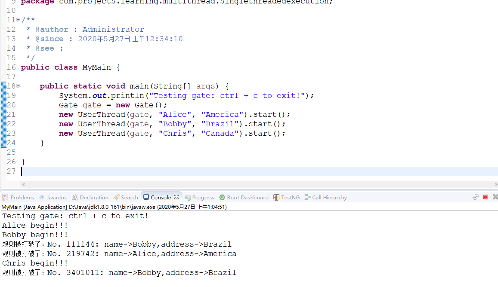

# SingleThreadedExecution

> 以一个线程运行。 是多线程设计的基础。

## 一、反例-不使用STE的程序
MyMain.java
```java
package com.projects.learning.multithread.singlethreadedexecution;

/**
 * @author : Administrator
 * @since : 2020年5月27日 上午12:34:10
 * @see :
 */
public class MyMain {

	public static void main(String[] args) {
		System.out.println("Testing gate: ctrl + c to exit!");
		Gate gate = new Gate();
		new UserThread(gate, "Alice", "America").start();
		new UserThread(gate, "Bobby", "Brazil").start();
		new UserThread(gate, "Chris", "Canada").start();
	}

}
```

Gate.java
```java
package com.projects.learning.multithread.singlethreadedexecution;

/**
 * @author : Administrator
 * @since : 2020年5月27日 上午12:34:21
 * @see : 表示通过的门，非线程安全
 */
public class Gate {
	/**
	 * 到目前为止已经通过的人数
	 */
	private int counter;

	/**
	 * 最后通过的人
	 */
	private String name;

	/**
	 * 出生地
	 */
	private String address;

	/**
	 * @see :
	 */
	public Gate() {
		// TODO Auto-generated constructor stub
	}

	/**
	 * 通过门
	 * 
	 * @see :会把counter字段递增；传入的name和address赋值给人
	 * @param :
	 * @return : void
	 */
	public void pass(String name, String address) {
		this.counter++;
		this.name = name;
		this.address = address;
		check();
	}

	@Override
	public String toString() {
		return "No. [counter=" + counter + ", name=" + name + ", address="
		        + address + "]";
	}

	/**
	 * 检查门的状态，检查最后一个通过人的数据。如果姓名和出生地不同，则表示异常
	 * 
	 * @see :
	 * @param :
	 * @return : void
	 */
	public void check() {
		if (name.charAt(0) != address.charAt(0)) {
			System.out.println("规则被打破了");
		}
	}

}

```

UserThread.java

```java
package com.projects.learning.multithread.singlethreadedexecution;

/**
 * @author : Administrator
 * @since : 2020年5月27日 上午12:34:30
 * @see :
 */
public class UserThread extends Thread {
	private final Gate gate;

	private final String myname;

	private final String myaddress;

	/**
	 * @see :
	 */
	public UserThread(Gate gate, String myname, String myaddress) {
		this.gate = gate;
		this.myname = myname;
		this.myaddress = myaddress;

	}

	public void run() {
		System.out.println(myname + " begin!!!");

		while (true) {
			gate.pass(myname, myaddress);
		}
	}

}

```

以下是运行结果：

由此可以看出，gate是非线程安全的。

还可以得到以下信息：
- 看counter的值，当开始规则失败的时候，counter的值已经好几十万了，也就是说检查出错误的时候，三人穿梭门已经好多次了
- 由于run方法是执行的是无限循环代码，所以检查出了错误，如果只测试几次，或者几万次那很难测出问题。
- 如果检查出错误，说明程序不安全。但是就算没有检查出错误，也不能说明安全。检查次数不够、时间点不对都有可能检查不出错误。

测试行为不能证明安全性，只能提高“程序也许安全” 的概率。

**调试信息不可靠**
在日志中可以看出，当没有满足姓名和地址的判定的时候，也会check出错。
导致的原因是，当某个线程执行check的时候，其他线程不断执行pass方法，内部修改了name和address字段。

如果现实调试信息的代码本身就是非线程安全的，那么调试信息很哟可能是错的。

## 二、正例-使用STE的程序
MyMain.java
```java
package com.projects.learning.multithread.singlethreadedexecution;

/**
 * @author : Administrator
 * @since : 2020年5月27日 上午12:34:10
 * @see :
 */
public class MyMain {

	public static void main(String[] args) {
		System.out.println("Testing gate: ctrl + c to exit!");
		Gate gate = new Gate();
		new UserThread(gate, "Alice", "America").start();
		new UserThread(gate, "Bobby", "Brazil").start();
		new UserThread(gate, "Chris", "Canada").start();
	}

}
```

Gate.java
```java
package com.projects.learning.multithread.singlethreadedexecution;

/**
 * @author : Administrator
 * @since : 2020年5月27日 上午12:34:21
 * @see : 表示通过的门，非线程安全
 */
public class Gate {
	/**
	 * 到目前为止已经通过的人数
	 */
	private int counter;

	/**
	 * 最后通过的人
	 */
	private String name;

	/**
	 * 出生地
	 */
	private String address;

	/**
	 * @see :
	 */
	public Gate() {
		// TODO Auto-generated constructor stub
	}

	/**
	 * 通过门
	 * 
	 * @see :会把counter字段递增；传入的name和address赋值给人
	 * @param :
	 * @return : void
	 */
	public void pass(String name, String address) {
		this.counter++;
		this.name = name;
		this.address = address;
		check();
	}

	@Override
	public String toString() {
		return "No. [counter=" + counter + ", name=" + name + ", address="
		        + address + "]";
	}

	/**
	 * 检查门的状态，检查最后一个通过人的数据。如果姓名和出生地不同，则表示异常
	 * 
	 * @see :
	 * @param :
	 * @return : void
	 */
	public void check() {
		if (name.charAt(0) != address.charAt(0)) {
			System.out.println("规则被打破了");
		}
	}

}

```

UserThread.java

```java
package com.projects.learning.multithread.singlethreadedexecution;

/**
 * @author : Administrator
 * @since : 2020年5月27日 上午12:34:30
 * @see :
 */
public class UserThread extends Thread {
	private final Gate gate;

	private final String myname;

	private final String myaddress;

	/**
	 * @see :
	 */
	public UserThread(Gate gate, String myname, String myaddress) {
		this.gate = gate;
		this.myname = myname;
		this.myaddress = myaddress;

	}

	public void run() {
		System.out.println(myname + " begin!!!");

		while (true) {
			gate.pass(myname, myaddress);
		}
	}

}

```

以下是运行结果：

由此可以看出，gate是非线程安全的。

还可以得到以下信息：
- 看counter的值，当开始规则失败的时候，counter的值已经好几十万了，也就是说检查出错误的时候，三人穿梭门已经好多次了
- 由于run方法是执行的是无限循环代码，所以检查出了错误，如果只测试几次，或者几万次那很难测出问题。
- 如果检查出错误，说明程序不安全。但是就算没有检查出错误，也不能说明安全。检查次数不够、时间点不对都有可能检查不出错误。

测试行为不能证明安全性，只能提高“程序也许安全” 的概率。

**调试信息不可靠**
在日志中可以看出，当没有满足姓名和地址的判定的时候，也会check出错。
导致的原因是，当某个线程执行check的时候，其他线程不断执行pass方法，内部修改了name和address字段。

如果现实调试信息的代码本身就是非线程安全的，那么调试信息很哟可能是错的。
