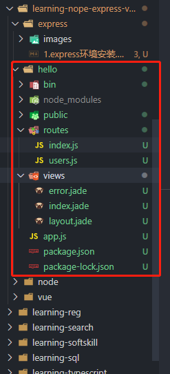

# <center>express安装和基本使用</center>

## 一、安装

> npm install express-generator -g
> express --version 查看express的版本号

这是一个项目的骨架。

## 二、创建项目

> express hello 创建hello项目

运行方式:
> cd hello
> npm install
> npm start

就可以访问3000端口了，这是启动了一个基本的express应用。

## 三、项目介绍




### 3.1 app.js

```node
//app.js
//http错误处理模块
var createError = require('http-errors');

//express、path、cookie处理对象、日志模块、路由模块、引入
var express = require('express');
var path = require('path');
var cookieParser = require('cookie-parser');
var logger = require('morgan');

var indexRouter = require('./routes/index');
var usersRouter = require('./routes/users');

//创建应用，引入页面模版引擎
var app = express();

// view engine setup
app.set('views', path.join(__dirname, 'views'));
app.set('view engine', 'jade');

//设置日志级别
app.use(logger('dev'));

//使用json格式处理数据
app.use(express.json());

//定义urlencode处理数据以及querystring模块解析数据
app.use(express.urlencoded({ extended: false }));

//使用cookie处理对象
app.use(cookieParser());

//定义静态资源
app.use(express.static(path.join(__dirname, 'public')));

//定义指向index的路由
app.use('/', indexRouter);

//定义指向user的路由
app.use('/users', usersRouter);


//404错误处理
// catch 404 and forward to error handler
app.use(function(req, res, next) {
  next(createError(404));
});

// error handler
app.use(function(err, req, res, next) {
  // set locals, only providing error in development
  res.locals.message = err.message;
  res.locals.error = req.app.get('env') === 'development' ? err : {};

  // render the error page
  res.status(err.status || 500);
  res.render('error');
});

module.exports = app;

```

## 四、路由

路由通常是指应用程序的端点如何访问客户端请求，定义什么路径来访问。

express默认的首页方法中使用了res.render方法，该方法的作用是渲染页面。第二个参数是页面名称，对应一个views目录中的indes.jade文件；第二个参数就是传入到页面文件的对象，可以将数据渲染到页面上。

**热加载工具**

> npm install nodemon -g
> npm install nodemon -D

在package.json中的:


```node
"scripts": {
    "start": "node ./bin/www"
  }
```

改为

```node
"scripts": {
    "start": "nodemon ./bin/www"
  }

```

### 4.1 路由匹配规则

普通的写法属于精确匹配。即如果定义"/world",则必须输入"/world"才能访问到。

还支持模糊匹配，比如"/wes?t"。则访问"wet"和"west"都可以命中。

还有以下:

- /we+st。命中west weest weeest等。
- /w(es)?t。命中west、wt等。
- /we*st。命中west、we123st、wexxxst等。

还支持正则表达式。

如: /west/，可以匹配/west 、 /aawest、/westee等。

### 4.2 中间件

可以把Express看成是路由和中间件合成的一个Web框架。
Express的中间件是可以让我们访问请求对象Request和Response以及下一个中间件函数。下一个中间件函数通常声明next。

express的三个参数，req,res,next。

### 4.3 express页面

```node
res.render("index",{

});
```

这是Response对象的一个render方法，它的第一个参数是，渲染的模板文件名，一般是views目录中的文件名，即页面文件。这个目录名称通常可以设置。

Express默认的模板引擎是jade，当然也可以换成其他的模版。以，art-template为例:

> npm install -S art-template
> npm install -S express-art-template

依赖完成之后，可以修改项目中的app.js文件。按照如下切换:

```node
app.set("view engine","jade");

//换成如下
app.engine(".html",require("express-art-template"));
app.set("view engine", "html");
```

如此之后，把对应的jade文件，换成html即可，本节中的后续用法，都是以art-template来介绍。

### 4.4 渲染数据

页面中使用{{}}来接收传过来的参数。在res.render方法中，把数据返回到页面。

### 4.5 条件渲染

```jade
{{if test}}
<p>123</p>
{{/if}}
```

可以按照这种方式来进行条件渲染，相当于以{{if 条件}}开始，{{/if}}结束。

### 4.6 嵌套条件

参照条件渲染，正确进行嵌套，不能交叉。

### 4.7 循环渲染

#### 4.7.1 基本循环渲染

```node
{{each list as item}}

{{/each}}
```

即使，以{{each list as item}}开头，以{{/each}}结尾。

#### 4.7.2 循环结合条件

```node
{{each list as item}}
    {{if test}}
        <p>123</p>
    {{/if}}
{{/each}}
```

## 五、请求对象Request

下面以req替代Request

### 5.1 req.url

获取请求地址。对应的就是，访问路径中截取根目录之后剩余的部分。如果是get请求，且带有参数，那么参数也包含在内。

### 5.2 req.query

获取get请求的参数。这是一个对象，包含路由中每个查询字符串参数的属性。如果没有查询字符串，则是空对象{}。

比如访问路径是:/book?id=15。

则获取到的req.query就是:

```node
{
    id: 15
}
```

query只能获取get请求方式、或者拼接在url后面的参数，不能获取其他的请求方式post、put等的参数。

### 5.3 req.body 

获取post的请求参数。同样是键值对形式的存在。如果没有参数，则是一个空对象{}。

### 5.4 req.params

把url传入的参数，存到了req.params属性，同时又是一个对象，包含了所有自定义的url参数，可以轻松获取到任何一个参数。

比如/book/:id,访问的时候/book/2,则req.params就是:{id:2}
比如/book/:userId/:id,访问的时候/book/2/3,则req.params就是:{userId:2,id: 3}.

### 5.5 req.headers

获取请求头。

### 5.6 req.cookies

获取客户端cookie。前后端交互的时候，有时候需要将数据存放在客户端的cookie中，客户端再次发送请求的时候，后端可以拿到cookie中的值做一些操作。

req.headers中也可以获取cookie，不过获取出来的是字符串，并不容易操作。cookie信息保存在req.cookies中，如果请求不包含cookie，则认为是{}。

客户端的cookie是存在于请求头里的，不存在于请求体中，使用req.cookies可以获取到cookie，因为express做了处理，在设置的时候需要到请求的header中去设置。

比如如果在设置的时候,cookie设置为a=5;b=7,则在获取到req.cookies的时候，是:{a:5,b:7}。

## 六、response对象:简称res

### 6.1 res.render

有三个参数。

- view  string 必选。页面文件，用于渲染的路径。
- locals Object 非必选。属性定义页面的局部变量。
- callback。Function 非必选。回调函数，返回可能的错误和呈现的字符串，不执行自动响应，错误的时候，该方法在next内部调用。

### 6.2 res.send 发送http响应

发送一个http响应到前端，只接收一个参数，这个参数可以是任何类型，可以是一个Buffer对象、一个String、一个Object、或者一个Array。

send可以接收任何类型的参数，是因为执行这个方法返回的时候，会自动设置响应头数据类型，即Content-Type字段。对应关系如下:

- Buffer对象。application/octet-stream。
- String。text/html。
- Array或者Object。application/json。

### 6.3 res.json

返回json数据。接收一个参数，可以是任何类型的Json格式类型，包括对象、数组、字符串、布尔值、数字，甚至是可以转换成json的其他数据，如null和undefined。

### 6.4 res.status

设定状态码。在使用status方法的时候，后面一定要有结束方法，比如end或者send，或者json等。因为status并不返回结果，只是设置一个状态。

### 6.5 res.redirect

跳转指定路由。当接收到请求的时候，会先进入直接方法内部，然后再进行302跳转。还可以在redirect之后设置status。

```node
res.redirect(301,"/newUrl");
```


