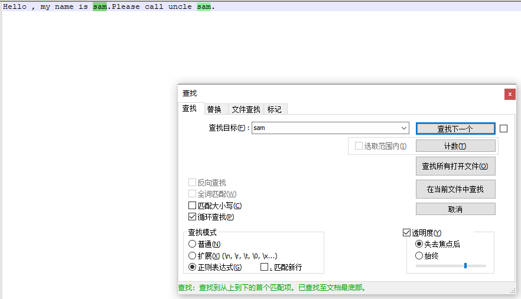
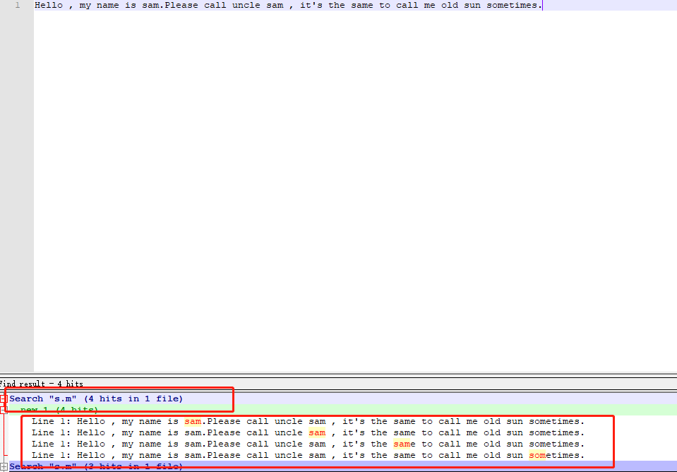
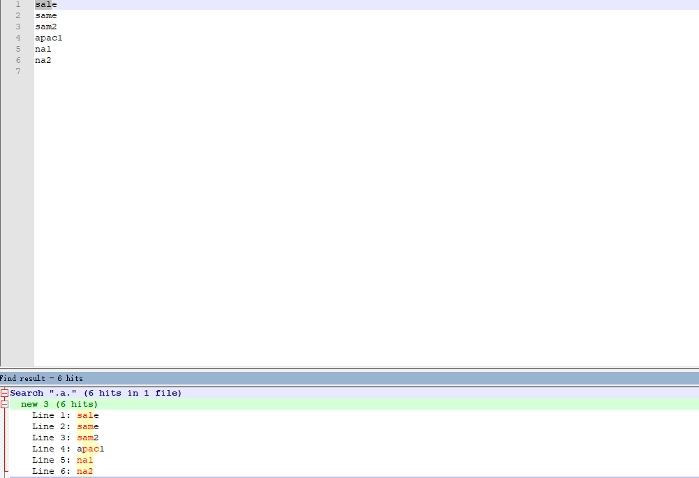

# <center>正则表达式</center>

## 一、匹配单个字符

### 1.1 匹配普通文本

正则表达式可以包含普通文本，甚至可以只包含普通文本。但这种正则表达式多少有点浪费。

```txt
Hello , my name is sam.Please call uncle sam.
```
正则表达式： 
> sam

搜索结果:



#### 1.1.1 有多少匹配结果

通常来说，绝大多数的正则表达式引擎只是返回第一个匹配结果。但也有很多引擎，可以提供一种获得所有匹配结果的机制，通常以数组或者其他特殊格式的形式返回。
比如：js中的g（global）标志将返回一个包含所有匹配结果的数组。

#### 1.1.2 字母大小写

正则表达式是区分大小写的，所以sam和Sam不匹配。不过绝大多数的正则表达式实现也支持不区分大小写的匹配操作。

比如：js中的i标志，可以强制执行不区分大小写字母的搜索。

### 1.2 匹配任意字符

正则表达式中，特殊字符或者特殊字符集合用来标识要搜索的东西。
"."字符(英文句号)可以匹配任意单个字符。

于是c.t可以匹配到cat和cot,还有其他一些无意义的单词，同样s.m可以匹配sam和same。

匹配结果:


通常我们用术语**模式**来标识实际的正则表达式。
.字符可以匹配任意单个字符、字母、数字，甚至是.字符本身。

举例:想搜索以na或者sa开头的数据
文本如下:
```txt
sale
same
sam2
apac1
na1
na2
```

正则表达式:
> .a.


很显然，出现了不该匹配的数据。为什么？因为只要有任意3个字符且中间那个是a，就匹配到了该模式。
我们真正需要的是再紧跟着英文句号之后的.a.的模式。

### 1.3 匹配特殊字符

.字符在正则表达式里有特殊含义。如果模式里需要一个.，就想办法告诉正则表达式，你需要的是个.字符，而不是他在正则表达实例的特殊含义。因此你必须转义(\反斜杠)。"\\"是个元字符，表示他有特殊含义，而不是原本的意思、