# <center>正则表达式</center>

## 一、匹配单个字符

### 1.1 匹配普通文本

正则表达式可以包含普通文本，甚至可以只包含普通文本。但这种正则表达式多少有点浪费。

```txt
Hello , my name is sam.Please call uncle sam.
```
正则表达式： 
> sam

搜索结果:


#### 1.1.1 有多少匹配结果

通常来说，绝大多数的正则表达式引擎只是返回第一个匹配结果。但也有很多引擎，可以提供一种获得所有匹配结果的机制，通常以数组或者其他特殊格式的形式返回。
比如：js中的g（global）标志将返回一个包含所有匹配结果的数组。

#### 1.1.2 字母大小写

正则表达式是区分大小写的，所以sam和Sam不匹配。不过绝大多数的正则表达式实现也支持不区分大小写的匹配操作。

比如：js中的i标志，可以强制执行不区分大小写字母的搜索。

### 1.2 匹配任意字符

正则表达式中，特殊字符或者特殊字符集合用来标识要搜索的东西。
"."字符(英文句号)可以匹配任意单个字符。

于是c.t可以匹配到cat和cot,还有其他一些无意义的单词，同样s.m可以匹配sam和same。

匹配结果:


通常我们用术语**模式**来标识实际的正则表达式。
.字符可以匹配任意单个字符、字母、数字，甚至是.字符本身。

举例:想搜索以na或者sa开头的数据
文本如下:
```txt
sale
same
sam2
apac1
na1
na2
```

正则表达式:
> .a.


很显然，出现了不该匹配的数据。为什么？因为只要有任意3个字符且中间那个是a，就匹配到了该模式。
我们真正需要的是再紧跟着英文句号之后的.a.的模式。

### 1.3 匹配特殊字符

.字符在正则表达式里有特殊含义。如果模式里需要一个.，就想办法告诉正则表达式，你需要的是个.字符，而不是他在正则表达实例的特殊含义。因此你必须转义(\反斜杠)。"\\"是个元字符，表示他有特殊含义，而不是原本的意思。因此，.表示匹配任意单个字符,"\\."表示匹配.本身。

正则表达式中，"\\"字符总是出现在具有特殊含义的字符序列的开头，这个序列由一个或者多个字符组成。

如果要搜索"\\"本身，就必须对"\\"进行转义，相应的转义序列是两个梁旭的反斜杠"\\\\"。

那么"."可以匹配所有字符?未必。在绝大多数的正则表达式里,"."不能匹配换行符。

## 二、匹配一组字符

### 2.1 匹配多个字符中的一个

在正则中可以使用元字符"\[]"来定义一个字符集合，在使用"\[]"的字符集合里，出现在他们中间的所有字符，都是该集合的组成部分，必须匹配其中的某个成员(但不一定是全部)。

例如:[ns]匹配n或者s，[]本身不匹配任何东西，只负责定义一个集合。

字符集合一般在不区分大小写的时候，用的多。比如[Re]eg[Ex]x。

### 2.2 字符集合区间

一些频繁使用的字符区间已经被定义好。比如0~9、a~z、A~Z。为了简化区间的定义，正则表达式提供特殊的元字符"-"来表示区间。

如：0-9 a-z A-Z。

```txt
sales1.xls
orders3.xls
sale2.xls
sales3.xls
apac1.xls
europe2.xls
sam.xls
na1.xls
na2.xls
sa1.xls
ca1.xls
```

在上述文本中查找.

> [ns]a[0-9]\.xls

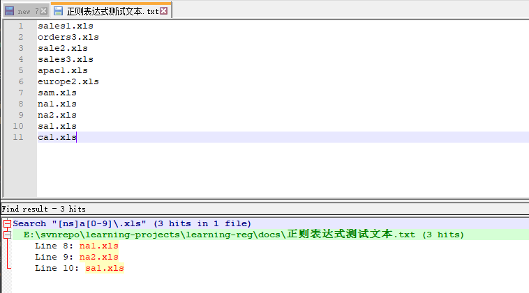

模式[0-9]的功能和[0123456789]的功能完全等价。字符区间不限于数字。

- A-Z A-Z的大写。
- a-z a-z的小写。
- A-F A-F的大写。
- A-z Ascii字符A到Ascii z的所有字母。不常用，因为还包含了[和^等。

所以常用的一半还是数字字符区间和字母字符区间。

**定义区间的时候，一定要避免后面的字符比前面的字符小，这样受限没有意义，还会让模式失效。**

**"-"是一个元字符，只有出现在[]中间的时候才有元字符的意义，如果不在中括号中，则它只代表一个普通字符只能匹配"-"本身。因此它不需要转义。**

在一个字符集里可以包含多个区间，比如下面的字符集表示匹配任何一个字母或者数字，除此之外都不匹配。

> [A-Za-z0-9]

它等同于[abc...xyzABC...XYZ0...9]。

示例，查找RGB代表的颜色。

通常RGB代表的颜色，一般是#000000的形式给出。用大写或者小写字母均可。比如#FF00ff也是合法的颜色值。

取一段合法的css代码：

```css
body{
    background-color: #fefbd8;
}

h1{
    background-color: #0000ff;
}

div{
    background-color: #d0f4e6;
}

span{
    background-color: #f08970;
}
```

使用如下的表达式:
> #[0-9A-Fa-f][0-9A-Fa-f][0-9A-Fa-f][0-9A-Fa-f][0-9A-Fa-f][0-9A-Fa-f]
查找结果如下:

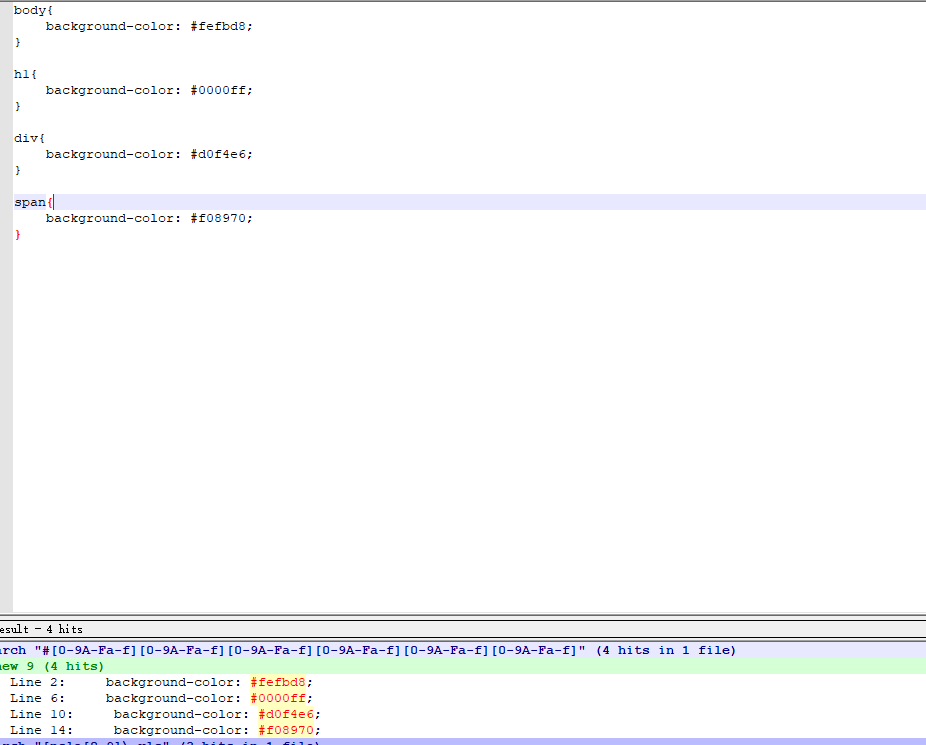

如此可看到能找到RGB的颜色值，这种写法有些重复，所以后面还有其他的方式代表这种写法。

### 2.3 排除

我们通常用字符集表示一组想要找到的内容，有时候可能需要反过来做，指定一组不需要匹配的字符。就是排除指定集合里的那些字符。

如果想要排除的少数，希望匹配的占大多数，那么没必要把所有期望匹配的一一列出来，可以使用^来表示去除一些数据。

还以这个为例：

```txt
sales1.xls
orders3.xls
sale2.xls
sales3.xls
apac1.xls
europe2.xls
sam.xls
na1.xls
na2.xls
sa1.xls
ca1.xls
```

> [ns]a[^0-9]\.xls

我们原本的意图是想查找一个以n或者s开头的，后面跟一个a，在后面跟一个非数字的文件名。

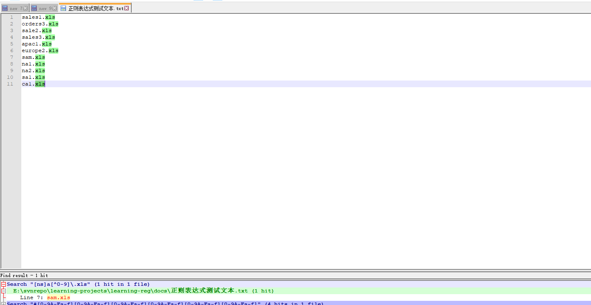

因此可以看到只找到了sam.xls。

**^的效果是将作用于给定字符集里的所有字符或者字符区间，而不是仅限于紧跟在它之后的那一个字符或者区间。**

## 三、使用元字符

### 3.1 谈谈转义

前面提到过，元字符本身不能代表元字符，那么需要用"\\"来进行转义。既然如此，那么我们可以清楚，如果需要代表"\\"本身，那么需要"\\\\"来表示。

来看一个windows的路径的例子。

```txt
G:\eclipse\eclipse-jee-oxygen-2-win32-x86_64\eclipse\configuration
```

如果我们希望改成linux中能使用的路径，那么需要把这个路径的反斜杠“\\”，换成"/"。

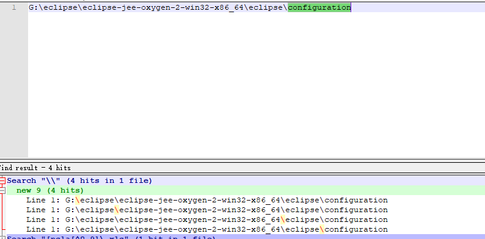

因此使用:
> \\\\

可以匹配到这个路径分隔符。如果只有一个，则正则表达式认为你的表达式不完整。

### 3.2 匹配空白

元字符大致可以分为两种，一种是用来匹配文本的，一种是正则表达式的语法的一部分。

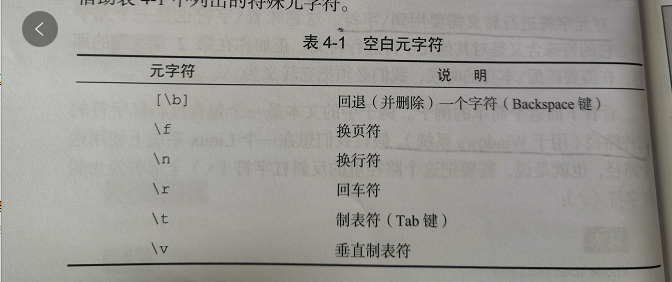
如果有以下文本:

```txt
"101","Ben","Forta"
"102","Jim","James"

"103","Roberta","Robertson"
"104","Bob","Bobson"
```

下面是用"\\r\\n"来匹配的字符，它可以匹配一个行尾的换行符。所以可看到有4个匹配。
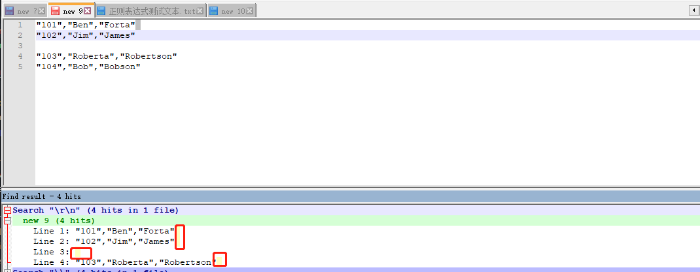

如果我们想匹配中间的那个空白行:

> \\r\\n\\r\\n

可以使用这个,它将匹配连续两个行尾标记，正式聊天记录之间的空白行。

上面是windows的换行符，在unix和macos系统中，只用了一个换行符，在这些系统上只需要"\\n"即可，不需要"\\r"。

理想的正则表达式可以适应这两种：包含一个可选的\r和一个必须匹配的\n。

### 3.3 匹配特定的字符类型

一些常用的字符集合可以用特殊的元字符来代替，这些元字符匹配的是某一类字符。因此又叫类元字符，它不是必不可少的，通常我们用枚举或者字符集合也可以代表他们。

#### 3.3.1 匹配数字或非数字

前面有匹配数字的写法，[0-9]和[0123456789]这种形式，如果需要匹配非数字那只需要[^0-9]即可。

- \\d。匹配一个数字字符，等价于[0-9]
- \\D。匹配一个非数字字符，等价于[^0-9]。

因此正则表达式通常是区分大小写的。

#### 3.3.2 匹配字母数字或者非字母数字

字母数字是一种常用的字符集。包括a-z（大小写）、0-9、_。

- \\w。表示任何一个字母数字字符大小写均可，或者下划线字符。等价于[a-zA-Z0-9_]
- \\W。表示任何一个非字母数字字符，或者非下划线字符。等价于[^a-zA-Z0-9_]

#### 3.3.3 匹配空白或者非空白

- \\s。匹配任何一个空白字符，等价于[\\f\\n\\r\\t\\v]
- \\S。匹配任何一个非空白字符,等价于[^\\f\\n\\r\\t\\v]

匹配退格的字符不在这个\s的范围内，\S中也不排除它。

#### 3.3.4 匹配十六进制或者八进制

十六进制用0X开头来表示，比如0x0A代表ASCII字符的10，也就是\n。

八进制用0开头的来表示，数值本身可以是三位或者2位。比如:\011代表ASCII字符9，也就是\t。

### 3.4 POSIX字符类

- [:alnum:] 任何一个字母或者数字。[a-zA-Z0-9]
- [:alpha:] 任何一个字母。[a-zA-Z]
- [:blank:] 空格或者制表。[\t ]
- [:cntrl:] ascii的控制字符(0-31再加上127)
- [:digit:] 数字。[0-9]
- [:graph:] 和[:print:]一样，但是不包括空格
- [:lower:] 匹配小写字母。[a-z]
- [:print:] 任何一个可打印字符
- [:punct:] 既不属于alnum又不属于cntrl的字符
- [:space:] 任何一个空白字符，包括空格
- [:upper:] 任何一个大写字母。[A-Z]
- [:xdigit:] 任何一个十六进制数字[a-fA-F0-9]

js不支持使用POSIX字符集。

如果要使用posix字符集，则需要以"\[\["开头，以"]]"结尾，这是必须的。它的字符类必须出现在[:和:]之间，有用的[:digit:]而不是:digit:。

比如前面匹配RGB颜色值的表达式会写成:

> #\[[:xdigit:]]\[[:xdigit:]]\[[:xdigit:]]\[[:xdigit:]]\[[:xdigit:]]\[[:xdigit:]]

匹配结果如下，可有看出同样可以匹配的十六进制的RGB颜色值。

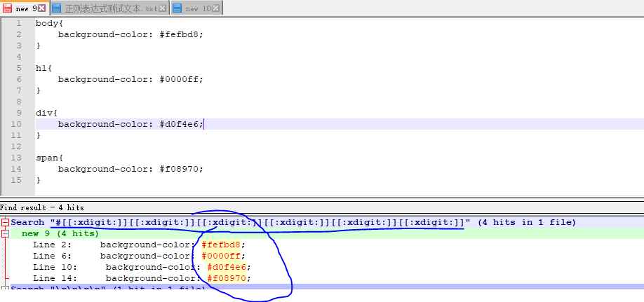

外层的[]代表的是定义一个字符集，内层的[]是posix字符集的一个不可分割的部分。

## 四、重复匹配

我们要匹配一个邮件地址:text@text.text，根据之前的写法可能会写:
> \w@\w\\.\w

\w可以匹配所有的字符和数字以及下划线，@字符不需要转义，但是.字符需要被转义。

但是这个正则表达式，没有发挥到实际的作用，它只能匹配a@b.c这样的邮箱地址。问题就在于\w只能匹配一个字符，但是我们又无法预知一个邮件地址中包含多少个字符。比如如下的都可能是正确的邮件地址:

```txt
b@forta.com
ben@forta.com
bforta@forta.com
```

所以不确定性有很多。

### 4.1 匹配一个或者多个字符

要想匹配某个字符或者某个字符集合的一次或者多次重复，只要在后面加上一个简单的+就可以了。+匹配一个或者多个字符，但是至少是一个，不能匹配0个。比如a匹配a本身，a+可以匹配aa、aaaa等等。类似的，[0-9]匹配单个数字，[0-9]+匹配连续出现的一个或者多个数字。

在给一个字符集加上+的时候，必须把+放在字符集外面。比如[0-9]+确实可以匹配一个或者多个连续出现的数字，但是[0-9+]也是一个合法的表达式，只不过意义已经完全不同，它匹配的是任意一个数字或者+。

回到上面的例子，我们可以写出如下的表达式:
> \w+@\w+\\.\w+

+是一个元字符，如果要匹配+，则需要转义。

通常在字符集中使用一些元字符的时候，比如.和+,正则表达式会把他们解析成普通的字符，因此不写转义也没问题，写了转义也可以。

### 4.2 匹配0个或者多个

+匹配一个或者多个，但是不能没有，也就是至少要出现一个才能匹配。
如果想匹配一个可有可无的字符，可以出现0次或者多出的情况，用*来表示。

用法和+相同，只需要放到单个字符或者字符集的后面，就代表这个字符集或者字符，出现0次或者多次的情况。

比如：

> B.*Forta

将匹配B Forta 、B. Forta Ben Forta以及其他组合。

```txt
Hello .ben@forta.com is my email address.
```

使用正则表达式
> \w+[\w.]*@[\w.]+\\.\w+

可以匹配到这个邮箱地址。

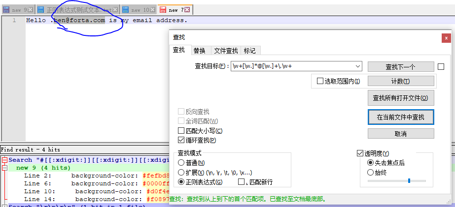

*等于使其可选的元字符，+至少要匹配一次，\*可以匹配多次,也可以一次都不匹配。\*是一个元字符，如果需要匹配\*本身就必须使用转义\\\*。

### 4.3 匹配0个或一个字符

另一个有用的元字符是?。和+一样，?可以匹配可选文本，就算文本没出现也可以匹配。但是与+不同，?只能匹配某个字符，或者字符集合的0次出现，或者一次出现，最多不超过一次。?非常适合匹配一段文本的某个特定的可选字符。

比如匹配Url（http和https）

> https?:\\/\\/[\w+.\\/]+

```txt
Hello .ben@forta.com is my email address.
the url is http://www.forta.com/,to connect
securely use https://www.forta.com/ instead.
```

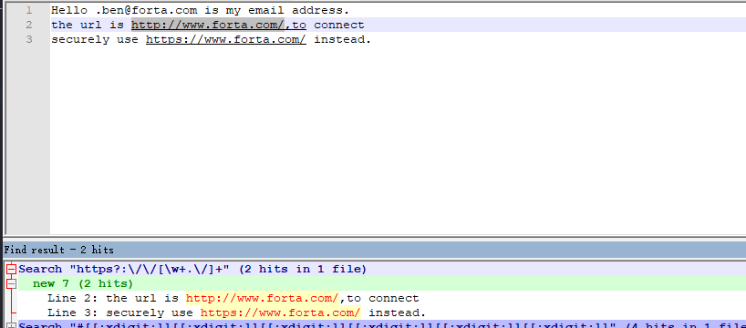

所以之前匹配unix和windows路径匹配符的写法，可以换一种：
> [\\r]?\\n[\\r]?\n

[\\r]?\\n匹配一个可选的\r和一个必不可少的\n。

通常上面https?的写法我们会写成更简明和可读性好的：
> http[s]?

这样显得可读性更好。但是不能写成http[s?]这就不对了。

### 4.4 匹配重复次数

思考如下的问题:

- +和*匹配的字符个数没有上限，我们无法为其匹配的字符个数设定一个最大值。
- +、*、?匹配的字符最小数是0个或者1个，我们无法明确地为其匹配的字符个数另行设定一个最小值。
- 我们无法指定具体的匹配次数。

所以我们又了重复范围的用法。在{}之间指定重复次数。

{}是元字符，如果要匹配他们自身，则需要加转义。

#### 4.4.1 具体的重复匹配

还看之前的匹配RGB颜色值的写法，思考一下最原始的写法，和posix的写法，问题在于你无论如何都要写6次相同的字符集合。

换成区间匹配:

> #[a-fA-F0-9]{6}

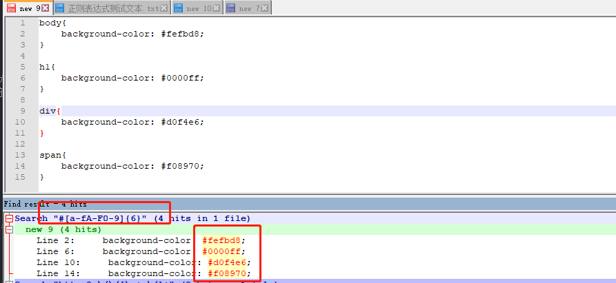

#### 4.4.2 区间范围

{}得用法还可以给重复次数设定一个区间范围，也就是匹配的最小次数和最大次数。区间必须是{2,4}这种形式。

```txt
4/8/17
10-6-2018
2/2/2
01-01-01
```

> \\d{1,2}[-\\/]\d{1,2}[-\\/]\d{2,4}

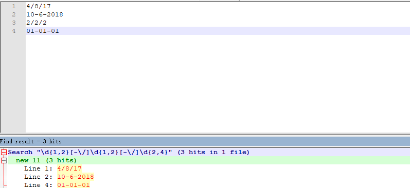

#### 4.4.3 至少匹配重复多少次

这种用法不指定最大次数，只是省略了最大值。比如{3,}表示至少重复3次，就是重复3次或者更多次。

此时注意不能丢掉那个","，如果丢掉了它，就会从至少匹配n次，变成了精确匹配n次。

### 4.5 防止过度匹配

*和+都是贪婪匹配，其匹配行为是多多益善，而不是适可而止。如果不想贪婪匹配怎么办，可以使用lazy模式。可以在量词的后面，加一个?，就变成了懒惰版本。

|贪婪型|懒惰型|
|---|---|
|\*|\*?|
|\+|\+?|
|{n,}|{n,}?|

比如在如下的HTML代码中查找span元素的标签：

```html
<span>text2</span><span>text3</span><span>text4</span>
```

如果按照:
> \<span>.*\</span> 

这种写法，则匹配结果如下:

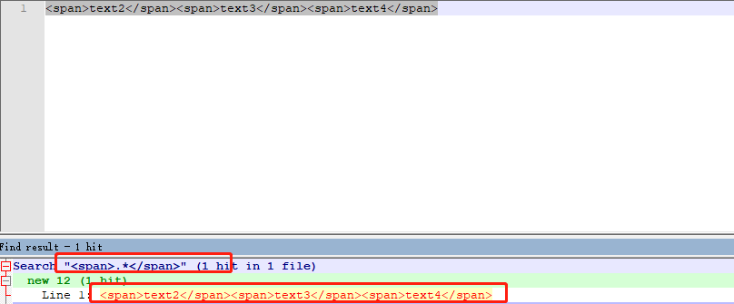

发现中间的几个span被.*一网打尽了，这确实包含了我们想要的内容，但是也夹杂了其他的内容。

换成懒惰型的写法，第一个匹配则仅限于第一个span，后面的则成了其他的第二、第三个匹配。

> \<span>.*?\</span>

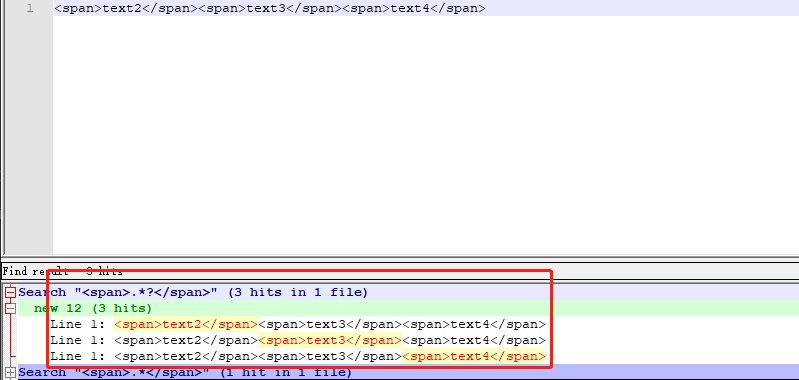

## 五、位置匹配

### 5.1 边界

位置匹配用于指定应该在什么地方进行匹配操作。看文本:

```txt
The cat scattered his food all over the room.
```

查找cat.

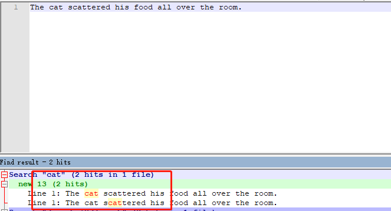

如果我们想把cat换成dog，那么这种写法显然是不行的。

边界，就是用于指定模式前后位置，或者边界的特殊元字符。

### 5.2 单词边界

单词边界由\\b来界定。用来匹配一个单词的开头和结尾。

用单词边界来改写上面的例子:

> \bcat\b

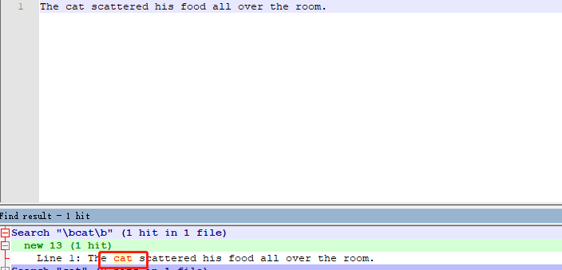

所以除了cat之外，另一个不会被匹配到，因为前后有s和t在，他们不会被\\b匹配到。

所以到底是\\b代表什么？正则表达式引擎其实是不懂英语的，也不知道什么是单词边界。它匹配的是字符之间的一个位置，一边是单词，也就是能够被\\w匹配的字母数字字符和下划线，另一边就是其他的内容，也就是可以被\\W匹配到的字符。

如果要真的要匹配一个完整的单词，需要在前后都要加上\\b，如果只在一边加上\\b，那么结果可能会有多余的部分。

\\b匹配的是一个位置，而不是一个固定的字符。所以\\bcat\\b匹配的实际是三个字符，而不是5个。、

如果不想匹配边界，可以使用\\B.

### 5.3 字符串边界

单词边界可以对单词位置匹配，字符串边界有着相似的用途，只不过在用的时候收尾进行模式匹配。字符串边界元字符有两个，\^代表开始，\$代表结束。

之前我们使用\^代表排除部分字符，现在又可以代表字符串的开始。只有当它出现在字符串集里的时候且紧跟左方括号的后面时，它才代表排除该字符集合，如果出现在字符串集之外，且位于模式的开始，\
^将匹配字符串的起始位置。

来测试一下xml文档的标识符，xml文档都是以\<\?xml>标签开头的,另外可能也包含其他的属性。

如:\<\?xml version="1.0" \?>。

下面的正则表达式可以检测这个。
> <\\?xml.*\\?>

但是这个模式不太准确。因为如果把这个标签写在第二行也是可以检测到的，但是正规的xml文档，需要在第一行。

所以需要让xml的标签出现在字符串的第一行，这时候\^就需要出手了。

> ^\s*<\\?xml.*\\?>

\^开始匹配了最开始的地方，\\s\*匹配了紧随其后后的几个空白，这就允许标签之前出现一些空白（空格、回车、换行、制表等）。所以上面的正则表达式，不仅解决了xml的起始标签的检测，还允许正确处理空白。

### 5.4 多行匹配

(?m)用于启用多行模式，多行模式迫使正则表达式引擎将换行符视为字符串分隔符，这样一来\^既可以匹配字符串开头，也可以匹配换行之后的起始位置，\$不仅能匹配字符串结尾，还能匹配换行符之后的结束位置。

(?m)必须出现在整个模式的最前面。

我们找一段代码里的注释。

```javascript
function test(){
    //Make sure not empty
    if(filed.value == ''){
        return false;
    }
    //init
    var windowName = "spellWindow";
    //Done
    return false;
}
```

正则表达式:

> (?m)^\s*\\\/\\\/.*$

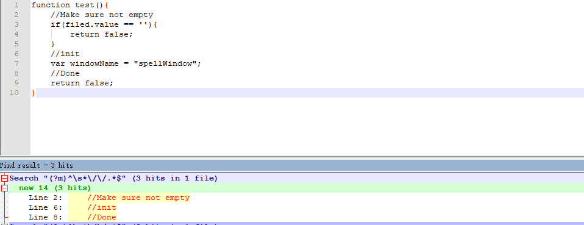

## 六、子表达式

### 6.1 子表达式

实际上我们可以看到，之前的用法+、?等都只能作用于紧挨着它之前的字符或者元字符。

比如有时候要匹配html文件中的\&nbsp;如果用\&nbsp;{2,}实际上是无法匹配两个以上的空格的，因为它只作用于紧挨着它之前的那个字符，在这里是一个分号";"。

### 6.2 子表达式分组

子表达式必须放在()中间，它们是元字符，如果要匹配它们本身，则需要使用转义。
比如匹配IP地址，一般是12.119.114.200这种类型。
> (\\d{1,3}\\.){3}\\d{1,3}

```txt
12.119.114.200
http://www.baidu.com
```

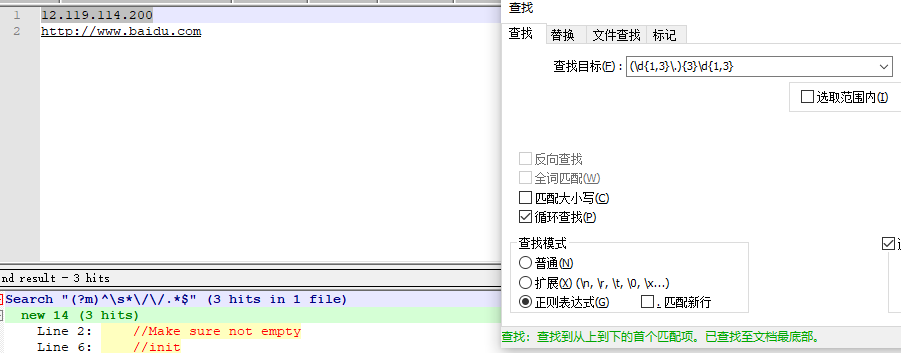

如果你希望在写表达式的时候，加上括号来区分子表达式，增加可读性，那么也是无可厚非的。

### 6.3 子表达式的嵌套

回到前面匹配ip地址写法，他当然可以匹配正确的ip地址，但是有些不合法的ip地址也可以匹配到。

比如有ip中的数字，超过255，也是可以匹配出来的。

一个正则表达式，写出来不难，写出来能找到内容不难，难的是能考虑到所有的场景，确保将不需要的内容都排除在外。

所以考虑下上面的ip规则:

- 任意的1或者2位数字
- 任意的1开头的三位数字
- 任意的2开头、第二位数字在0-4之间的三位数字
- 任意的以25开头，第三位数字在0-5之间的三位数字

那么可以先这么写：

> (((25[0-5])|(2[0-4]\\d)|(1\\d{2})|(\\d{1,2}))\\.){3}(((25[0-5])|(2[0-4]\\d)|(1\\d{2})|(\\d{1,2})))

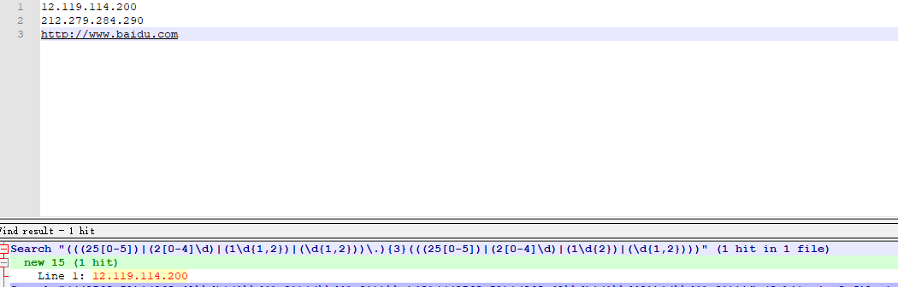

注意，更精细的表达式需要排在前面，否则|这个操作符，会排除后面的表达式，直接命中前面的就结束了，有可能造成不准确。

比如如果交换一下位置:

> (((\\d{1,2})|(1\\d{2})|(2[0-4]\\d)|(25[0-5]))\\.){3}(((\\d{1,2})|(25[0-5])|(1\\d{2})|(2[0-4]\\d)))

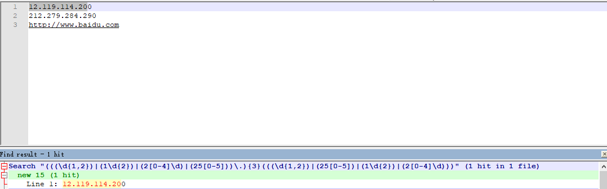

可以看到，最后的0没有匹配上，因为被前面的表达式截断了。

## 七、反向引用

### 7.1 为什么要反向引用

看个例子:

```html
<body>
<h1>welcome</h1>
this is content <br/>
<h2>SQL</h2>
About sql.
<h2> RegEx</h2>
about Regex。
</body>
```

我们需要找到所有的页面标题，不管是几级的。

> <[hH]1>.*<\\/[hH]1>

这个表达式可以找到一级标题，那我们想找到所有的标题，可以用区间来替代1.
> <[hH][1-6]>.*<\\/[hH][1-6]>

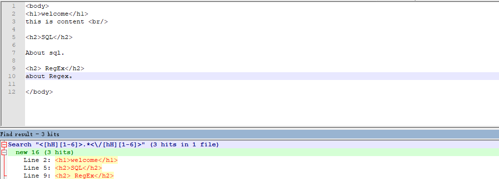

看起来是可行的。所以我们例子中的每个标签都占一行，所以没有贪婪的问题，如果想确保没问题，那可以采用懒惰型匹配。
> <[hH][1-6]>.*?<\\/[hH][1-6]>

这样没问题吗？那改写一下：

```html
<body>
<h1>welcome</h1>
this is content <br/>
<h2>SQL</h2>
About sql.
<h2> RegEx</h2>
about Regex。

<h2> 错误的标签。</h3>
</body>
```

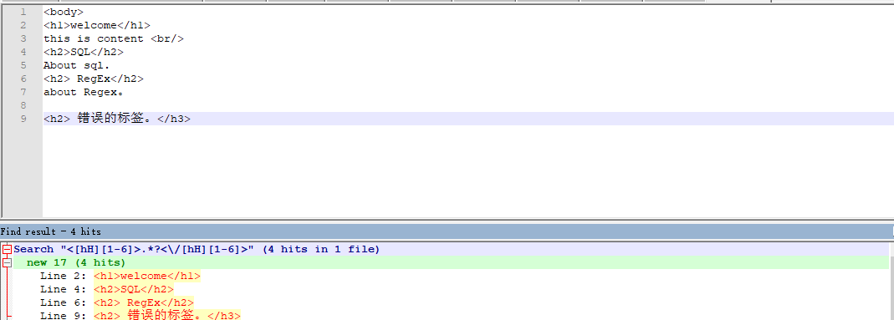

看得到那个错误的标签也匹配出来了。
错误的来源，是匹配结束标签的地方，它对开始标签一无所知，也无所对应。

### 7.2 反向引用

假设一个场景，你需要找到一段文本里的所有连续重复出现的单词，可能是打字错误，连续输了两遍。显然，在搜索的时候，匹配第二次出现的时候，这个单词是必须已知的。

```html
This is a block of of text,
several words here are are 
repeated , and and they should not be.
```

> [ ]+(\\w+)[ ]+\\1
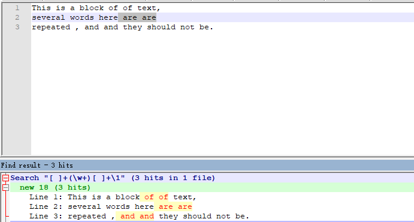

看起来是生效了。看看原理：

[ ]+ 匹配一个或者多个空格。
\\w+匹配一个或者多个字母数字字符。它是一个子表达，它不是用来重复匹配的，也没有什么要重复匹配的地方。它只是对模式分组，将其标识起来备用。
[ ]+ 匹配结尾的空格。
最后一部分\\1，是对前面那个子表达式的反向引用，\1匹配的内容与第一个分组匹配的内容一样。因此，如果(\\w+)匹配的是单词of，那么\\1也匹配单词of。如果(\\w+)匹配的是and，那么\\1也是匹配单词and。

那么反向引用的意思就是指向先前的子表达式。

JS使用"\\"来标识反向引用，vi也是如此，perl用\$来标识，比如用\$1取代之前\\1的用法。
\.NET返回一个对象，这个对象的Groups属性包含所有的匹配。
C#,match.Groups[1]对应着第一个匹配。
JAVA和Python返回一个匹配对象，包含着名为group的数组。

可以把反向引用想象成变量。

回到之前的HTML匹配，可以换成下面的表达式，就不会在匹配错误的标签了。

> <\[hH]([1-6])>.*?<\\/[hH]\\1>

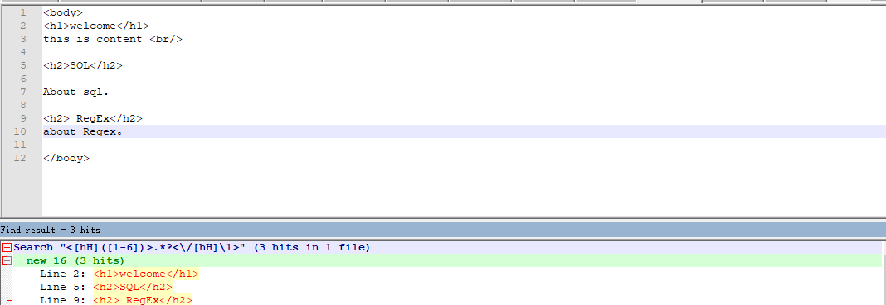

反向引用只能用来引用括号的子表达式。

提示：反向引用匹配通常从1开始计数，在许多实现里第0个匹配通常来指代整个正则表达式。

子表达式使用位置来引用，\\1对应第一个子表达式，以此类推。但这么用法会有一系列问题，比如我们增删了子表达式，改了表达式的位置可能会使这个模式失效。

为了弥补这个问题，有些正则表达式的实现会考虑使用命名子表达式来实现。

但不一定所有的正则表达式实现都支持，请一定要注意。

### 7.3 替换操作

#### 7.3.1 普通替换

之前所说的正则表达式的所有功能，都是搜索的，这是最常用也是它的基本功能。但是也可以完成更强大的替换操作。

简单的文本替换，实际上用不到正则表达式。简单的文本处理也就够了。当然正则表达式也可以完成，但是并没有发挥它的强大之处。

```html
Hello ben@forta.com is my email address.
the url is www@forta.com,to connect
securely use www3@forta.com instead.
```

考虑一下把上面的邮件地址换成可点击的超链接。比如需要把"ben@forta.com"换成

```html
<a href="mailto:ben@forta.com">ben@forta.com</a>
```

> (\\w+[\\w\\.]*@[\\w\\.]+\\.\\w+)
> 替换为: \<a href="mailto:\$1">$1\</a>

正则表达式需要有两个表达式，一个用来指定搜索模式，另一个用来指定替换模式。反向引用可以使用跨模式，在第一个模式里匹配的子表达式可以用在第二个模式里，这里用上面的模式和之前用的一样，但是要把它写成子表达式，被匹配到的文本就可以用用于替换模式了。

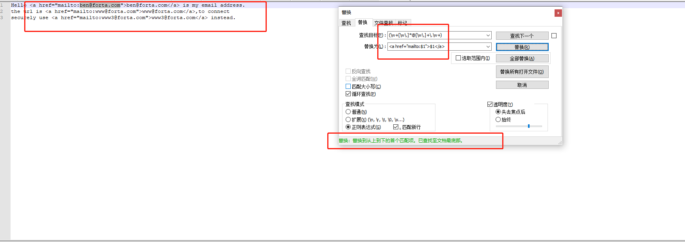

根据你所使用的正则表达式实现来修改反向引用的指示符。比如js中需要用\\来替换\$。

同一个子表达式可以被多次引用，只需要用到的地方写出反向引用的形式。

#### 7.3.2 大小写转换

|元字符|说明|
|---|---|
|\\E|结束\\L或者\\U转换|
|\\l|把下一个字符转换成小写|
|\\L|把\\L到\\E之间的字符全部转换为小写|
|\\u|把下一个字符转换成大写|
|\\U|把\\U到\\E之间的字符全部转换为大写|

\\l和\\u可以防止在字符或者子表达式之前，转换下一个字符的大小写。\\L和\\U可以转换其与
\\E之间所有字符的大小写。

比如把下面的h1标签内的内容都换成大写:即把text2换成TEXT2等等

```html
<h1>text2</h1>text2<h1>text3</h1>text3<h1>text4</h1>
```

> (\<[hH]1>)(.*?)(<\/[hH]1>)
> \$1\\U\$2\\E\$3

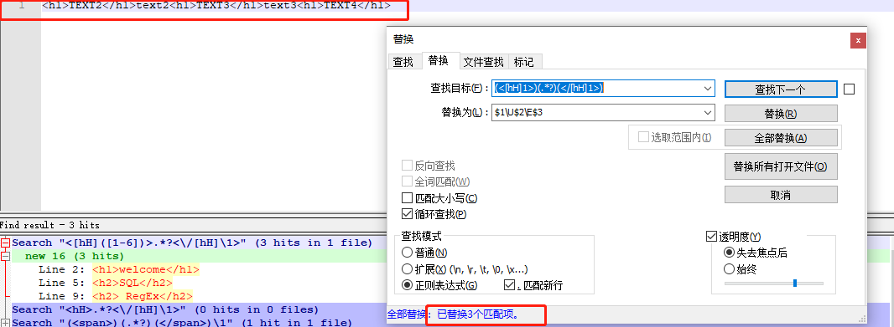