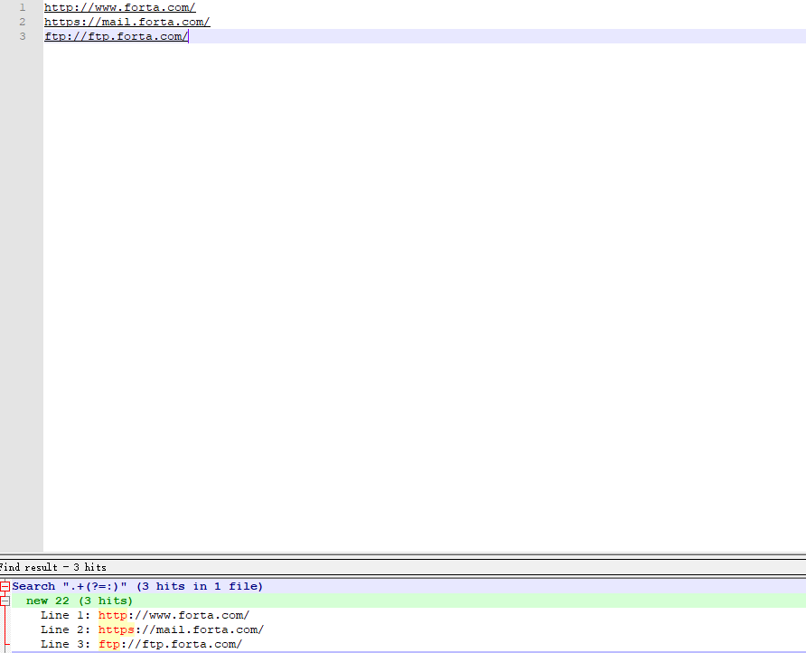
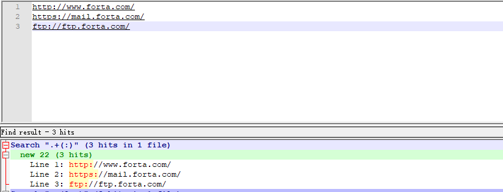
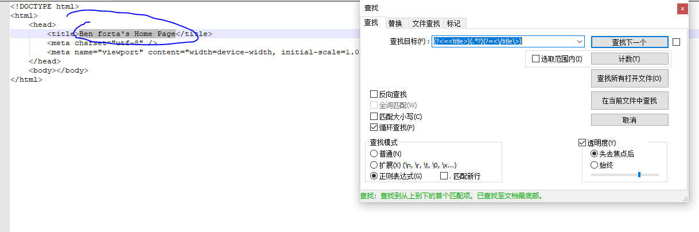
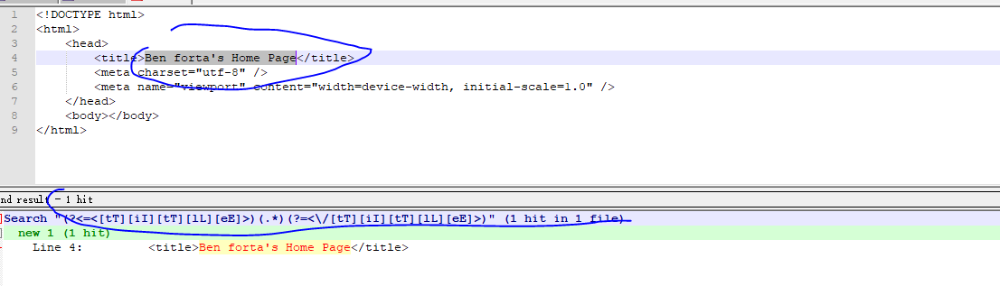
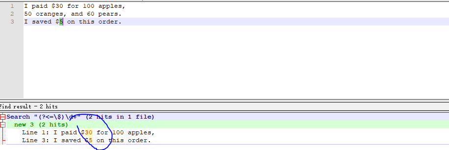
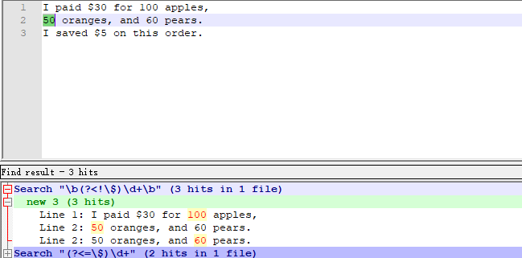

# <center>正则表达式-其他用法</center>

## 一、环视

### 1.1 环视简介

看一个示例：我们想提取页面的标题，比如在title中取页面的内容。

```html
<!DOCTYPE html>
<html>
	<head>
		<title>Ben forta's Home Page</title>
		<meta charset="utf-8" />
		<meta name="viewport" content="width=device-width, initial-scale=1.0" />
	</head>
	<body></body>
</html>
```

使用正则表达式: <[tT][iI][tT][lL][eE]>.*<\\/[tT][iI][tT][lL][eE]>

可以匹配到的内容是:

> \<title>Ben forta's Home Page\</title>

我们本来只想要文字，但是把标签也拿到了，那能不能只返回文字呢？可以。
可以使用之前的分组表达式，可以用子表达式划分三部分，开始标签、标题文字、结束标签。划分之后，可以只取标题文字的部分。

但是这个过程确实多余了，我们想要拿到一些东西，但是我们拿到了本来不想要的东西，然后把这些多余的东西去掉了，然后再拿到我们想要的东西。那么需要一种模式，这个模式包含一些不用被返回的匹配，这些匹配是为了找出正确的匹配位置，其自身不属于最终的匹配结果。

这就是所谓,你需要"环视"。

有向前查看和向后查看的概念，主流的正则表达式都支持前者，少部分支持后者。

比如Java、.NET、PHP、Python和Perl都支持向后查看。

### 1.2 向前查看

指定了一个必须匹配，但是不用在结果中返回的模式。其实就是子表达式，从格式上看也是如此，它的模式是以?=开头的子表达式，需要匹配的文本跟在=后面。

有些表达式文档使用术语“消耗”来表述"匹配和返回文本"的含义，向前查看不消耗匹配的文本。
下面有些url地址，我们来查找协议的部分:

```txt
http://www.forta.com
https://mail.forta.com
ftp://ftp.forta.com
```

> .+(?=:)


可以看出确实找到了url的协议部分。

再看一下不使用向前查看的方式:

> $.+(:)$


可以看出这时候,冒号被消耗掉了，因为被匹配了。

向前查看和向后查看其实都有返回值的，只不过返回的是空字符串，因此环视操作有时候也被称为零宽度匹配操作。

任何子表达式都可以转换成向前查看表达式，只要在之前加上?=即可，在同一个搜索模式里可以使用多个，出现的位置没有限制。

### 1.3 向后查看

?=被称为向前查看操作符，除了向前查看许多正则表达式还支持向后查看。向后查看操作符是?<=。

它必须出现在一个子表达式里，后面要跟随匹配的文本。

比如:(?<=\<title>)(.*?)(?=<\/title\>) 可以匹配到title的内容。



### 1.4 向前和向后查看

同1.3，可以查找对应标签内的内容。

> (?<=\\<[tT][iI][tT][lL][eE]>)(.*)(?=<\\/[tT][iI][tT][lL][eE]>)



### 1.4 否定式环视

前面的用法都是肯定是向前查看和肯定是向后查看。
否定式环视，需要结合否定式向前查看(向前查看不匹配指定模式的文本)和否定式向后查看(向后查看不匹配指定模式的文本)。

你可能想用\^来实现否定式环视，但实际上不行。可以使用!来替代=。

|种类|说明|
|---|---|
|(?=)|肯定是向前|
|(?<=)|肯定式向后|
|(?!)|否定式向前|
|(?<!)|否定式向后|

一般来说，凡是支持向前查看的正则表达式实现也都支持肯定式向前查看和否定式向前查看，凡是支持向后查看的正则表达式实现也都支持肯定式向后查看和否定式向后查看。

```txt
I paid $30 for 100 apples,
50 oranges, and 60 pears.
I saved $5 on this order.
```

在这段文本中有数量有金钱。
我们先找金钱。
> (?<=\\$)\\d+



那么再来找找数量，但是不要价格。

> \\b(?<!\\$)\\d+\\b



## 二、嵌入式条件

### 2.1 正则表达式里的条件

正则表达式里条件要用?定义。

- ?匹配前一个字符或者表达式，如果它存在的话
- ?=和?<=匹配前面或者后面的文本，如果它存在的话。

