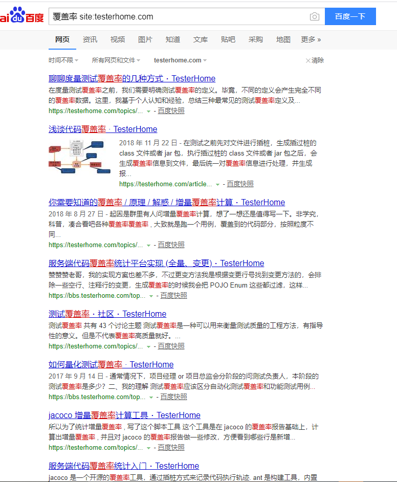
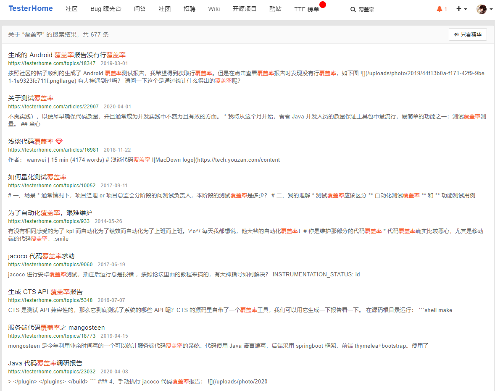
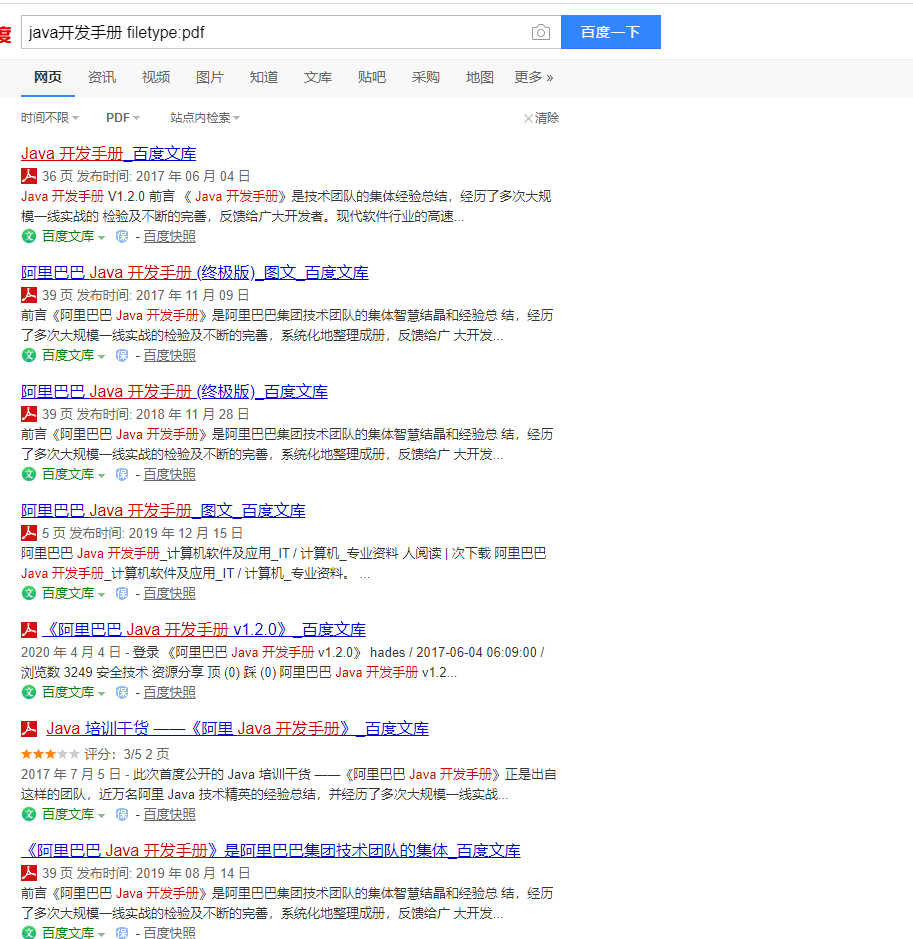
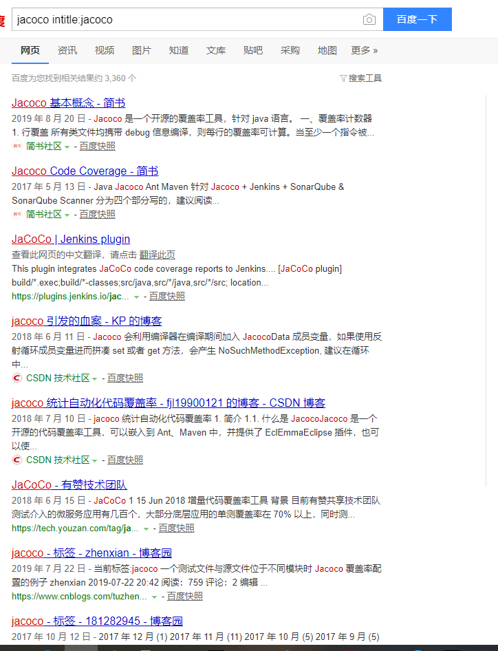
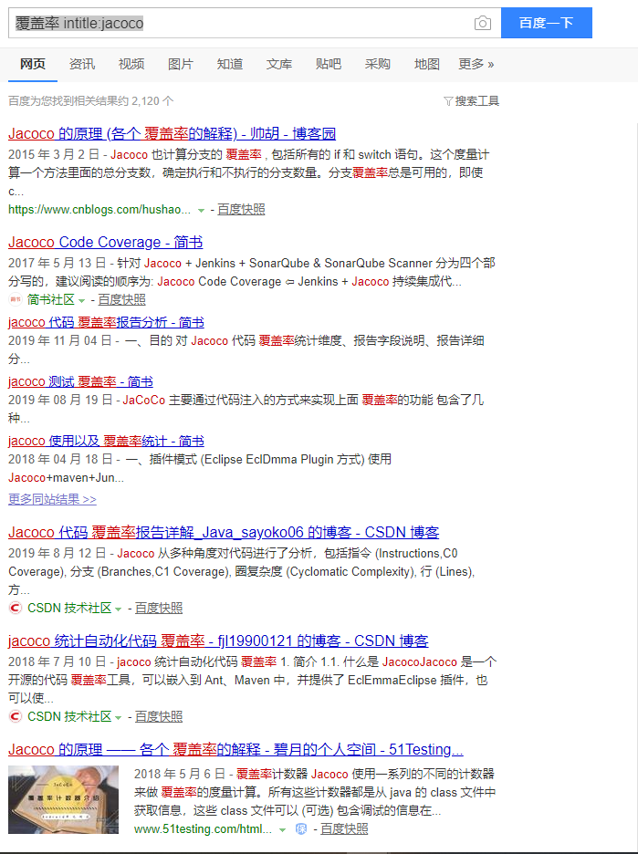
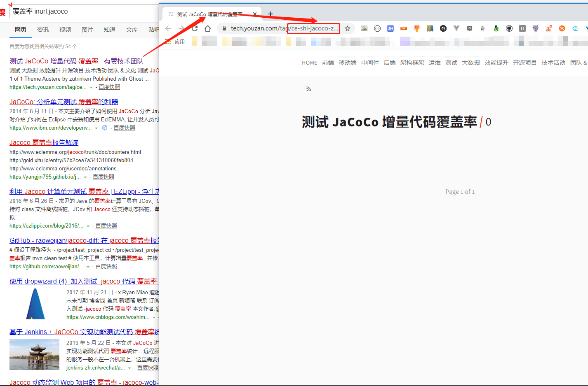
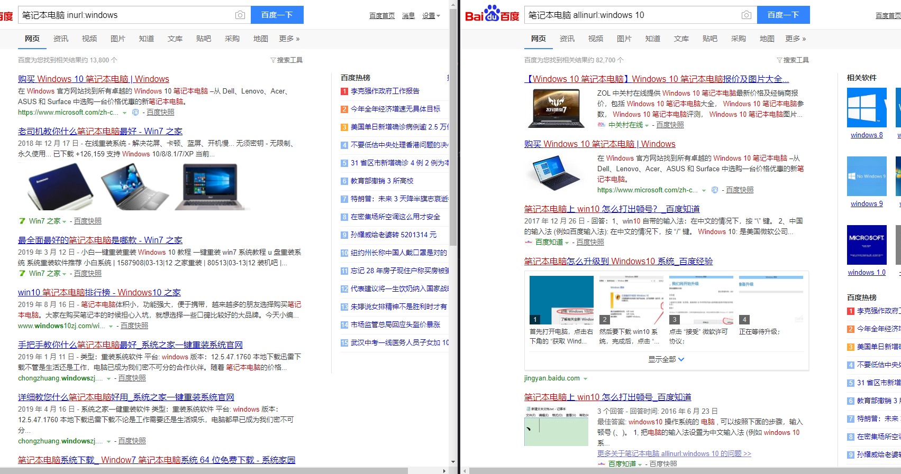
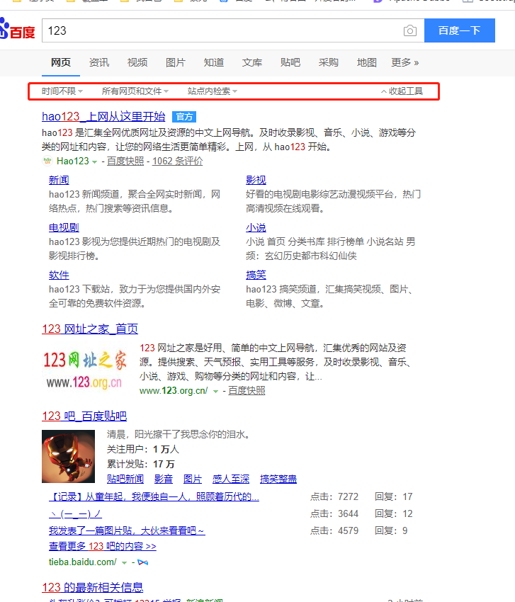
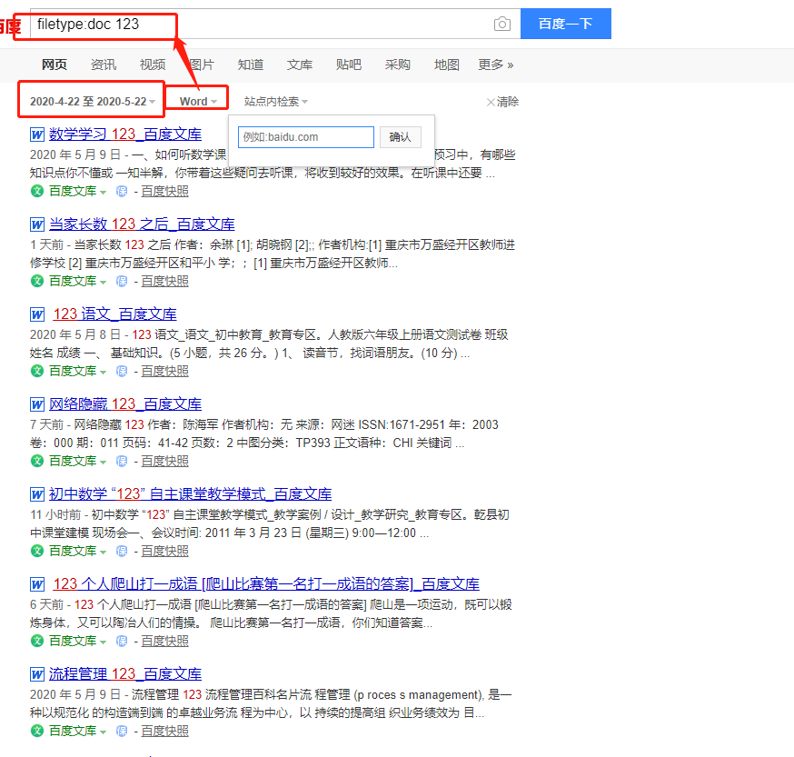

# 
搜索

## 一、搜索指令

### 1.1 site:搜索结果限定在某个网站中

> 用法: 关键词 空格  site英文冒号网站地址(不含协议，只需要域名)
> 用途: 搜索结果限定在某个网站中
> 样例: 覆盖率 site:testerhome.com

如果已经知道要搜索的结果在某个网站中，则可以用该方式，把限定的范围固定在指定网站中。

示例:在testerhome中搜索覆盖率关键字
> 覆盖率 site:testerhome.com

结果:

示例：在testerhome中搜索覆盖率

也许有人会想，既然可以直接在网站中搜索，那为何要走搜索引擎这一步呢？
并不是所有的网站的站内搜索搜设计的比较好，或者有的网站不提供搜索。使用搜索引擎可以弥补这一些不足。

### 1.2 filetype 指定搜索文件类型

> 用法: 关键词 空格 filetype英文冒号+文件格式
> 用途: 在搜索结果中指定包含关键词，且返回内容格式被指定为特定类型
> 样例: java开发手册 filetype:pdf

文件格式可以是pdf、PPT、doc等等。

搜索结果:

### 1.3 时间1..时间2 限定搜索的时间范围

> 用法: 关键词 空格 时间1..时间2
> 用途: 限定特定时间范围内的结果。
> 样例: 人工智能 2015..2018

这个用法，如果在github或者gitlab中熟悉的话，应该可以在比较代码的时候会见到，比如搜索某个文件在时间1和时间2之间的变更内容等。

示例:搜索2015到2020年的人工智能相关的行业报告

> 人工智能 2015..2018

结果,出现的是一些行业报告和数据统计，过滤掉一部分广告：

如果直接搜索人工智能的结果如下，可以看到显示的人工智能本身的定义和一些新闻或者广告，这与一开始的精确搜索行业报告，结果缺少精确度:

### 1.3 intitle 限定搜索标题中包含的关键字

为了减少搜索出相关度比较低的内容的概率，可以使用intitle提高效率。该指令的返回结果中，网页标题要包含关键字，网页设计的一个原则就是把主业的关键内容用简洁的语言表示在标题里面。
因此，只查询标题，通常也可以找到高相关性的专题。

> 用法: 关键词 空格  intitle:关键词
> 用途：限定搜索网页标题中包含的关键字
> 样例: 覆盖率 intitle:jacoco

比如搜索: 网页标题中包含关键字jacoco的，内容中包含jacoco的结果
> 搜索指令: jacoco intitle:jacoco

结果:

再比如，搜索内容中包含关键字"覆盖率"，且同时网页标题中包含jacoco。
> 用法: 覆盖率 intitle:jacoco

结果:

**用此种方式可以过滤掉那些只是在文章中一笔带过你需要的关键字的内容，标题中包含的内容一般是该文章中需要主要表达的内容，搜索命中率会更高**

注意前后两个关键词可以不同。

### 1.5 inurl限定搜索结果的网址中包含指定字段

inurl用于搜索的关键词在url里。同时支持中英文。

> 用法：关键词 inurl:限定关键字
> 用途：查找url中包含限定关键字的内容。
> 样例: 覆盖率 inurl:jacoco

**有时候inurl可以取代site，因为site之后跟的是一个完整域名，如果记不住可以用inurl取代**

示例:搜索内容含有覆盖率，且url中包含jacoco的内容
> 搜索指令: 覆盖率 inurl:jacoco

结果:

### 1.6 "-"减号: 搜索信息中不包含某些词

减掉一些不想看的信息和网站，比如可以去掉推广之类的信息。

> 用法: 关键词 [-不想看的词 [-不想看的词]]
> 用途: 去掉搜索结果中不想看的信息
> 样例: 软件工程师考试 -广告 -推广

这个测试时，pc端表现不是很明显，手机端比较明显，展示手机端如下：

可以发现，在带减号的搜索中，虽然也有广告，但相对少了不少。

## 二、搜索指令的变种用法

### 2.1 -site:xxx.com

> 关键词 -site:xxx.com
搜索关键词，排除给定网站中的内容，这在搜索时，不想看到某些网站中的信息非常有用，可能让你点搜索一下子就清净了。

### 2.2 inurl和allinurl

inurl:找一个关键词
allinurl: 找多个关键词

比如找 inurl:windows或者allinurl: windows 10

下面结果可以看出差别：

### 三、百度的搜索工具

百度的搜索中，内置了一个搜索工具，相当于一些搜索指令的工具化。
如下图所示:

如下是使用搜索工具的效果:

