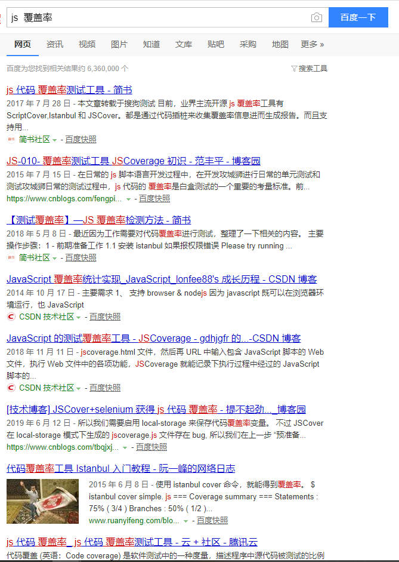

# 
高级检索式

## 一、布尔逻辑

与或非，不用多说。在搜索的时候，代表了关键词之间的关系。在这三个的基础上还可以叠加。

- AND
    逻辑与，在搜索时可以用+  ，或者空格来表示。用于检索两个关键词以上的情形，检索的结果必须和这几个词都有关系。

如下所示:

- OR 逻辑或

或可能不同的搜索引擎有所不同，有的用"|"表示。检索结果只要和关键词中的其中一个相关即可。

示例如下:

- 逻辑非

表示不需要这个关键词。用"-"减号表示，也有用"!"表示。

比如想搜索演员A，但不想搜索跟演员A相关的演员B的消息。

就可以用: 演员A - 演员B

不过逻辑关系的搜索，有的搜索引擎支持的多，有的只支持部分。百度和谷歌应该是都支持的。

建议规则:
百度中用符号，即+ | -来处理。
谷歌中建议用大写的半角字母代替： 如AND OR NOT等。

**当其中一种搜索引擎对逻辑符号的支持不明显的时候，建议换一种试试，比如谷歌或者必应**