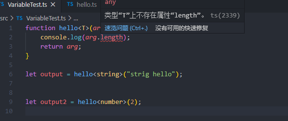

# <center>类型和函数</center>

## 一、js的数据类型

- boolean。true 和false
- null。表明null值的特殊关键字
- undefined。未定义时的值
- number。数字
- string。字符串
- symbol。数据类型，它的实例，唯一且不可改变
- object。对象，存放值的命名容器。
运行时处理类型，无法在代码阶段获知。

## 二、Ts的基本类型

Ts是js的超集，所以它的基本类型和js是完全相同的。

- boolean.
  
```typescript
let areYouOk: boolean = true
```

- 数字
  
```typescript
let a: number = 6
let b: number = 1_000_000
```

- 字符串
  双引号或者单引号均可。

```typescript
let name: string = "xiaoming";
let otherName: string = "daming";
```

  还可以使用模版字符串，可以定义多行文本和内嵌表达式。反引号包围，$符号向句子中插入表达式。

```typescript
let name: string = `xiaoming`;
let age: number = 37;
let sentence: string = `Hello , my name is ${name} . 
I'll be ${age + 1} years old next month.`;
```

- null和undefined
  
- 数组
  直接定义：

```typescript
let list: number[] = [1,2,3];
```

  数组泛型:

```typescript
let list: Array<number> = [1,2,3];
```

## 三、变量声明

let、const是es6新增的变量声明方式。
即使在声明的时候不指定变量类型，Ts依旧可以根据指定的变量进行类型推断。

```typescript
let name = `xiaoming`;

const age = 5;

//这时候再给name赋值为1就会报错
name = 1;
```

实际效果如下:


如果在初始化阶段已经声明了该变量的类型，在中途更改，会触发ts的编译时检查，如果有问题就会报错。

**类型断言**：以下两种形式等效，具体怎用看个人习惯。

尖括号:

```typescript
let oneString: any = "this is a string";
let stringLength: number =  (<string>oneString).length;
```

as:

```typescript
let oneString: any = "this is a string";
let stringLength: number =  (oneString as string).length;
```

在Ts的JSX中类型断言可以使用as，但是不能使用尖括号。尖括号在JSX中已经用于表达泛型了。

## 四、泛型

用于提升代码重用性。希望代码不仅支持当前设计的数据类型，也能支持将来的数据类型。

### 4.1 泛型函数

来实现一个函数，直接将输入的参数作为返回值返回出去。命名为hello

如果不适用泛型，可能会如下写：

如果传入一个数字:

```typescript
function hello(arg: number): number{
    return arg;
}
```

稍后需求会变，需要传入一个字符串：

```typescript

function hello(arg: string): string{
    return arg;
}
```

当然也可以用any来处理：

```typescript

function hello(arg: any): any{
    return arg;
}
```

但any类型，不能保证我们传入的和输出的是同一个类型，这就违背了函数的初衷。

换用泛型方式实现：

```typescript
function hello<T>(arg: T): T{
    return arg;
}
```

这就能满足，传入的和输出的类型是一致的。

如何使用呢，两种方式：

- **尖括号**

```typescript

let output = hello<string>("strig hello");
```

- **类型推断**

Ts会根据传入的类型自动判断T的类型。

```typescript

let output = hello("hello string");
```

这样，编译器知道T的类型就是“hello string”的类型，也就是string。

这时候ide(如vscode)上就会可以明确提示变量的类型，如下所示:


类型推断在某些特殊场景会失灵，请注意。

### 4.2 泛型变量

假设上面的函数，我们想使调用参数的length属性，就会发现编译报错。



这是因为，当你传入一个string的时候，没有问题，但是如果是个number呢？编译器会选择最差的场景来处理,T代表任意类型，那么它就一定会有最糟糕的类型，就提示错误。

换一种泛型表示：

```typescript

function hello<T>(arg: T[]): T[]{
    console.log(arg.length);
    return arg;
}
```

或者:

```typescript
function hello<T>(arg: Array<T>): Array<T>{
    console.log(arg.length);
    return arg;
}

```

结果如下:


## 五、枚举

TS支持基于字符串或者数字的枚举。

### 5.1 数字枚举

```typescript
enum  OrderStatus{
    Start = 1,
    Unpaid = 2,
    Shipping = 3,
    Shipped = 4,
    Complete = 5
}

//甚至可以这样
/**
 * enum  OrderStatus{
    Start = 1,
    Unpaid ,
    Shipping ,
    Shipped ,
    Complete
}
 * /
```

使用时可以用OrderStatus.Start代替他的数字1，增加可读性且有自注释的效果。
定义首个数字之后，其他的如果没有指定值的话，默认递增，如果指定了就按照指定后的值。

如果首个数字也不指定，默认从0开始。

但有一点，枚举中的值必须是确定的值，不能是变得，或者无法推断的。

如下所示：

```typescript
enum ExampleWrong{
    A = hello(),
    B
}
```


### 5.2 字符串枚举

跟数字枚举的区别：必须是字符串字面量;字符串枚举没有递增的含义，必须手动初始化。

```typescript
enum  OrderStatus{
    Start = "Start",
    Unpaid = "Unpaid",
    Shipping = "Shipping",
    Shipped = "Shipped",
    Complete = "Complete"
}

```

### 5.3 反向映射

属于数字枚举的一个技巧，得益于TS在实现数字枚举时的代码编译。

```typescript
enum Enum{
    A
}
```

按照上例子,编译出来的js代码是:

```javascript
var Enum;

(function(Enum){
    Enum[Enum["A"] = 0] = "A";
})(Enum || (Enum = {}));

```


所以，既可以根据属性名获取值，也可以根据值获取属性名。

```typescript

const enumA = Enum.A;
const nameOfEnumA = Enum[enumA];
const nameOfEnumANew = Enum[Enum.A];

console.log(enumA, nameOfEnumA , nameOfEnumANew);
```


这主要是编译成js代码之后，运行时包含了正向映射: key -> value，也包含了反向映射value -> key，而字符串枚举编译后没有这样的特性。看如下编译后的代码就明显了，红框内显示的比较清晰。


## 六、symbol

ES6之后symbol成了基本类型之一。可通过构造函数创建。

```typescript
const symbol1 = Symbol();
const symbol2 = Symbol("hello");
const symbol3 = Symbol("hello");

console.log(symbol2 === symbol3);//这里会有编译时错误
```

同样的方式生成两个symbol也是不同的，因为它是唯一的。所以2和3无论如何都不会相等。

**所以，symbol可以用于对象属性的键。**

```typescript
const symbol = Symbol();
const obj = {
    [symbol]: "value"
};

console.log(obj[symbol]);//"value"
```

## 七、iterator、generator

### 7.1 iterator

当一个对象实现了Symbol.iterator的时候，则认为可迭代。如array、map、set、string、int32Array、unit32Array等。对象上的Symbol.iterator函数负责返回供迭代的值。

for..of语句会遍历可迭代的对象，调用对象上的Symbol.iterator方法。

```typescript
const array = [233,"hello",true];

for(let value of array){
    console.log(value);
}

```

for..in 和for..of都可以迭代一个数组，但他们之间区别很大，最明显的区别莫过于他们勇于迭代的返回值不同，for..in迭代的是键，for..of迭代的是对象的值。

以下例子可以看出端倪:

```typescript
const array = [3,4,5];
for (let i in array){
    console.log(i);//0,1,2
}
for (let i of array){
    console.log(i);//3,4,5
}
```

结果如下:


还有一个区别在于，for..in可以操作任何对象，提供了查看对象属性的方法，但是for..of关注迭代对象的值，内置对象map和set已经实现了Symbol.iterator方法，我们可以访问它的值。

```typescript
const fruits = new Set(["apple","pear","mango"]);

for(let fruit in fruits){
    console.log(fruit);
}

console.log("-----------");
for(let fruit of fruits){
    console.log(fruit);
}

```

### 7.2 generator

语法: function *。称为生成器。

调用generator函数时返回一个generator对象，generator对象遵循迭代器接口，通常有next、return、throw函数。

generator用于创建懒迭代器。

```typescript
function* infiniteList() {
    let i = 0;
    while (i < 10) {
        yield i++;
    }
}

var iterator = infiniteList();
let j = 0;

while (j < 10) {
    console.log(iterator.next());
    j++;
}
```

generator实际上允许函数可以暂停执行，比如当我们执行了第一次的next之后，可以先去做别的事，再回来执行next，剩余函数的控制权就交给了调用者。

当你直接调用generator的函数时，它不会执行，只会创建一个generator对象。

从上可知:

- generator对象只会在调用next的时候才开始执行
- 函数在执行到yield的时候，会暂停，并返回yield的值
- 函数在next被调用时继续恢复执行

实质上generator的函数的执行与否由外部的ghenerator对象控制的。

除了yield传值到外部，我们也可以通过next传值到内部调用。

```typescript
function* generator(){
    const who = yield;
    console.log("hello " + who);
}

const iterator = generator();

console.log(iterator.next());


console.log(iterator.next("TypeScript"));


```
