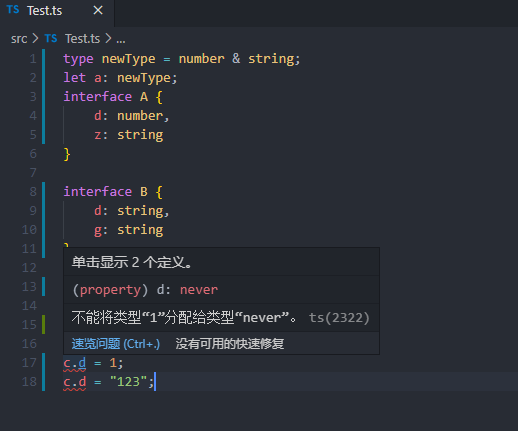

# <center>类型和函数</center>

## 一、js的数据类型

- boolean。true 和false
- null。表明null值的特殊关键字
- undefined。未定义时的值
- number。数字
- string。字符串
- symbol。数据类型，它的实例，唯一且不可改变
- object。对象，存放值的命名容器。
运行时处理类型，无法在代码阶段获知。

## 二、Ts的基本类型

Ts是js的超集，所以它的基本类型和js是完全相同的。

- boolean.
  
```typescript
let areYouOk: boolean = true
```

- 数字
  
```typescript
let a: number = 6
let b: number = 1_000_000
```

- 字符串
  双引号或者单引号均可。

```typescript
let name: string = "xiaoming";
let otherName: string = "daming";
```

  还可以使用模版字符串，可以定义多行文本和内嵌表达式。反引号包围，$符号向句子中插入表达式。

```typescript
let name: string = `xiaoming`;
let age: number = 37;
let sentence: string = `Hello , my name is ${name} . 
I'll be ${age + 1} years old next month.`;
```

- null和undefined
  
- 数组
  直接定义：

```typescript
let list: number[] = [1,2,3];
```

  数组泛型:

```typescript
let list: Array<number> = [1,2,3];
```

### 2.1、变量声明

let、const是es6新增的变量声明方式。
即使在声明的时候不指定变量类型，Ts依旧可以根据指定的变量进行类型推断。

```typescript
let name = `xiaoming`;

const age = 5;

//这时候再给name赋值为1就会报错
name = 1;
```

实际效果如下:


如果在初始化阶段已经声明了该变量的类型，在中途更改，会触发ts的编译时检查，如果有问题就会报错。

**类型断言**：以下两种形式等效，具体怎用看个人习惯。

尖括号:

```typescript
let oneString: any = "this is a string";
let stringLength: number =  (<string>oneString).length;
```

as:

```typescript
let oneString: any = "this is a string";
let stringLength: number =  (oneString as string).length;
```

在Ts的JSX中类型断言可以使用as，但是不能使用尖括号。尖括号在JSX中已经用于表达泛型了。

### 2.2、泛型

用于提升代码重用性。希望代码不仅支持当前设计的数据类型，也能支持将来的数据类型。

#### 2.2.1 泛型函数

来实现一个函数，直接将输入的参数作为返回值返回出去。命名为hello

如果不适用泛型，可能会如下写：

如果传入一个数字:

```typescript
function hello(arg: number): number{
    return arg;
}
```

稍后需求会变，需要传入一个字符串：

```typescript

function hello(arg: string): string{
    return arg;
}
```

当然也可以用any来处理：

```typescript

function hello(arg: any): any{
    return arg;
}
```

但any类型，不能保证我们传入的和输出的是同一个类型，这就违背了函数的初衷。

换用泛型方式实现：

```typescript
function hello<T>(arg: T): T{
    return arg;
}
```

这就能满足，传入的和输出的类型是一致的。

如何使用呢，两种方式：

- **尖括号**

```typescript

let output = hello<string>("strig hello");
```

- **类型推断**

Ts会根据传入的类型自动判断T的类型。

```typescript

let output = hello("hello string");
```

这样，编译器知道T的类型就是“hello string”的类型，也就是string。

这时候ide(如vscode)上就会可以明确提示变量的类型，如下所示:


类型推断在某些特殊场景会失灵，请注意。

#### 2.2.2 泛型变量

假设上面的函数，我们想使调用参数的length属性，就会发现编译报错。


这是因为，当你传入一个string的时候，没有问题，但是如果是个number呢？编译器会选择最差的场景来处理,T代表任意类型，那么它就一定会有最糟糕的类型，就提示错误。

换一种泛型表示：

```typescript

function hello<T>(arg: T[]): T[]{
    console.log(arg.length);
    return arg;
}
```

或者:

```typescript
function hello<T>(arg: Array<T>): Array<T>{
    console.log(arg.length);
    return arg;
}

```

结果如下:


### 2.3、枚举

TS支持基于字符串或者数字的枚举。

#### 2.3.1 数字枚举

```typescript
enum  OrderStatus{
    Start = 1,
    Unpaid = 2,
    Shipping = 3,
    Shipped = 4,
    Complete = 5
}

//甚至可以这样
/**
 * enum  OrderStatus{
    Start = 1,
    Unpaid ,
    Shipping ,
    Shipped ,
    Complete
}
 * /
```

使用时可以用OrderStatus.Start代替他的数字1，增加可读性且有自注释的效果。
定义首个数字之后，其他的如果没有指定值的话，默认递增，如果指定了就按照指定后的值。

如果首个数字也不指定，默认从0开始。

但有一点，枚举中的值必须是确定的值，不能是变得，或者无法推断的。

如下所示：

```typescript
enum ExampleWrong{
    A = hello(),
    B
}
```


#### 2.3.2 字符串枚举

跟数字枚举的区别：必须是字符串字面量;字符串枚举没有递增的含义，必须手动初始化。

```typescript
enum  OrderStatus{
    Start = "Start",
    Unpaid = "Unpaid",
    Shipping = "Shipping",
    Shipped = "Shipped",
    Complete = "Complete"
}

```

#### 2.3.3 反向映射

属于数字枚举的一个技巧，得益于TS在实现数字枚举时的代码编译。

```typescript
enum Enum{
    A
}
```

按照上例子,编译出来的js代码是:

```javascript
var Enum;

(function(Enum){
    Enum[Enum["A"] = 0] = "A";
})(Enum || (Enum = {}));

```


所以，既可以根据属性名获取值，也可以根据值获取属性名。

```typescript

const enumA = Enum.A;
const nameOfEnumA = Enum[enumA];
const nameOfEnumANew = Enum[Enum.A];

console.log(enumA, nameOfEnumA , nameOfEnumANew);
```


这主要是编译成js代码之后，运行时包含了正向映射: key -> value，也包含了反向映射value -> key，而字符串枚举编译后没有这样的特性。看如下编译后的代码就明显了，红框内显示的比较清晰。


### 2.4、symbol

ES6之后symbol成了基本类型之一。可通过构造函数创建。

```typescript
const symbol1 = Symbol();
const symbol2 = Symbol("hello");
const symbol3 = Symbol("hello");

console.log(symbol2 === symbol3);//这里会有编译时错误
```

同样的方式生成两个symbol也是不同的，因为它是唯一的。所以2和3无论如何都不会相等。

**所以，symbol可以用于对象属性的键。**

```typescript
const symbol = Symbol();
const obj = {
    [symbol]: "value"
};

console.log(obj[symbol]);//"value"
```

### 2.5、iterator、generator

#### 2.5.1 iterator

当一个对象实现了Symbol.iterator的时候，则认为可迭代。如array、map、set、string、int32Array、unit32Array等。对象上的Symbol.iterator函数负责返回供迭代的值。

for..of语句会遍历可迭代的对象，调用对象上的Symbol.iterator方法。

```typescript
const array = [233,"hello",true];

for(let value of array){
    console.log(value);
}

```

for..in 和for..of都可以迭代一个数组，但他们之间区别很大，最明显的区别莫过于他们勇于迭代的返回值不同，for..in迭代的是键，for..of迭代的是对象的值。

以下例子可以看出端倪:

```typescript
const array = [3,4,5];
for (let i in array){
    console.log(i);//0,1,2
}
for (let i of array){
    console.log(i);//3,4,5
}
```

结果如下:


还有一个区别在于，for..in可以操作任何对象，提供了查看对象属性的方法，但是for..of关注迭代对象的值，内置对象map和set已经实现了Symbol.iterator方法，我们可以访问它的值。

```typescript
const fruits = new Set(["apple","pear","mango"]);

for(let fruit in fruits){
    console.log(fruit);
}

console.log("-----------");
for(let fruit of fruits){
    console.log(fruit);
}

```

#### 2.5.2 generator

语法: function *。称为生成器。

调用generator函数时返回一个generator对象，generator对象遵循迭代器接口，通常有next、return、throw函数。

generator用于创建懒迭代器。

```typescript
function* infiniteList() {
    let i = 0;
    while (i < 10) {
        yield i++;
    }
}

var iterator = infiniteList();
let j = 0;

while (j < 10) {
    console.log(iterator.next());
    j++;
}
```

generator实际上允许函数可以暂停执行，比如当我们执行了第一次的next之后，可以先去做别的事，再回来执行next，剩余函数的控制权就交给了调用者。

当你直接调用generator的函数时，它不会执行，只会创建一个generator对象。

从上可知:

- generator对象只会在调用next的时候才开始执行
- 函数在执行到yield的时候，会暂停，并返回yield的值
- 函数在next被调用时继续恢复执行

实质上generator的函数的执行与否由外部的ghenerator对象控制的。

除了yield传值到外部，我们也可以通过next传值到内部调用。

```typescript
function* generator(){
    const who = yield;
    console.log("hello " + who);
}

const iterator = generator();

console.log(iterator.next());


console.log(iterator.next("TypeScript"));


```

外部是可以对generator内部进行干涉的。

- 外部系统可以传递一个值到generator函数中。
- 外部系统可以抛入一个异常到generator函数中。

## 三、高级类型

以下的高级类型是TS独有的。

### 3.1  interface

interface可以做为字典。

### 3.2 交叉类型和联合类型

交叉类型是将多个字典类型合并为一个字典类型。

基本类型不存在交叉。

```typescript
type newType = number & string;
let a: newType;
interface A{
    d: number,
    z: string
}

interface B{
    f: string,
    g: string
}

type C = A & B

let c: C
```

type关键字是用来声明类型变量的，运行时与类型相关的代码都会被移除掉，并不会影响到js的执行。

如果交叉代码有属性冲突，就会有异常。

```typescript
type newType = number & string;
let a: newType;
interface A{
    d: number,
    z: string
}

interface B{
    d: string,
    g: string
}

type C = A & B

let c: C

```



为满足一个变量可能是number或者也可能是string,可以使用any。

```typescript
function padLeft(value: string , padding: any){
    if(typeof padding === "number"){

        return Array(padding+1).join(" ") + value;
    }

    if(typeof padding === "string"){
        return padding + value;
    }

    throw new Error(`Expected string or number , got '${padding}'。`);
}
padLeft("Hello World", 4);
```

也可以使用联合类型。

```typescript
function padLeft(value: string, padding: string | number) {
    if (typeof padding === "number") {

        return Array(padding + 1).join(" ") + value;
    }

    if (typeof padding === "string") {
        return padding + value;
    }

    throw new Error(`Expected string or number , got '${padding}'。`);
}
console.log(padLeft("Hello World", 4));
//这里会报编译错误
padLeft("Hello World", true);
```

可以使用联合类型：


**联合类型**:表示一个变量可以是几种类型之一，用"|"竖线分隔几个类型。如果一个值是联合类型，我们只能访问他们的共有属性。

在interface中，联合类型取得是交集，交叉类型取得是并集。
TypeScript只会帮你在编译的时候做类型检查，并不确保你的代码在运行时安全。

### 3.3 类型保护与区分类型

联合类型可以用于把值区分为不同类型。
那如何区分确定的类型？

```typescript
interface Teacher{
    teach(): void;
}

interface Student{
    Learn(): void;
}

function getPerson(): Teacher |  Student{
    return {} as Teacher;
}

const person = getPerson();

//以下两个调用显然都会报错
//person.Learn();
//person.teach();
//以下两种是可以的
(<Student>person).learn();
(<Teacher>person).teach();

```

报错如下：


函数的返回值类型已经预设为Teacher或者Student，后续person的类型也推导为Teacher或者Student，导致我们并不能只调用交集中的函数，这个问题比较严重。

所以上述的类型断言来强制类型推测，可以解决类型的问题。

虽然可以顺利使用各自的函数，但是要经常类型断言，很麻烦。

所以ts中有一种类型保护机制，可以让可读性提高，同时还能减少类型断言。要实现这种方式，需要定义一个函数，但是返回值必须是一个主谓宾语句。

```typescript
function isTeacher(person: Teacher | Student): person is Teacher{
    return (<Teacher>person).teach !== undefined;
}
```

这里，person is Teacher就是类型保护语句，参数必须来源于当前函数签名里的一个参数名。
每当使用一些变量调用isTeacher的时候 ，ts就会将变量指定为类型保护中的类型，但这个类型与变量的原始类型是兼容的。

完整代码如下:

```typescript
interface Teacher{
    teach(): void;
}

interface Student{
    Learn(): void;
}

function getPerson(): Teacher |  Student{
    return {} as Teacher;
}

const person = getPerson();

//以下两个调用显然都会报错
//person.Learn();
//person.teach();
//以下两种是可以的
(<Student>person).learn();
(<Teacher>person).teach();

function isTeacher(person: Teacher | Student): person is Teacher{
    return (<Teacher>person).teach !== undefined;
}

if(isTeacher(person)){
    person.teach();
}else{
    person.learn();
}

```

### 3.4 typeof 与instanceof

重构上面的padLeft代码，改用联合类型重写。

```typescript
function isNumber(padding: number | string): padding is number{
    return typeof padding === "number";
}

function isString(padding: number | string): padding is string{
    return typeof padding === "string";
}

function padLeft(value: string,padding: number | string){
    if(isNumber(padding)){
        return Array(padding+1).join(" ") + value;
    }
    if(isString(padding)){
        return padding + value;
    }

    throw new Error(`Expected string or number , got '${padding}'.`);
}

padLeft("Hello World", 4);
```

这样的方式，每次都调用typeof进行类型判断，都必须定义一个函数，有些繁琐。

> ts会把typeof padding === "string";视为一种类型保护。

typeof在ts中只能匹配基本类型的时候，才能视为类型保护。

除了typeof，instanceof也可以起到类型保护的作用，instanceof相较于typeof，类型保护更精细，通过构造函数来区分类型。

换一种方式来丰富一下实现:

```typescript
interface Person {
    talk(): void;
}

class Teacher implements Person {
    name: string;
    constructor(name: string) {
        this.name = name;
    }
    talk() {
        console.log(`teacher ${this.name} is talking.`);
    }
}

class Student implements Person {
    name: string;
    age: number;
    classRoom: string;

    constructor(name: string, age: number, classRoom: string) {
        this.name = name;
        this.age = age;
        this.classRoom = classRoom;
    }

    talk() {
        console.log(`student ${this.name} , age : ${this.age}  is talking in ${this.classRoom}.`);
    }
}


function getPerson() { 
    return Math.random() < 0.5 ? new Teacher("张老师") : new Student("小明", 8, "三班");
}

const person = getPerson();

if (person instanceof Teacher) { 
    console.log(person);
}

if (person instanceof Student) { 
    console.log(person);
}

```

多运行几次，可能会发现不同的结果:


### 3.5 类型别名

类型别名，就是给类型起一个新的名字。ts中使用type关键字来描述类型变量。

```typescript
type Age = number;
type AgeCreator = () => Age;

function getAge(arg: AgeCreater): Age{
    return arg();
}
```

使用别名并不会在类型系统中新建一个基本类型，当然新建基本类型也是永远不可能的。
类型别名也可以是泛型.

```typescript
type Person<T> = { age: T}
```

也可以使用类型别名在属性里引用自己。

```typescript
type Person<T> = {
    name: T,
    mother: Person<T>;
    father: Person<T>;
}
```

### 3.6 字面量类型

```typescript
type Profession = "teacher";
```

通常它结合联合类型使用，可以达到类似枚举的效果。

```typescript
type Profession = "teacher" | "doctor" | "accountant";
function personCreator(profession: Profession){

}

personCreator("teacher");
personCreator("doctor");
personCreator("accountant");
//下面会报错
personCreator("programmer");
```

运行结果如下:


### 3.7 索引类型和映射类型

索引类型，编译器可以检查使用了动态属性名的代码。
举例：

```typescript
function pluck(obj , names){
    return names.map(name=>obj[name]);
}

```

如果在ts中需要它，需要通过索引类型查询和索引访问操作。

```typescript
function pluck<T, K extends keyof T>(obj: T , names: K[]): T[K][]{
    return names.map(name=>obj[name]);
}

interface Person{
    name: string;
    age: number;
}

const person: Person= {
    name: "Jarid",
    age: 35
}

console.log(pluck(person,['name']));
console.log(pluck(person , ['profession']));

```

运行结果如下:


编译器会检查传入的值是否是Person属性的一部分。

keyof关键字，完成了类型索引。

**一种场景是已知类型的每个属性都是可选的**:可以使用问号

```typescript
interface Person{
    name?: string;
    age?: number;
}
```

**属性只读不可修改**:

```typescript
interface Person{
    readonly name: string;
    readonly age: number;
```

ts提供了从旧类型创建新类型的方式，叫"映射类型"。在映射类型里，新类型以相同的形式去转换旧类型的每个属性。

ts内置了readonly和partial，所以不需要手动实现。

内置类型还有required、pick、record、exclude、extract、nonnullable。

### 3.8 类型推导

就是在没有明确指出类型的地方，ts编译器会自动推测出当前变量的类型。
这种通常发生在变量初始化或者函数有返回值的时候。

当需要从几个表达式中推断类型的时候，会使用这些表达式的类型来推断一个最合适的通用类型集。

```typescript
let a = [0,'hello',null];
```

为了推断a的类型，我们必须考虑所有元素的类型，这里有三种选择:number、string、null，计算通用类型算法会考虑所有候选类型，给出一个兼容所有候选型的类型。


**ts的类型化兼容性是基于结构子类型的**

如下的定义是没问题的：

```typescript
interface Person{
    age: number;
}
class Father{
    age: number;
}

let person : Person;
person = new Father();

```

换一种方式:

```typescript
interface Person {
    age: number;
}
class Father {
    age: number;
}

interface Person2 {
    age2: number;
}
class Father3 {
    age3: number;
}

let person: Person;
person = new Father();

let person2: Person2;

person2 = new Father3();
```


所以可以看得出来，只要满足子结构的描述，就可以通过编译器的检查。所以ts的设计思想并不是满足正确的类型，而是满足能正确通过编译的类型，这就会造成运行时和编译时可能存在类型偏差。

ts的类型兼容系统规则是：如果x要兼容y，那么y至少要具有和x一样的属性。

```typescript
interface Person{
    name: string;
}

let person: Person;
const alice = {name:"alice",age: 22};
person = alice;

```

当alice赋值给person的时候，编译器会检查person的每一个属性，如果在alice中找到了，就不会报错，且把值赋给person。编译器发现alice中有name属性，就认为它是合理的，尽管这并不一定正确。

所以如果a = b,是对象赋值，那么至少b要包含a中的所有属性，多一些也可以。

这个对比，是递归的，会检查每个成员以及子成员。

**函数赋值**
判断两个函数返回值是否相同时，ts比对的是函数签名。

函数里包含了函数及返回值。

```typescript
let fun1 = (a: number) => 0;
let fun2 = (b: number,s: string) => 0;

fun2 = fun1;

//这里会报错
fun1 = fun2;

```

要看fun1是否能赋给fun2，首先看参数列表，fun1的每个参数都必须能在fun2里找到对应的参数，参数的名字无所谓，要找到相同的类型，fun1的每个参数都能在fun2中找到对应的参数，所以赋值是允许的。

fun1 = fun2的时候出现赋值错误，fun2有第二个必填参数，但是fun1并没有，所以不允许赋值。

infer关键字可以帮助我们引入一个待推断的类型变量，这个待推断的类型变量在推断成立时会写入类型，在失败的时候退为any。

## 四、函数

### 4.1 函数定义

函数类型包含了两个部分，参数类型和返回值类型。

```typescript
function add1(x: number , y: number): number{
    return x + y;
}
```

### 4.2参数

#### 4.2.1 可选参数

ts中每个参数必须有值，如果允许的话也可以传递undefined和null，但是参数必须一一对应，占住坑。

```typescript
function buildName(firstName: string , lastName: string){
    return firstName + " " + lastName;
}

let name1 = buildName("back");
let name2 = buildName("back","backup","backdown");
let name3 = buildName("back","down");
```

看实际效果:


因此，函数参数在调用的时候，多一个或者少一个都不能通过编译，如果我们希望有些函数参数可有可无或者在没提供的时候给默认值，那么"?"是一个可选的方案。

```typescript
function buildName(firstName: string , lastName?: string){
    if(lastName){
        return firstName + " " + lastName;
    }else{
        return firstName;
    }
}

let name1 = buildName("back");
let name2 = buildName("back","backup","backdown");
let name3 = buildName("back","down");
```

可以看出，一个参数时是可以通过编译的，但是个数过多依然不行。


可选参数必须跟在必要参数后面，如果想让firstName可选的，则必须调整参数位置，把firstName放在后面。

#### 4.2.2 默认参数

```typescript
function buildName(firstName: string , lastName = "sam"){
    let fullName = firstName + " " + lastName;
    console.log(fullName);
    return fullName;
}

let name1 = buildName("back");
let name2 = buildName("back","backup","backdown");
let name3 = buildName("back","down");
```


可以看出lastName作为默认参数与可选参数一样的，是可以省略的，不同的是，省略后会有一个默认值提供使用。
和可选参数还有一点不同的是，默认参数不用放到最后，可以放到任何位置。

如果不是放在最后面，就必须石永红undefined或者null对位置进行占位处理。

#### 4.2.3 剩余参数

有时，你想同时操作多个参数，或者并不知道会有多少参数传递进来，在js中可以使用arguments来访问所有传入的参数。而在ts里，可以把所有参数收集到一个变量里，加省略号即可。

```typescript
function buildName(firstName: string , ...names: string[]){
    return firstName + " " + names.join(" ");
}

buildName("brack","hussion" , "obma", "ii");

```

可以把剩余参数看成个数不限的可选参数，可以一个都没有，也可以有很多个，编译器创建一个参数数组来存储这些剩余参数。

### 4.3 回调函数 、promise

基于回调方式的异步函数时。需要记住:

- 一定不要调用两次回调。
- 一定不要抛出错误。
  
#### 4.3.1 创建promise

promise是有过程状态的，只有pending、resolved、rejected。

promise通过Promise构造器创建，resolve和reject是两个参数，分别处理成功或失败的情况。

```typescript
const promise = new Promise((resolve,reject)=>{

});
```

#### 4.3.2 订阅promise

promise可以用then或者catch来订阅。

```typescript
const promise = new Promise((resolve,reject)=>{
    resolve(2333);
});

promise.then((res)=>{
    console.log(res);
});

promise.catch((err)=>{
    console.log(err);
});

const promise = new Promise((resolve,reject)=>{
    reject(new Error("somthing error"));
});

promise.then((res)=>{

});

promise.catch((err)=>{
    console.log(err);
});
```

#### 4.3.3 链式

链式是promise的核心有点，一旦你得到了一个promise的实例，你调用promise.then将会得到一个新的promise。

```typescript
Promise.resolve(2333).then((res)=>{
    console.log(res);
    return 22222333;
}).then((res)=>{
    console.log(res);
    return 2222223333;
}).then((res)=>{
    console.log(res);
    return 2222222333333;
});

```


promise的实例调用catch也返回一个新的promise对象。

```typescript
Promise.reject(new Error("some erroe")).then((res)=>{
    console.log(res);
    return 22222333;
}).then((res)=>{
    console.log(res);
    return 2222223333;
}).then((res)=>{
    console.log(res);
    return 2222222333333;
}).catch((err)=>{
    console.log(err);
});

```

以上的都中间then都不会被调用。

#### 4.3.4 TypeScript和Promise

TS的强大在于它可以通过promise链推测传递的值的类型。

```typescript
Promise.resolve(2333).then((_res)=>{
    //res number
    return true;
}).then(res=>{
    //res boolean
}) 

```

这样的类型推导都难不倒ts。

#### 4.3.5 并行控制流

Promise.all函数，可以使用它等待n个promise完成。你提供给promise.all一个promise组成的数组，Promise.all返回给你一个包含了n个resolved的值的数组。

### 4.4 async和await

async和await用声明的方式告诉js运行在await关键字处暂停执行代码，等待结果返回，并在结果返回处继续执行代码。
async await函数时基于迭代器实现的。
迭代器的能力：

- 暂停执行函数
- 把值放入函数中
- 错误抛到函数中

不同于迭代器和生成器，我们不用手动操作next、throw。

### 4.5 重载

重载是静态语言的一种能力，就是函数或者方法有相同的名称，有不同的参数类型或者参数顺序，称之为互相重载。

jsbenshen是动态类型语言，没有原生支持重载，通常可以在代码中加判断语句实现重载。

TS中的重载不支持多个不同参数的重载。

如：

```typescript
function padLeft(value: string ,padding: number): string;
function padLeft(value: string ,padding: string): string;

function padLeft(value: string , padding: any){
    if(typeof padding === "number"){

    }

    if(typeof padding === "string"){

    }
}
```

如上声明了多个padLeft函数，最后一个在类型宽泛的版本中去实现，都是为了可以在编译时和代码提示时获得最佳体验。