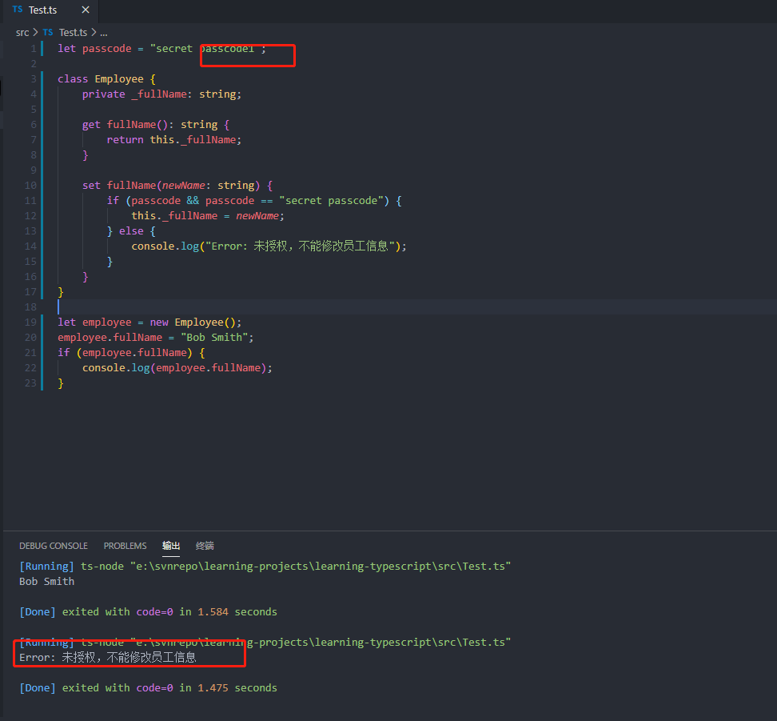

# <center>接口和函数</center>

## 一、接口

### 1.1 定义

TS的核心原则之一是对值锁具有的解构进行类型检查，有时称为"鸭式辨型法"或者"结构性子类型化"。接口的作用是为这些类型命名，以及为你的代码或者第三方代码定义契约。

interface，不仅可以描述对象的结构，还可以做接口的关键字。

#### 1.1.1 可选属性

接口里的属性不是必须有的，有些只是在某些条件下存在，或者可以不存在。给函数传入的参数对象可以只有部分属性赋值。

可选属性，好处之一是对可能存在的属性进行预定义，好处之二是可以捕获调用了不存在属性时的错误。

#### 1.1.2 只读属性

一些对象属性只能在对象刚刚创建的时候修改，可以在属性名前用readonly指定。

```typescript
interface Point{
    readonly x: number;
    readonly y: number;
}
```

Ts具有ReadonlyArray<T>类型，与Array<T>类似，只是把可变得方法都去掉了。可以确保数组创建后不能被修改。

```typescript
let a: number[] = [1,2,3,4];
let ro: ReadonlyArray<number> = a;
//下error
ro[0] = 12;

//
ro.push(5);//error
ro.length = 100;//error
a = ro;//error
```

#### 1.1.3 额外的属性检查

### 1.2 函数类型

接口能描述js中对象拥有的各种各样的外形，除了描述带有属性的普通对象外，接口也可以描述函数类型。

为了让接口表示函数类型，我们需要给接口定义一个调用签名，就像是一个参数列表和返回值类型的函数定义。

```typescript
interface SearchFunc{
    (source: string , subString: string): boolean;
}
```

这样可以像使用其他的接口一样使用这个函数接口。

```typescript
let mySearch: SearchFunc;

mySearch = function(source: string, subString: string){
    let result = source.search(subString);
    return result > -1;
}
```

对于函数类型检查来说，函数的参数名不需要和接口里定义的名字匹配。
可以用下面的方式去修改上面的代码：

```typescript
mySearch = function(src: string, sub: string){
    let result = src.search(sub);
    return result > -1;
}
```

类型检查会对函数的参数逐个检查，要求对应位置上的参数类型是兼容的，如果不想指定类型，ts的类型系统会推断出参数类型，因为函数直接赋值了SearchFunc的类型变量，函数的返回值类型是通过其返回值推断出来的，比如这里是false或者true，如果让这个函数返回数字或者字符串，类型检查器就会警告我们函数的返回值类型与SearchFunc接口中定义的不匹配。

### 1.3 可索引类型

与使用接口描述函数类型差不多，也可描述那些能够"通过索引得到"的类型，例如a[10]可索引类型具有一个"索引签名"，描述了对象的索引类型，还有相应的索引返回值类型。

```typescript
interface StringArray {
    [index: number]: string
}

let myArray : StringArray;

myArray = ["bob","fred"];

let myStr: string = myArray[0];
```

这里定义了StringArray接口，具有索引签名，这个索引签名表示了使用number去索引StringArray的时候，会得到string的返回类型。

共有两种索引类型：string和数字。可以同时使用两种类型的索引，但是数字索引的返回值必须是字符串索引返回值类型的子类型，这是因为当使用number来索引的时候，js会将它转换成string然后再去索引对象。也就是说，用100去索引等同于使用"100"去索引，因此两者要保持一致。

```typescript
class Animal{
    name: string;
}

class Dog extends Animal{
    breed: string;
}

//使用数值类型的字符串索引，有时会得到完全不同的animal，因此这种用法是错误的
interface NotOkay{
    [x: number]: Animal;
    [x: string]: Dog
}

```

字符串索引签名能够很好描述dictionary模式，也会确保所有属性与其返回值类型相匹配，因此字符串索引声明了Obj.property和obj['property']两种形式都可以。
以下有个例子，name的类型和字符串索引类型不匹配，所以类型检查器会报错：

```typescript
interface NumberDictionary{
    [index: string]: number;
    length: number;//可以，因为它是number类型
    name: string;//不可以，name的类型与索引类型返回值不匹配
}
```


可以将索引签名设置为只读，这样就可以防止给索引赋值。

### 1.4 继承接口

和类一样，接口也可以继承。

```typescript
interface Shape{
    color: string;
}

interface Square extends Shape{
    sideLength: number;
}

let square = <Square>{};

square.color = "blue";
square.sideLength = 10;
```

一个接口可以继承多个接口，创建出多个接口的继承接口。

```typescript
interface Shape{
    color: string;
}

interface PenStroke{
    penWidth: number;
}

interface Square extends Shape , PenStroke{
    sideLength: number;
}

let square = <Square>{};

square.color = "blue";
square.sideLength = 10;
square.penWidth = 5,0;
```

## 二、类

### 2.1 定义

```typescript
class Greeter{
    greeting: string;
    constructor(message: string){
        this.greeting = message;
    }

    greet(){
        return "Hello , " + this.greeting;
    }
}

let greeter = new Greeter("world");
```

我们引用任何一个类成员的时候都带了this，表示访问的是类成员。

new一个实例的时候，会调用之前定义的构造函数，创建一个实例，并执行构造函数进行初始化。

### 2.2 实现接口

可以用接口来明确强制一个类符合某种契约。

```typescript
interface ClockInterface{
    currentTime: Date;

    //可以在接口中描述方法，让类实现它
    setTime(d: Date);
}

class Clock implements ClockInterface{
    currentTime: date;
    constructor(h: number , m: number){

    }

    setTime(d: Date){
        this.currentTime = d;
    }
}
```

接口描述了类的公共部分，而不是公共和私有两部分，它不会帮你检查类是否具有某些私有成员。

### 2.3 继承

ts中可以使用常用的面向对象模式。基于类的设计中一种最基本的模式是允许使用继承扩展现有的类。

```typescript
class Animal{
    move(distanceInMeters: number = 0){
        console.log(`Animal moved ${distanceInMeters}m.`);
    }
}

class Dog extends Animal{
    bark(){
        console.log("woof ! woof!");
    }
}

const dog = new Dog();
dog.bark();
dog.move(10);
dog.bark();
```


上面是基本用法，类从父类中继承了属性和方法。

如果派生类中也包含了构造函数，它必须调用super(),并会执行基类的构造函数，在构造函数里访问this的属性之前一定要调用super(),这是ts强制执行的一条重要规则。

如下是稍微复杂一点的继承关系:

```typescript
class Animal {
    name: string;
    constructor(theName: string) {
        this.name = theName;
    }

    move(distanceInMeters: number = 0) {
        console.log(`Animal ${this.name} moved ${distanceInMeters}m.`);
    }
}

class Dog extends Animal {
    constructor(name: string) {
        super(name);
        this.name = name;
    }
    move(distanceInMeters = 5) {
        console.log("dog is moving...");
        super.move(distanceInMeters);
    }

    bark() {
        console.log("woof ! woof!");
    }
}

class Horse extends Animal {
    constructor(name: string) {
        super(name);
    }
    move(distanceInMeters = 45) {
        console.log("Horse is moving...");
        super.move(distanceInMeters);
    }
}

let doggy = new Dog("Doggy");
let horse: Animal = new Horse("Xiao Ma");

doggy.move();
horse.move(34);
```


### 2.4 存取器

ts支持通过getter和setter来截取对象成员的访问，可以有效控制如何访问对象成员。
从一个没有存取器的开始：

```typescript
class Employee{
    fullName: string;
}

let employee = new Employee();
employee.fullName = "Bob simit";
if(employee.fullName){
    console.log(employee.fullName);
}
```

这里可以随意设置fullName，虽然很方便，但是有可能带来麻烦。

```typescript
let passcode = "secret passcode";

class Employee{
    private _fullName: string;

    get fullName(): string{
        return this._fullName;
    }

    set fullName(newName: string){
        if(passcode && passcode == "secret passcode"){
            this._fullName = newName;
        }else{
            console.log("Error: 未授权，不能修改员工信息");
        }
    }
}

let employee = new Employee();
employee.fullName = "Bob Smith";
if(employee.fullName){
    console.log(employee.fullName);
}
```


下面修改一下密码，来验证是不是可以让存取器生效:



**存取器会有以下几点需要注意**:

- 需要将编译器设置为输出ES5或者更高，不支持es3
- 只带有get不带有set的存取器自动被设置为readonly。这从代码生成的.d.ts文件时是有帮助的，利用这个属性的用户会看到不允许修改它的值。

### 2.5 只读属性

可以使用readonly把属性设置为只读的，只读属性必须在声明或者构造函数时进行初始化。

```typescript
class Octopus{
    readonly name: string;
    readonly numberOfLegs: number = 8;
    constructor(theName: string){
        this.name = theName;
    }
}

let dad = new Octopus("Man with the 8 strong logs");
dad.name = "Man with the 3-piece suit";//错误
```


### 2.6 类函数和静态属性

上面讨论的实例成员。我们也可以创建类的静态成员，属性存在于类本身上面，不是在类的实例上。像用this访问实例属性一样，可以用类名访问静态成员。

```typescript
class Grid {
    static origin = { x: 0, y: 0 };
    calculateDistanceFromOrigin(point: { x: number, y: number }) {
        let xDist = (point.x - Grid.origin.x);
        let yDist = (point.y - Grid.origin.y);

        return Math.sqrt(xDist * xDist + yDist * yDist) / this.scale;
    }

    constructor(public scale: number) {

    }
}

let grid1 = new Grid(1.0);
let grid2 = new Grid(5.0);

console.log(grid1.calculateDistanceFromOrigin({ x: 10, y: 10 }));
console.log(grid2.calculateDistanceFromOrigin({ x: 10, y: 10 }));

```

### 2.7 抽象类

抽象类一般作为其他派生类的基类使用，不会直接被实例化。

不同于接口，抽象类可以包含成员的实现细节，abstract用于定义抽象类和在抽象类内部定义抽象方法。

```typescript
abstract class Animal{
    abstract makeSound():void;
    move(): void{
        console.log("roaming the earth");
    }
}
```

抽象方法不包含具体实现且必须在派生类中实现，抽象方法必须包含abstract关键字，可以包含访问修饰符。

```typescript
abstract class Department {
    constructor(public name: string) {

    }
    printName(): void {
        console.log(`department name: ` + this.name);
    }

    abstract printMeeting(): void;
}
class AccountingDepartment extends Department {
    constructor() {
        super("Account and auditing");
    }

    printMeeting(): void {
        console.log(`Account name: ` + this.name);
    }

    generateReports(): void {
        console.log('Generating accounting reports...');
    }
}

let department: Department;
//不允许创建抽象类实例
//department = new Department();

department = new AccountingDepartment();
department.printName();
department.printMeeting();
//下面错的，声明的Department类没有该方法。
//department.generateReports();
```
