# <center>VUE概述</center>

## 一、MV*

MVC是WEB开发中的一种广泛的架构模式，之后又演变出MVP和MVVM模式。

### 1.1 MVC

MVC: Model  View Controller（模型、视图、控制器）
模型: 应用程序的数据以及用于访问控制和修改这些数据的业务规则。当模型发生改变的时候，会通知视图，为视图提供查询模型相关状态的能力。同时，也为控制器提供访问封装在模型内部的应用程序的功能的能力。

视图：组织模型的内容，从模型那里获得数据并指定这些数据如何表现。当模型变化的时候，视图负责维护数据表现的一致性。视图同时将用户的请求通知控制器。

控制器： 定义了程序的行为。负责对来自视图的请求进行控制，并把这些请求映射成相应的行为，这些行为由模型负责实现。

在独立的GUI客户端中，用户的请求有可能由页面事件触发、也有可能是客户端来的get或者post请求。模型实现的行为包括处理业务、和修改模型状态，根据用户请求和模型行为的结果，控制器选择一个视图作为用户请求的响应。

下面是MVC的关系图:

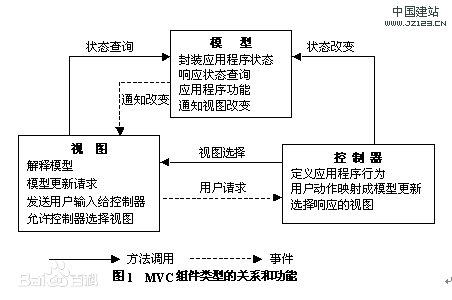

### 1.2 MVP

MVP: Model-View-Presenter，由经典的MVC模式演变而来，基本思想有相通的地方（Presenter负责处理逻辑的处理、Model提供数据、View负责显示）

MVP和MVC的区别在于：MVP中VIEW并不是直接使用Model，他们之间的通信通过Presenter进行，所有的交互都发生在P端，而在MVC中View会直接在Model中读取数据，而不是通过Controller。

下面是MVP的关系图:


### 1.3 MVVM

MVVM(Model-View-ViewModel),是一种简化用户界面的事件驱动编程方式。
MVVM的核心是数据驱动，即VIEW-MODEL，它是View和Model的关系映射，是一个值转换器，负责转换Model的数据对象，使得数据变得更加易于管理和使用。在MVVM中View和Model是不直接通信的，它们之间存在ViewModel这个中介充当观察者。

MVVM最核心的特性是双向绑定。当用户操作View的时候，ViewModel感知到变化，然后通知Model发生改变，反之如果Model发生改变，ViewModel感知到变化，通知View进行更新。ViewModel向上与视图层View双向绑定，向下与Model层通过接口请求进行数据交互，起到承上启下的作用。

View<-双向绑定> ViewModel <=> Model

MVVM的核心理念是通过声明式的数据绑定来实现VIEW的分离，完全解耦View。
不少前端框架采用MVVM模式，如Knockout、Ember等，以及当前流行的Angular、Vue。

## 二、ES6

### 2.1 块作用域

块级声明用于声明在指定块的作用域之外无法访问的变量。存在于
- 函数内部
- 块中({内部代码})

#### 2.1.1 let

在函数作用域或者全局作用域中通过关键字var声明，无论在哪里声明，都会被当成在当前作用域顶部声明的变量，这就是javascript的变量提升机制。

ES6引入了let，用法与var相同，不过let声明的变量不会被提升，可以把变量的作用域限制在当前代码块。

使用let声明的变量，还可以防止重复，重复声明则会报错。
同一作用于下不能用let重复定义已经存在的标识符，但在不同的作用域下则可以。

#### 2.1.2 const

ES6提供了Const关键字，用于声明常量，const声明的变量必须在声明的同时初始化。
与let类似，同一作用域下const声明已经存在的标识符也会报错，不管它之前是用var还是let声明的。

如果const声明对象，对象本身的绑定不能修改，但它的属性和值可以修改。

#### 2.1.3 全局块作用域绑定

全局作用域中使用var声明的变量或对象，将作为浏览器幻境中的window对象属性，意味着使用var很可能会无意覆盖已经一个存在的全局属性。

如果在全局作用域下使用let或者const，则会在全局作用域下创建一个新的绑定，但该绑定不会成为window对象的属性。

如果不想为全局对象window创建属性，或者为了避免覆盖window对象的属性，则可以用let或者const声明。

### 2.2 模版字面量

ES6引入了模版字面量，对字符串的操作进行了增强。
- 多行字符串
- 字符串占位

#### 2.2.1 多行字符串

模版字面量的语法是使用反引号替换单双引号。
如果要在字符串中使用反引号，则需要(\\)转义。
在模版字面量中不需要转义单双引号。

如果需要在字符串中添加新行，在模版字面量中直接换行即可，

```node
let hello = "hello";
let message = `${hello} vue!`;
let messageWithEnter = `${hello}
new line 
vue!
`
console.log(hello);
console.log(message);
console.log(messageWithEnter);
```
下面是演示结果:

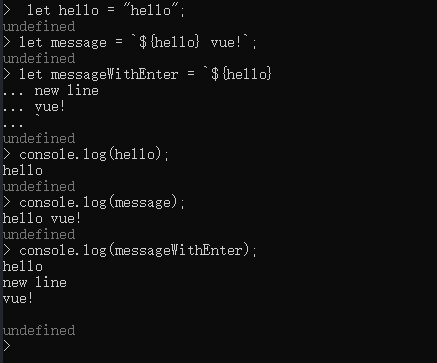

注意：
反引号中所有的空白字符（包括但不限于空格、换行、制表）都属于字符串的一部分。

#### 2.2.2 字符串占位符

在模版字面量里，可以将javascript变量或者任何的合法表达式嵌入进去，将其结果作为字符串的一部分输出出去。

占位符由${}组成，中间可以包含变量或者JavaScript的表达式。
模版字面量本身也是JavaScript的表达式，因此一个模版字面量中可以嵌入另一个模版字面量。

###  2.3 参数

#### 2.3.1 默认参数

在ES5中，默认参数只能在代码中处理。如下:

```javascript
function a (paramA , paramB){
    paramA = paramA || "defaultParama";
    paramB = paramB || "defaultParamb";
}
```
本身参数是可选参数，那么不传入对应的值的时候，应当给出默认值。但是这里有一个缺陷，就是有些默认值或者新传入的值可能是falsy的，那么会导致出现一些问题。比如paramB的值传入0的时候，虽然是个合法的值，但会被视为一个假值，导致会被设置的默认值替换。

当然也可以用其他的方式来解决这个问题，比如增加代码用typeof来判断，虽然健壮了些，但毫无疑问增加了许多代码来实现。

Es6中，简化了参数默认值的实现过程，可以直接在参数列表中为形参指定默认值。
如：

```javascript
function method(url = "baseUrl" , timeout = 0){
    //函数其他的部分
}

```
如果按照method()调用，则url和timeout分别被指定默认值。
如果按照method("/login")调用，则url被设置为"/login",timeout则使用默认值0;
如果按照method("/login",3)调用，则url设置为"/login",timeout则使用3。

此外，与java、c++等语言要求，默认参数的指定必须在参数列表的最右边不同，es6中声明函数的时候，可以为任意位置的参数指定默认值，在已指定默认值的参数后面，还可以有无默认值的参数。

在这种情况下，只有在没有给默认值参数传值，或者主动为他们传入undefined的时候，才会使用他们的默认值。

为一个具有默认值的参数传递null是合法的，他不会使用默认值，值会变成null。

#### 2.3.2 rest参数

js的函数有个特别的地方，无论在函数中定义了多少个形参，都可以传入任意数量的参数，在函数内部可以通过arguments对象来接收这些参数，看如下的代码：

```javascript
function calculate(op){
    if(op === "+"){
        let result = 0 ;
        for(let i = 1;i < arguments.length ; i++>){
            result += arguments[i];
        }

        return result;

    }else if (op === "*"){
        let result = 1 ;
        for(let i = 1;i < arguments.length ; i++>){
            result *= arguments[i];
        }

        return result;
    }
}

```

不足之处:
- 调用者需要知道这个函数可以接受任意数量的参数，单从函数声明的参数列表是看不出来的
- 第一个参数是命名参数的时候，且已经被使用了，遍历其他的参数的时候，arguments对象需要从1（或者更多）开始。

ES6中引入了rest参数，在函数的命名参数前面添加...，表明这是一个rest参数，用于获取函数的多余参数。它是一个数组，包含着自他之后传入的所有参数，通过这个数组名称可以逐一访问参数。

如：
```javascript
function calculate(op , ...data){
    if(op === "+"){
        let result = 0 ;
        for(let i = 0;i < data.length ; i++>){
            result += data[i];
        }

        return result;

    }else if (op === "*"){
        let result = 1 ;
        for(let i = 0;i < data.length ; i++>){
            result *= data[i];
        }

        return result;
    }
}
```

区别:
arguments取得的是传入的所有参数，包括明确指定了的命名参数。
rest参数，可以处理的参数数目一目了然，清晰明了。

注意：
每个函数智能化有一个rest参数，且只能是最后一个参数。
如下面的声明则是错误的：
```javascript
function calculate(op , ...data,last){

}
```

### 2.4 展开

展开运算符语法上接近rest参数，也是三个点(...),它可以将一个数组转换为各个独立的数据，也可以取出对象的所有可遍历属性，rest参数是让你指定多个独立的参数并通过整合之后访问。

看代码：
```javascript

function sum( a , b ,c){
    return a + b + c;
}

let array1 = [1,2,3];
sum(...array1);
```

展开运算符可以把array1数组中的各个值且对应起来传入sum函数。

#### 2.4.1 展开运算符可以复制数组

  看代码:
```javascript
let array1 = [1,2,3];
let array2 = array1;//array2和array1是同一个
let array3 = [...array1];//array3和array1不是同一个

array1[0] = 4;
console.log(array2);
console.log(array3);
```
结果如下:

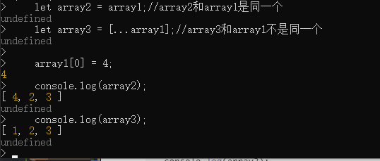
  
#### 2.4.2 展开运算符合并数组

展开运算符也可以合并数组。

```javascript
let array4 = [1,2,3];
let array5 = [...array4,6,7,8];
console.log(array5);
```
结果如下:
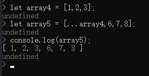


#### 2.4.3 展开运算符取出对象的可遍历属性，复制到新对象

```javascript
let book1 = {
    title:"vue实战",
    author:"testAuthor"
}

let book2 = {
    ...book1,
    price:"38￥"
}

console.log(book2);
```

结果如下:
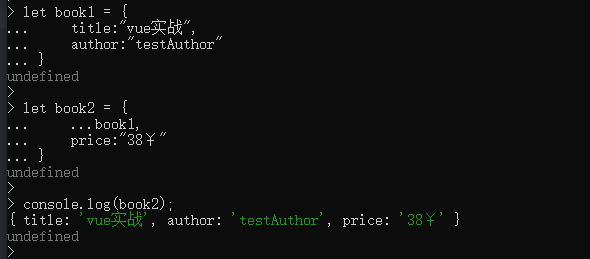

### 2.5 对象字面量语法扩展

ES6中对原有的语法进行了扩展，使得新的用法更简洁。

#### 2.5.1 属性初始值简写

ES5及早期版本中，对象字面量需要key:value都写出来，只是简单的键值对集合。
如：

```javascript
function createCar(color , doors){
    return {
        color: color,
        doors: doors
    }
}
```

由此看出，代码重复不少。左边是键值，右边是键值

ES6中给出了简写，可以消除部分重复。当一个对象的属性和本地变量同名的时候，可以不用写冒号和键值，简单书写属性名即可。

```JavaScript
function createCar(color , doors){
    return {
        //参数名和本地变量同名
        color,
        doors
    }
}
```

当对象字面量只有属性名称的时候，JavaScript引擎会在本地可访问的作用域中查找同名变量，如果找到则会把变量值赋值给对象字面量力的同名属性。

#### 2.5.2 对象方法的简写

ES6改进了对象字面量方法的定义。在ES5以及以前，必须指定方法名称并给出完整的函数定义。
ES5:
```javascript
var car = {
    color: "red",
    doors: 4,
    showColor: function(){
        console.log(this.color);
    }
}
```

ES6省略冒号和function关键字:
```javascript
var car = {
    color:"red",
    doors: 4,
    showColor(){
        console.log(this.color);
    }
}

car.showColor();
console.log(car.showColor.name);

```
下面是运行结果：


**注意**:
对象方法简写创建的方法有一个name属性，值为圆括号前面的名称。

#### 2.5.2 可计算的属性名

JavaScript中访问对象的属性时，可以通过点或者方括号，但是如果属性名包含了特殊字符或者需要计算才能得到，则需要使用方括号。

代码如下:
```javascript
let suffix = "name";
let person = {};
person['first name'] = "sam";//属性名有空格
person['last' + suffix] = "liu";//属性名由表达式计算
person.age = 20;
console.log(person);
```
结果如下:

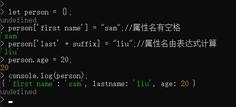

任何可用于对象实例方括号记法的属性名，都可以作为计算属性名。

### 2.6 解构

在JavaScript中，我们经常需要从某个对象或者数组中提取数据出来单独使用，这种操作重复又无趣。
如：
```javascript
let book = {
    title:"Vue",
    author:"sam",
    isbn:"12345"
}

//提取对象属性
let title = book.title;
let author = book.author;

//提取数组数值
let arr = [1 , 2, 3];
let a = arr[0], b = arr[1] , c = arr[3]
```

ES6中，对象和数组提供了解构功能，允许按照一定的模式从对象和数组中取出值，给变量赋值。

#### 2.6.1 对象解构

##### 2.6.1.1 语法: 在赋值操作符左边放置一个对象字面量。
```javascript
let book = {
    title:"Vue",
    author:"sam",
    isbn:"12345"
}

let { title , author , isbn} = book;

console.log(`title is :${title} , author is :${author} , isbn is :${isbn}`)

```
下面是结果:

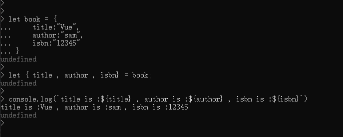

##### 2.6.1.2 同名限制

如果是用var、let、const进行解构声明，则必须提供初始化程序，等号右边必须有值，否则胡出错。
```javascript

let { title , author , isbn};
```
结果如下:
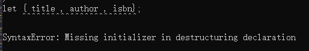

如果变量之前已经声明过，后面又想通过解构进行赋值，则需要把整个解构语句括起来。如：
```javascript

let book = {
    title:"Vue",
    author:"sam",
    isbn:"12345"
}

let  title , author , isbn;
//这个是错误的：
//{title, author , isbn} = book;

({title , author ,isbn } = book);
console.log(`title is :${title} , author is :${author} , isbn is :${isbn}`)
```
下面是先声明后解构的结果:


下面是未加括号的结果,可看出无法取出想要的结果:
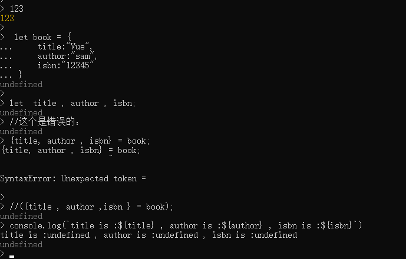
原因是： JavaScript引擎会默认把一对开放的花括号视为一个代码块，语法规定了代码块语句不允许出现在赋值语句左侧，添加圆括号之后把块语句转化为了一个表达式，从而实现解构赋值。

##### 2.6.1.3 解构的一些有趣操作

整个解构表达式的值与后面右侧的对象值相等，因此可以实现一些有趣的操作。
给变量赋值的同时，还可以给函数传参：

```javascript
let book = {
    title:"Vue",
    author:"sam",
    isbn:"12345"
}
function outputBook(book){
    console.log(book);
}

let  title , author , isbn;
outputBook({title , author ,isbn } = book);
console.log(`title is :${title} , author is :${author} , isbn is :${isbn}`)
```

结果如下：
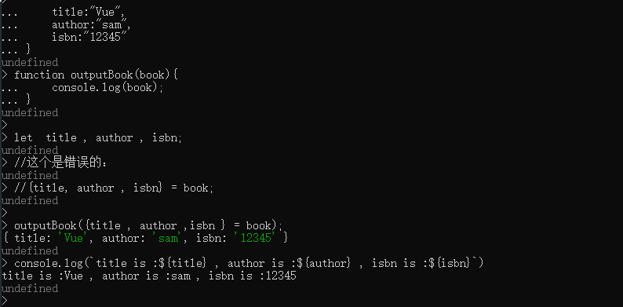

##### 2.6.1.4 解构默认值

当本地变量中，在对象不存在的时候，则会指定为undefined，如果此时想给定一个默认值，则可以在左侧直接=赋值。如下:
```javascript
let book = {
    title:"Vue",
    author:"sam",
    isbn:"12345"
}
function outputBook(book){
    console.log(book);
}

let  title , author , isbn ,unknown;
outputBook({title , author ,isbn ,unknown = "unknownvalue"} = book);
console.log(`title is :${title} , author is :${author} , isbn is :${isbn} , unknown is :${unknown}`)

```
当解构对象的属性中不存在某个属性的时候，或者该属性的值为undefined的时候，就使用提供的默认值。结果如下:
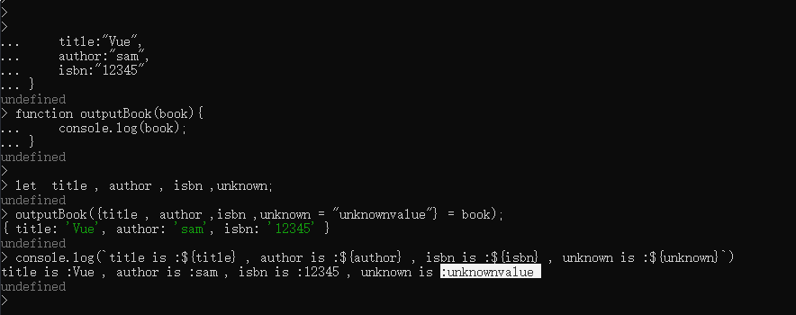

##### 2.6.1.5 解构时局部变量和属性不同名

多数情况下，我们都使用和属性名相同的局部变量名，当然也可以使用不同的名称，只需要在解构的时候赋值左边的对面字面量使用key:value的形式即可。
它的含义是，读取key的值，赋给本地变量value。
要读取的属性是冒号左边的属性，读取出来的属性值赋给冒号右边的那个变量。

如下所示：
```javascript
let book = {
    title:"Vue",
    author:"sam",
    isbn:"12345"
}
function outputBook(book){
    console.log(book);
}

let  bookTitle , author , isbn ,unknown;
outputBook({title:bookTitle , author ,isbn ,unknown = "unknownvalue"} = book);
console.log(`title is :${bookTitle} , author is :${author} , isbn is :${isbn} , unknown is :${unknown}`)
```

结果如下，同样可以得到属性值:

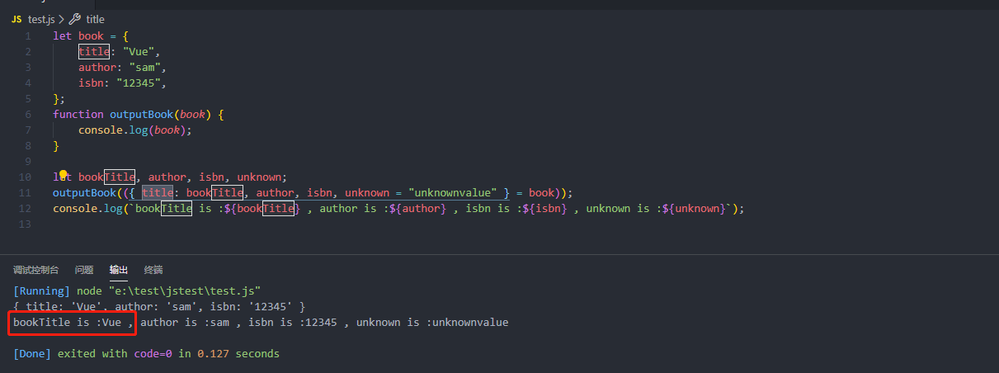

##### 2.6.1.6 嵌套解构

JavaScript中的对象嵌套很平常，解构的时候同样可以嵌套。

```javascript
let book = {
    title:"Vue",
    author:"sam",
    isbn:"12345",
    category:{
        id:1,
        name:"前端技术"
    }
}

let {title, author ,isbn ,category:{name: categoryName}} = book;
console.log(`title is :${title} , author is :${author} , isbn is :${isbn} , 所属种类is :${categoryName}`)
```

下面是嵌套解构的结果:

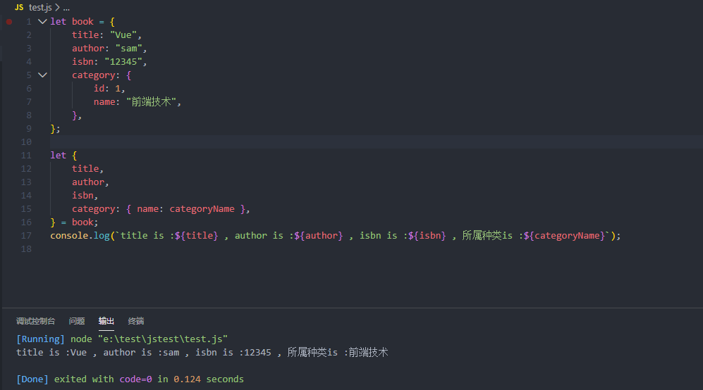
因此可以看出，这段代码的含义是：在找到book对象的category属性后，继续深入下一层查找name属性，找到了之后赋给categoryName局部变量。

在解构语法中，冒号前面的标识符代表要查找的属性索引，右侧为其要赋值的变量名；如果冒号右面是花括号，则表示要赋予的最终值嵌套在内部深层中。

#### 2.6.2 数组解构

和对象字面量的解构不同，数组解构使用方括号。数组本质结构的不同，决定了数组解构没有属性名的问题，因此会更简单。

##### 2.6.2.1 默认用法

如:

```javascript
let arr = [1 ,2 ,3 ];
let [a , b , c ] = arr;

console.log(`a:${a} , b: ${b} , c: ${c}`)

```
结果如下:
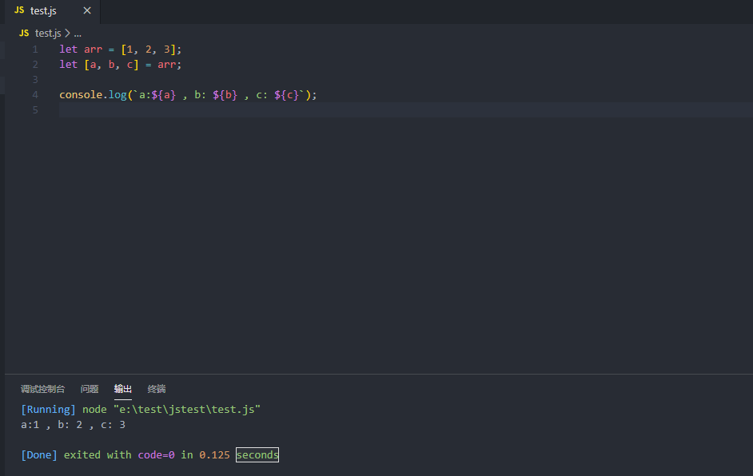

##### 2.6.2.2 指定位置

有的时候想取特定位置的值，比如取第二个，也就是索引1，如:

```javascript
let arr = [1 ,2 ,3 ];
let [ , b  ] = arr;

console.log(`b: ${b}`)

```
结果如下:


因此总结起来就是，前面的逗号是指定位置前方元素的占位符，无论数组中的元素有多少个，都可以用这种方式来提取。

##### 2.6.2.3 已声明的变量解构

与对象的解构不同，如果已经声明过的变量想通过解构来取值，不需要使用圆括号，因为没有了大括号表示代码块的歧义。

##### 2.6.2.4 解构默认值

同对象字面量的解构默认值用法。
当指定位置元素不存在或者为undefined的时候使用默认值。

##### 2.6.2.5 嵌套解构

同对象字面量的嵌套解构。

##### 2.6.2.6 展开运算符和解构同时使用

可以完成数组赋值，以及对象的重新提取和赋值。

## 2.7 箭头函数

ES6允许使用箭头定义函数，语法多变，可根据实际使用场景有多种形式，都需要有函数参数、箭头、函数体组成。

### 2.7.1 语法

#### 2.7.1.1 单一参数

单一参数、函数体只有一条语句。

```javascript
let welcome = msg => msg;

/**它相当于以下函数
function welcome(msg){
    return msg;
}
**/
console.log(welcome("sam"));
```

结果如下:

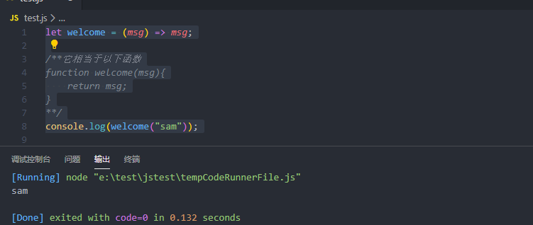

#### 2.7.1.2 多参数

多参数的箭头函数，需要用括号包括起来，和定义函数时类似。
如下:

```javascript
let welcome = (name , msg) => `${name} : ${msg}`;

/**它相当于以下函数
function welcome(name , msg){
    return `${name} : ${msg}`;
}
**/
console.log(welcome("sam" ,"你好"));
```

结果如下:
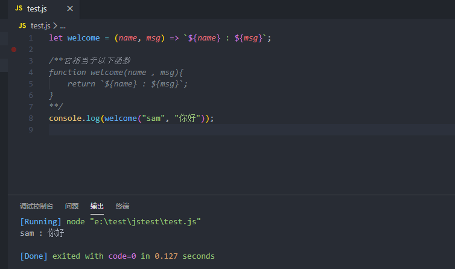

#### 2.7.1.3 无参数

无参数的函数定义，需要一个空的圆括号。

```javascript
let welcome = () => "这是个无参的箭头函数";

/**它相当于以下函数
function welcome(){
    return "这是个无参的箭头函数";
}
**/
console.log(welcome());
```

结果如下:
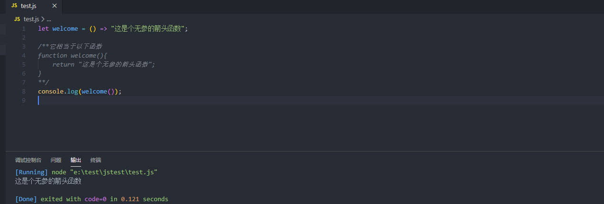

#### 2.7.1.4 代码块有多行

多行代码块的箭头函数定义，需要一个大括号包括代码块。

```javascript
let welcome = () => {
    let name = "hello welcome";
    return `这是个无参的箭头函数:${name}`
};

/**它相当于以下函数
function welcome(){
    let name = "hello welcome";
    return `这是个无参的箭头函数:${name}`
}
**/
console.log(welcome());
```

结果如下:
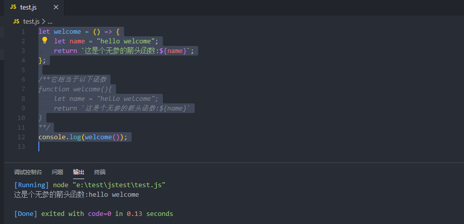

#### 2.7.1.5 无参 无函数体

没有参数，没有函数体的空箭头函数，需要空的圆括号包裹参数，一个空的花括号包裹函数体。
如下:

```javascript
let welcomeEmpty = () => {};
/**
相当于
function welcomeEmpty(){

}
**/

```

#### 2.7.1.6 返回值是对象字面量

如果箭头函数返回的是对象字面量，由于代码块和对象字面量定义的歧义，需要用圆括号把对象字面量括起来。如下所示：

```javascript
let welcome = () => 	({ name: "sam", msg: "welcome" });
let result = welcome();

console.log(`${JSON.stringify(result)}, type: ${typeof result}`);
```

结果如下：
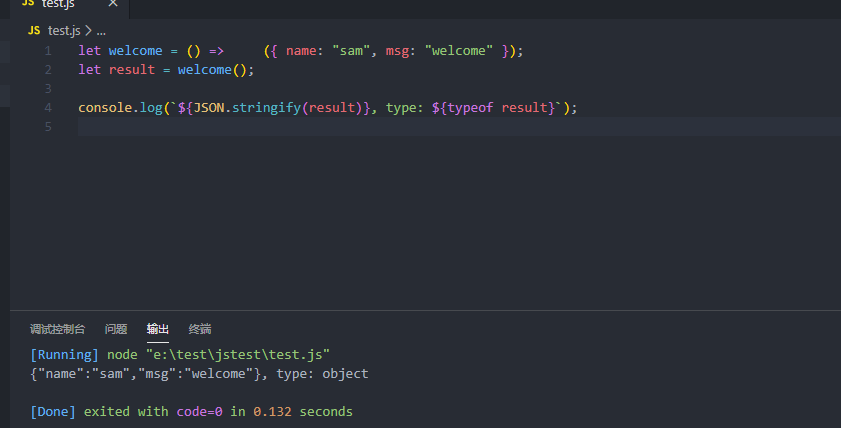